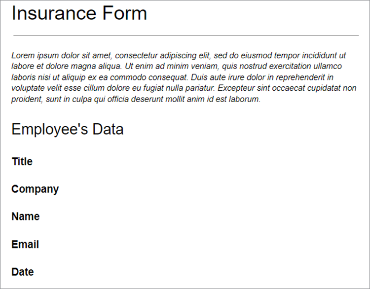

# Introdução à API do Adobe Sign

A [API do Acrobat Sign](https://developer.adobe.com/adobesign-api/) é uma ótima maneira de aprimorar a maneira como você gerencia contratos assinados. Os desenvolvedores podem integrar facilmente seus sistemas com a API do Sign, que fornece uma maneira confiável e fácil de fazer upload de documentos, enviá-los para assinatura, enviar lembretes e coletar assinaturas eletrônicas.

## O que você pode aprender

Este tutorial prático explica como os desenvolvedores podem usar a API do Sign para aprimorar aplicativos e fluxos de trabalho criados com o [!DNL Adobe Acrobat Services]. [!DNL Acrobat Services] inclui a [API de Serviços do Adobe PDF](https://developer.adobe.com/document-services/apis/pdf-services), a [API de Incorporação do Adobe PDF](https://developer.adobe.com/document-services/apis/pdf-embed/) (gratuita) e a [API de Geração de Documento do Adobe](https://developer.adobe.com/document-services/apis/doc-generation).

Mais especificamente, saiba como incluir a API do Acrobat Sign no seu aplicativo para coletar assinaturas e outras informações, como informações de funcionários em um formulário de seguro. Etapas genéricas com solicitações e respostas HTTP simplificadas são usadas. Você pode implementar essas solicitações em seu idioma favorito. Você pode criar um PDF usando uma combinação de [[!DNL Acrobat Services] APIs](https://developer.adobe.com/document-services/homepage/), carregá-lo na API do Sign como um documento [temporário](https://opensource.adobe.com/acrobat-sign/developer_guide/index.html#!adobedocs/adobe-sign/master/overview/terminology.md) e solicitar assinaturas do usuário final usando o contrato ou o fluxo de trabalho [widget](https://opensource.adobe.com/acrobat-sign/developer_guide/index.html#!adobedocs/adobe-sign/master/overview/terminology.md).

## Criação de um documento PDF

Comece criando um modelo do Microsoft Word e salvando-o como um PDF. Ou você pode automatizar seu pipeline usando a API de geração de documento para carregar um modelo criado no Word e depois gerar um documento PDF. A API de geração de documento faz parte do [!DNL Acrobat Services], [gratuito por seis meses e pago conforme usa por apenas US$ 0,05 por transação de documento](https://developer.adobe.com/document-services/pricing/main).

Neste exemplo, o modelo é apenas um documento simples com alguns campos de signatário para preencher. Nomeie os campos por enquanto e insira os campos reais neste tutorial.



## Descobrindo o ponto de acesso válido da API

Antes de trabalhar com a API do Sign, [crie uma conta de desenvolvedor gratuita](https://acrobat.adobe.com/ca/en/sign/developer-form.html) para acessar a API, testar a troca e a execução de documentos e testar o recurso de email.

O Adobe distribui a API do Acrobat Sign em várias unidades de implantação, chamadas de “fragmentos”. Cada fragmento atende à conta de um cliente, como NA1, NA2, NA3, EU1, JP1, AU1, IN1 e outros. Os nomes dos fragmentos correspondem a localizações geográficas. Esses fragmentos compõem o URI base (pontos de acesso) dos endpoints da API.

Para acessar a API do Sign, primeiro você deve descobrir o ponto de acesso correto para sua conta, que pode ser api.na1.adobesign.com, api.na4.adobesign.com, api.eu1.adobesign.com ou outros, dependendo de sua localização.

```
  GET /api/rest/v6/baseUris HTTP/1.1
  Host: https://api.adobesign.com
  Authorization: Bearer {YOUR-INTEGRATION-KEY-HERE}
  Accept: application/json

  Response Body (example):

  {
    "apiAccessPoint": "https://api.na4.adobesign.com/", 
    "webAccessPoint": "https://secure.na4.adobesign.com/" 
  }
```

No exemplo acima, há uma resposta com o valor como o ponto de acesso.

>[!IMPORTANT]
>
>Nesse caso, todas as solicitações subsequentes feitas à API do Sign devem usar esse ponto de acesso. Se você usar um ponto de acesso que não atende à sua região, receberá um erro.

## Carregamento de um documento temporário

O Adobe Sign permite que você crie diferentes fluxos que preparam documentos para assinaturas ou coleta de dados. Independentemente do fluxo do aplicativo, primeiro você deve fazer upload de um documento, que permanece disponível por apenas sete dias. As chamadas de API subsequentes devem fazer referência a este documento temporário.

O documento é carregado usando uma solicitação POST para o ponto de extremidade `/transientDocuments`. A solicitação com várias partes consiste no nome do arquivo, em um fluxo de arquivos e no tipo MIME (mídia) do arquivo de documento. A resposta de ponto de extremidade contém uma ID que identifica o documento.

Além disso, o aplicativo pode especificar um URL de retorno de chamada para o Acrobat Sign fazer ping, notificando o aplicativo quando o processo de assinatura for concluído.


```
  POST /api/rest/v6/transientDocuments HTTP/1.1
  Host: {YOUR-API-ACCESS-POINT}
  Authorization: Bearer {YOUR-INTEGRATION-KEY-HERE}
  x-api-user: email:your-api-user@your-domain.com
  Content-Type: multipart/form-data
  File-Name: "Insurance Form.pdf"
  File: "[path]\Insurance Form.pdf"
  Accept: application/json

  Response Body (example):

  {
     "transientDocumentId": "3AAA...BRZuM"
  }
```

## Criação de um formulário web

Formulários web (conhecidos anteriormente como widgets de assinatura) são documentos hospedados que qualquer pessoa com acesso pode assinar. Exemplos de formulários web incluem folhas de inscrição, isenções e outros documentos que muitas pessoas acessam e assinam online.

Para criar um novo formulário da Web usando a API do Sign, primeiro carregue um documento temporário. A solicitação POST para o ponto de extremidade `/widgets` usa o `transientDocumentId` retornado.

Neste exemplo, o formulário da Web é `ACTIVE`, mas você pode criá-lo em um dos três estados diferentes:

* RASCUNHO — para criar progressivamente o formulário da Web

* AUTHORING — para adicionar ou editar campos de formulário no formulário da Web

* ATIVO — para hospedar imediatamente o formulário da Web

As informações sobre os participantes do formulário também devem ser definidas. A propriedade `memberInfos` contém dados sobre os participantes, como email. No momento, esse conjunto não dá suporte a mais de um membro. Mas, como o email do signatário do formulário da Web é desconhecido no momento da criação do formulário, o email deve ficar vazio, como no exemplo a seguir. A propriedade `role` define a função assumida pelos membros em `memberInfos` (como SIGNER e APPROVER).

```
  POST /api/rest/v6/widgets HTTP/1.1
  Host: {YOUR-API-ACCESS-POINT}
  Authorization: Bearer {YOUR-INTEGRATION-KEY-HERE}
  x-api-user: email:your-api-user@your-domain.com
  Content-Type: application/json

  Request Body:

  {
    "fileInfos": [
      {
      "transientDocumentId": "YOUR-TRANSIENT-DOCUMENT-ID"
      }
     ],
    "name": "Insurance Form",
      "widgetParticipantSetInfo": {
          "memberInfos": [{
              "email": ""
          }],
      "role": "SIGNER"
      },
      "state": "ACTIVE"
  }

  Response Body (example):

  {
     "id": "CBJ...PXoK2o"
  }
```

Você pode criar um Formulário da Web como `DRAFT` ou `AUTHORING` e alterar seu estado à medida que o formulário passa pelo pipeline do aplicativo. Para alterar um estado de formulário da Web, consulte o ponto de extremidade [PUT /widgets/{widgetId}/state](https://secure.na4.adobesign.com/public/docs/restapi/v6#!/widgets/updateWidgetState).

## Leitura do URL de hospedagem do Formulário Web

A próxima etapa é descobrir o URL que hospeda o formulário da Web. O ponto de extremidade /widgets recupera uma lista de dados de formulário da Web, incluindo o URL hospedado do formulário da Web que você encaminha aos usuários, para coletar assinaturas e outros dados de formulário.

Este ponto de extremidade retorna uma lista, para que você possa localizar o formulário específico por sua id em `userWidgetList` antes de obter a URL que hospeda o Formulário da Web:

```
  GET /api/rest/v6/widgets HTTP/1.1
  Host: {YOUR-API-ACCESS-POINT}
  Authorization: Bearer {YOUR-INTEGRATION-KEY-HERE}
  Accept: application/json

  Response Body:

  {
    "userWidgetList": [
      {
        "id": "CBJCHB...FGf",
        "name": "Insurance Form",
        "groupId": "CBJCHB...W86",
        "javascript": "<script type='text/javascript' ...
        "modifiedDate": "2021-03-13T15:52:41Z",
        "status": "ACTIVE",
        "Url":
        "https://secure.na4.adobesign.com/public/esignWidget?wid=CBFCIB...Rag*",
        "hidden": false
      },
      {
        "id": "CBJCHB...I8_",
        "name": "Insurance Form",
        "groupId": "CBJCHBCAABAAyhgaehdJ9GTzvNRchxQEGH_H1ya0xW86",
        "javascript": "<script type='text/javascript' language='JavaScript'
        src='https://sec
        "modifiedDate": "2021-03-13T02:47:32Z",
        "status": "ACTIVE",
        "Url":
        "https://secure.na4.adobesign.com/public/esignWidget?wid=CBFCIB...AAB",
        "hidden": false
      },
      {
        "id": "CBJCHB...Wmc",
```

## Gerenciando seu formulário da Web

Este formulário é um documento PDF para os usuários preencherem. No entanto, você ainda precisa informar ao editor do formulário quais campos os usuários devem preencher e onde eles estão localizados no documento:


O documento acima ainda não mostra os campos. Eles são adicionados durante a definição de quais campos coletam as informações do signatário, bem como seu tamanho e posição.

Agora, vá para a guia [Formulários da Web](https://secure.na4.adobesign.com/public/agreements/#agreement_type=webform) na página “Seus contratos” e encontre o formulário que você criou.


Clique em **Editar** para abrir a página de edição do documento. Os campos predefinidos disponíveis estão no painel direito.


O editor permite arrastar e soltar texto e campos de assinatura. Depois de adicionar todos os campos necessários, você pode redimensioná-los e alinhá-los para polir seu formulário. Finalmente, clique em **Salvar** para criar o formulário.


## Enviar um formulário web para assinatura

Depois de concluir o formulário da Web, você deve enviá-lo para que os usuários possam preenchê-lo e assiná-lo. Depois de salvar o formulário, você pode exibir e copiar o URL e o código incorporado.

**Copiar URL do Formulário da Web**: use esta URL para enviar usuários para uma versão hospedada deste contrato para revisão e assinatura. Por exemplo:

[https://secure.na4.adobesign.com/public/esignWidget?wid=CBFCIBAA3...babw\*](https://secure.na4.adobesign.com/public/esignWidget?wid=CBFCIBAA3AAABLblqZhCndYscuKcDMPiVfQlpaGPb-5D7ebE9NUTQ6x6jK7PIs8HCtTzr3HOx8U6D5qqbabw*)

**Copiar código incorporado do formulário da Web**: adicione o contrato ao seu site copiando este código e colando-o no seu HTML.

Por exemplo:

```
<iframe
src="https://secure.na4.adobesign.com/public/esignWidget?wid=CBFC
...yx8*&hosted=false" width="100%" height="100%" frameborder="0"
style="border: 0;
overflow: hidden; min-height: 500px; min-width: 600px;"></iframe>
```


Quando os usuários acessam a versão hospedada do formulário, eles revisam o documento temporário carregado primeiro com os campos posicionados conforme especificado.


O usuário preenche os campos e assina o formulário.


Em seguida, o usuário assina o documento com uma assinatura armazenada anteriormente ou com uma nova.


Quando o usuário clica em **Aplicar**, o Adobe instrui o usuário a abrir o email e confirmar a assinatura. A assinatura permanece pendente até que a confirmação chegue.


Essa autenticação adiciona autenticação de vários fatores e fortalece a segurança do processo de assinatura.


## Leitura de formulários web concluídos

Agora é hora de obter os dados do formulário que os usuários preencheram. O ponto de extremidade `/widgets/{widgetId}/formData` recupera os dados inseridos pelo usuário em um formulário interativo quando ele assinou o formulário.

```
GET /api/rest/v6/widgets/{widgetId}/formData HTTP/1.1
Host: {YOUR-API-ACCESS-POINT}
Authorization: Bearer {YOUR-INTEGRATION-KEY-HERE}
Accept: text/csv
```

O fluxo de arquivos CSV resultante contém dados de formulário.

```
Response Body:
"Agreement
name","completed","email","role","first","last","title","company","agreementId",
"email verified","web form signed/approved"
"Insurance Form","","myemail@email.com","SIGNER","John","Doe","My Job Title","My
Company Name","","","2021-03-07 19:32:59"
```

## Criar um contrato

Como alternativa aos Formulários web, você pode criar contratos. As seções a seguir demonstram algumas etapas simples para gerenciar contratos usando a API do Sign.

Enviar um documento para destinatários especificados para assinatura ou aprovação cria um contrato. Você pode monitorar o status e a conclusão de um contrato usando APIs.

Você pode criar um contrato usando um [documento temporário](https://helpx.adobe.com/sign/kb/how-to-send-an-agreement-through-REST-API.html), um [documento da biblioteca](https://opensource.adobe.com/acrobat-sign/developer_guide/index.html#!adobedocs/adobe-sign/master/samples/send_using_library_doc.md) ou uma URL. Neste exemplo, o contrato é baseado no `transientDocumentId`, assim como o formulário da Web criado anteriormente.

```
POST /api/rest/v6/agreements HTTP/1.1
Host: {YOUR-API-ACCESS-POINT}
Authorization: Bearer {YOUR-INTEGRATION-KEY-HERE}
x-api-user: email:your-api-user@your-domain.com
Content-Type: application/json
Accept: application/json
Request Body:
{
    "fileInfos": [
      {
      "transientDocumentId": "{transientDocumentId}"
      }
     ],
    "name": "{agreementName}",
    "participantSetsInfo": [
      {
      "memberInfos": [
          {
          "email": "{signerEmail}"
          }
        ],
        "order": 1,
        "role": "SIGNER"
      }
    ],
    "signatureType": "ESIGN",
    "state": "IN_PROCESS"
  }
```

Neste exemplo, o contrato é criado como IN_PROCESS, mas você pode criá-lo em um dos três estados diferentes:

* RASCUNHO — para criar o contrato de forma incremental antes de enviá-lo

* AUTHORING — para adicionar ou editar campos de formulário no contrato

* IN_PROCESS — para enviar imediatamente o contrato

Para alterar um estado de contrato, use o ponto de extremidade `PUT /agreements/{agreementId}/state` para executar uma das transições de estado permitidas abaixo:

* RASCUNHO PARA CRIAÇÃO

* AUTHORING to IN_PROCESS

* IN_PROCESS a SER CANCELADO

A propriedade `participantSetsInfo` acima fornece emails de pessoas que devem participar do contrato e quais ações executar (assinar, aprovar, reconhecer e assim por diante). No exemplo acima, há apenas um participante: o signatário. As assinaturas manuscritas estão limitadas a quatro por documento.

Diferentemente dos Formulários web, ao criar um contrato, o Adobe o envia automaticamente para assinatura. O ponto de extremidade retorna o identificador exclusivo do contrato.


```
  Response Body:

  {
     id (string): The unique identifier of the agreement
  }
```

## Recuperando informações sobre membros do contrato

Depois de criar um contrato, você pode usar o ponto de extremidade `/agreements/{agreementId}/members` para recuperar informações sobre membros do contrato. Por exemplo, é possível verificar se um participante assinou o contrato.

```
GET /api/rest/v6/agreements/{agreementId}/members HTTP/1.1
Host: {YOUR-API-ACCESS-POINT}
Authorization: Bearer {YOUR-INTEGRATION-KEY-HERE}
Accept: application/json
```

O corpo da resposta JSON resultante contém informações sobre os participantes.

```
  Response Body:

  {
     "participantSets":[
        {
           "memberInfos":[
              {
                 "id":"CBJ...xvM",
                 "email":"participant@email.com",
                 "self":false,
                 "securityOption":{
                    "authenticationMethod":"NONE"
                 },
                 "name":"John Doe",
                 "status":"ACTIVE",
                 "createdDate":"2021-03-16T03:48:39Z",
                 "userId":"CBJ...vPv"
              }
           ],
           "id":"CBJ...81x",
           "role":"SIGNER",
           "status":"WAITING_FOR_MY_SIGNATURE",
           "order":1
        }
     ],
```

## Enviar lembretes de contrato

Dependendo das regras de negócios, um prazo pode impedir que os participantes assinem o contrato após uma data específica. Se o contrato tiver uma data de expiração, você pode lembrar os participantes quando essa data se aproximar.

Com base nas informações dos membros do contrato que você recebeu após a chamada ao ponto de extremidade `/agreements/{agreementId}/members` na última seção, você pode emitir lembretes de email para todos os participantes que ainda não assinaram o contrato.

Uma solicitação POST para o ponto de extremidade `/agreements/{agreementId}/reminders` cria um lembrete para os participantes especificados de um contrato identificado pelo parâmetro `agreementId`.

```
POST /agreements/{agreementId}/reminders HTTP/1.1
Host: {YOUR-API-ACCESS-POINT}
Authorization: Bearer {YOUR-INTEGRATION-KEY-HERE}
x-api-user: email:your-api-user@your-domain.com
Content-Type: application/json
Accept: application/json
  Request Body:

  {
    "recipientParticipantIds": [{agreementMemberIdList}],
    "agreementId": "{agreementId}",
    "note": "This is a reminder that you haven't signed the agreement yet.",
    "status": "ACTIVE"
  }

  Response Body:

  {
     id (string, optional): An identifier of the reminder resource created on the
     server. If provided in POST or PUT, it will be ignored
  }
```

Depois de publicar o lembrete, os usuários receberão um email com os detalhes do contrato e um link para o contrato.


## Leitura de contratos concluídos

Assim como os Formulários web, você pode ler os detalhes dos contratos que os destinatários assinaram. O ponto de extremidade `/agreements/{agreementId}/formData` recupera os dados inseridos pelo usuário quando ele assinou o Formulário da Web.

```
GET /api/rest/v6/agreements/{agreementId}/formData HTTP/1.1
Host: {YOUR-API-ACCESS-POINT}
Authorization: Bearer {YOUR-INTEGRATION-KEY-HERE}
Accept: text/csv
Response Body:
"completed","email","role","first","last","title","company","agreementId"
"2021-03-16 18:11:45","myemail@email.com","SIGNER","John","Doe","My Job Title","My
Company Name","CBJCHBCAABAA5Z84zy69q_Ilpuy5DzUAahVfcNZillDt"
```

## Próximas etapas

A API do Acrobat Sign permite gerenciar documentos, formulários web e contratos. Os fluxos de trabalho simplificados, mas completos, criados usando formulários web e contratos são feitos de uma maneira genérica que permite aos desenvolvedores implementá-los em qualquer idioma.

Para obter uma visão geral de como a API do Sign funciona, você pode encontrar exemplos no [Guia do Desenvolvedor de Uso da API](https://opensource.adobe.com/acrobat-sign/developer_guide/index.html#!adobedocs/adobe-sign/master/api_usage.md). Esta documentação contém artigos curtos sobre muitas das etapas seguidas ao longo do artigo, além de outros tópicos relacionados.

A API do Acrobat Sign está disponível em vários níveis dos [planos de assinatura eletrônica única e de vários usuários](https://acrobat.adobe.com/br/pt/sign/pricing/plans.html). Portanto, você pode escolher o modelo de preço mais adequado às suas necessidades. Agora que você sabe como é fácil incorporar a API do Sign aos seus aplicativos, pode estar interessado em outros recursos, como o [Acrobat Sign Webhooks](https://opensource.adobe.com/acrobat-sign/developer_guide/index.html#!adobedocs/adobe-sign/master/webhooks.md), um modelo de programação baseado em push. Em vez de exigir que o aplicativo execute verificações frequentes em eventos do Acrobat Sign, os webhooks permitem que você registre um URL HTTP para o qual a API do Sign executa uma solicitação de retorno de chamada de POST sempre que um evento ocorre. Os webhooks permitem programação robusta ao potencializar seu aplicativo com atualizações instantâneas e em tempo real.

Confira o [preço pré-pago](https://developer.adobe.com/document-services/pricing/main), para quando seu teste grátis de seis meses da API de Serviços do Adobe PDF terminar, e a API Incorporada gratuita do Adobe PDF.

Para adicionar recursos interessantes como criação automática de documentos e assinatura de documentos ao aplicativo, comece a usar o [[!DNL Adobe Acrobat Services]](https://www.adobe.io/apis/documentcloud/dcsdk/gettingstarted.html).
