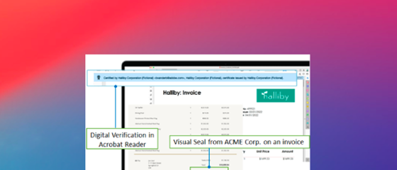

# Tutoriais de API do [!DNL Adobe Acrobat Services]

[!DNL Adobe Acrobat Services] tem seis APIs principais:

* [!DNL Adobe PDF Services API]
* [!DNL Adobe PDF Embed API]
* [!DNL Adobe Document Generation API]
* [!DNL Adobe PDF Electronic Seal API]
* [!DNL Adobe PDF Extract API]
* [!DNL Adobe PDF Accessibility Auto-Tag API]

As duas últimas APIs e seus SDKs estão incluídos no [!DNL Adobe PDF Services API] como parte de uma oferta paga. [!DNL PDF Embed API] é uma oferta gratuita. Essas APIs automatizam a geração, a manipulação e a transformação do conteúdo do documento por meio de um conjunto de serviços da Web modernos baseados em nuvem. Elas ajudam a fornecer experiências mais simples, rápidas e de marca para que você controle a interação do usuário com seus documentos, simplifique os fluxos de trabalho de PDF e promova o uso e a retenção. Estes tutoriais ajudam você a ficar atualizado, fornecendo experiências de marca mais simples e rápidas com as APIs do [!DNL Adobe Acrobat Services].

<table style="table-layout:fixed">
<tr>
  <td>
    
    

      <a href="pdfservices/overview-pdfservices.md"><strong>API de Serviços PDF</strong></a>
      

      APIs PDF com SDKs para node.js, .Net e Java para criar, converter, OCR PDF e muito mais
       
  </td>
  <td>
    
    

      <a href="docgen/overview-docgen.md"><strong>API de geração de documento</strong></a>
      

      Gerar documentos PDF e Word a partir de modelos do Word e dados JSON
       
  </td>  
  <td>
    
    

      <a href="pdfaccessibility/overview-accessibility.md"><strong>API de marca automática de acessibilidade do PDF</strong></a>
      

      Essa API viabilizada por IA marca automaticamente os documentos, facilitando o dimensionamento da acessibilidade do PDF
       
  </td>
  <td>
    
     

      <a href="pdfaccessibility/overview-accessibility.md"><strong>API de Extração de PDF</strong></a>
      

      Desbloqueie a estrutura e os elementos de conteúdo de qualquer PDF com um serviço Web viabilizado pelo aprendizado de máquina do Adobe Sensi
       
  </td>
</tr>
<tr>
  <td>
    
    

      <a href="pdfelectronicseal/overview-electronic-seal.md"><strong>API de selo eletrônico do PDF</strong></a>
      

      Saiba como aplicar um selo eletrônico inviolável a PDF em escala
       
  </td>
  <td>
    
    

      <a href="pdfembed/overview-embed.md"><strong>API de inserção de PDF</strong></a>
      

      API JavaScript gratuita para incorporar PDF de alta fidelidade, permitir colaboração e ver análises
       
  </td>
  <td>
    
    

      <a href="acrobatsign/overview-sign.md"><strong>API DO Acrobat Sign</strong></a>
      

      Integrar assinaturas eletrônicas à sua plataforma ou aplicativo
       
  </td>
   <td>
    
    

      <a href="usecases/overview-usecases.md"><strong>Casos de uso da API de Serviços do Acrobat</strong></a>
      

      Uma grande variedade de casos de uso da API de serviços da Acrobat
       
  </td>
</tr>
</table>
