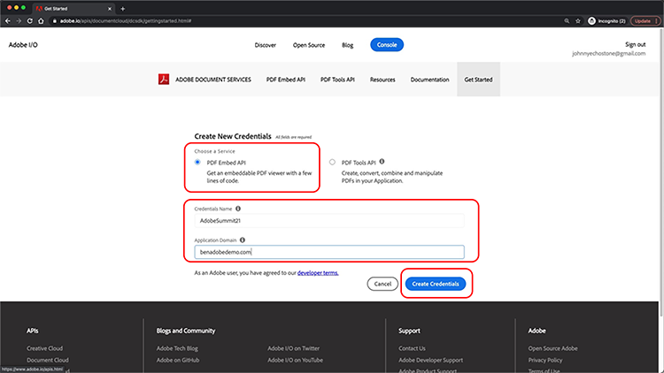
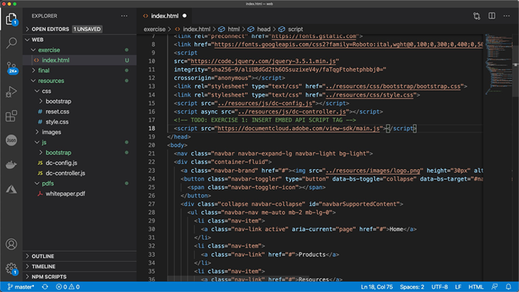

# Controle sua experiência online de PDF e reúna análises

Sua organização publica PDF em seu site? Saiba como usar a API incorporada do Adobe PDF para controlar a aparência, permitir a colaboração e coletar análises sobre como os usuários interagem com PDF, incluindo o tempo gasto em uma página e pesquisas. Para iniciar este tutorial prático de 4 partes, selecione *Introdução à API incorporada do PDF*.

<table style="table-layout:fixed">
<tr>
  <td>
    <a href="controlpdfexperience.md#part1">
        
    </a>
    <div>
    <a href="controlpdfexperience.md#part1"><strong>Parte 1: Introdução à API incorporada do PDF</strong></a>
    </div>
  </td>
  <td>
    <a href="controlpdfexperience.md#part2">
        
    </a>
    <div>
    <a href="controlpdfexperience.md#part2"><strong>Parte 2: Adicionar a API de incorporação PDF a uma página da Web</strong></a>
    </div>
  </td>
  <td>
   <a href="controlpdfexperience.md#part3">
      
   </a>
    <div>
    <a href="controlpdfexperience.md#part3"><strong>Parte 3: Acesso às APIs do Analytics</strong></a>
    </div>
  </td>
  <td>
   <a href="controlpdfexperience.md#part4">
      
   </a>
    <div>
    <a href="controlpdfexperience.md#part4"><strong>Parte 4: Adicionar interatividade com base em eventos</strong></a>
    </div>
  </td>
</tr>
</table>

## Parte 1: Introdução à API incorporada do PDF {#part1}

Na parte 1, saiba como começar a usar tudo o que você precisa para as partes 1 e 3. Você começará obtendo credenciais de API.

**Do que você precisa**

* Recursos do tutorial [baixar](https://github.com/benvanderberg/adobe-pdf-embed-api-tutorial)
* Adobe ID [obter um aqui](https://accounts.adobe.com/br)
* Servidor Web (Node JS, PHP, etc.)
* Conhecimento prático de HTML / JavaScript / CSS

**O que estamos usando**

* Um servidor Web básico (Nó)
* Código do Visual Studio
* GitHub

### Obtendo credenciais

1. Acesse o menu [Site do Adobe.io](https://www.adobe.io/).
1. Clique em **[!UICONTROL Saiba mais]** em Criar experiências envolventes de documentos.

   

   Isso leva você ao [!DNL Adobe Acrobat Services] página inicial.

1. Clique em **[!UICONTROL Começar]** na barra de navegação.

   Você verá uma opção em **Comece a usar o produto [!DNL Acrobat Services] APIs** até **Criar novas credenciais** ou **Gerenciar credenciais existentes**.

1. Clique em **[!UICONTROL Começar]** botão abaixo **[!UICONTROL Criar novas credenciais]**.

   

1. Escolha o **[!UICONTROL PDF Embed API]** e adicione um nome de credencial de sua escolha e um domínio de aplicativo na próxima janela.

   >[!NOTE]
   >
   >Essas credenciais só podem ser usadas no domínio do aplicativo listado aqui. Você pode usar qualquer domínio que escolher.

   

1. Clique em **[!UICONTROL Criar credenciais]**.

   A página final do assistente fornece os detalhes da credencial do cliente. Deixe esta janela aberta para que você possa voltar a ela e copiar a ID do cliente (chave de API) para uso posterior.

1. Clique em **[!UICONTROL Exibir Documentação]** para acessar a documentação e obter informações detalhadas sobre como usar esta API.

   

## Parte 2: Adicionar a API de incorporação PDF a uma página da Web {#part2}

Na parte 2, você aprenderá como incorporar facilmente a API de PDF em uma página da Web. Para fazer isso, use a demonstração online da API incorporada do Adobe PDF para criar nosso código.

### Obter o código do exercício

Criamos código para você utilizar. Embora você possa usar seu próprio código, as demonstrações serão feitas no contexto dos recursos do tutorial. Baixar código de amostra [aqui](https://github.com/benvanderberg/adobe-pdf-embed-api-tutorial).

1. Ir para [[!DNL Adobe Acrobat Services] site](https://www.adobe.io/apis/documentcloud/dcsdk/).

   ![Captura de tela de [!DNL Adobe Acrobat Services] site](assets/ControlPDF_6.png)

1. Clique em **[!UICONTROL APIs]** na barra de navegação, vá para a guia **[!UICONTROL PDF Embed API]** no link suspenso.

   

1. Clique em **[!UICONTROL Experimente a demonstração]**.

   Uma nova janela é exibida com a caixa de proteção de desenvolvedor para a API de PDF incorporada.

   

   Aqui você pode ver as opções para os diferentes modos de visualização.

1. Clique nos diferentes modos de exibição para Janela inteira, Contêiner dimensionado, Em linha e Lightbox.

   

1. Clique em **[!UICONTROL Janela inteira]** modo de visualização e, em seguida, clique no botão **[!UICONTROL Personalizar]** para ativar e desativar as opções.

   

1. Desativar **[!UICONTROL Baixar]** opção PDF.
1. Clique em **[!UICONTROL Gerar código]** para visualizar o código.
1. Copiar **[!UICONTROL ID do cliente]** na janela Credenciais de cliente da Parte 1.

   

1. Abra o **[!UICONTROL Web]** -> **[!UICONTROL resources]** -> **[!UICONTROL js]** -> **[!UICONTROL dc-config.js]** no editor de código.

   Você verá que a variável clientID está lá.

1. Cole suas credenciais do cliente entre as aspas duplas para definir a clientID para sua credencial.

1. Voltar para a visualização do código da sandbox do desenvolvedor.

1. Copie a segunda linha que tem o script Adobe:

   ```
   <script src=https://documentccloud.adobe.com/view-sdk/main.js></script>
   ```

   

1. Acesse o editor de código e abra o **[!UICONTROL Web]** -> **[!UICONTROL exercício]** -> **[!UICONTROL index.html]** arquivo.

1. Cole o código de script no `<head>` do processo na linha 18 sob o comentário que diz: **TODO: EXERCÍCIO 1: INSERIR TAG DE SCRIPT DE API INCORPORADA**.

   

1. Volte para a visualização do código da sandbox do desenvolvedor e copie a primeira linha de código que:

   ```
   <div id="adobe-dc-view"></div>
   ```

   

1. Acesse o editor de código e abra o **[!UICONTROL Web]** -> **[!UICONTROL exercício]** -> **[!UICONTROL index.html]** arquivo novamente.

1. Cole o `<div>` código na `<body>` do processo na linha 67 sob o comentário que diz: **TODO: EXERCÍCIO 1: INSERIR CÓDIGO DE API INCORPORADO DE PDF**.

   

1. Voltar para a visualização de código da sandbox do desenvolvedor e copiar as linhas de código da `<script>` abaixo:

   ```
   <script type="text/javascript">
       document.addEventListener("adobe_dc_view_sdk.ready",             function(){ 
           var adobeDCView = new AdobeDC.View({clientId:                     "<YOUR_CLIENT_ID>", divId: "adobe-dc-view"});
           adobeDCView.previewFile({
               content:{location: {url: "https://documentcloud.                adobe.com/view-sdk-demo/PDFs/Bodea Brochure.                    pdf"}},
               metaData:{fileName: "Bodea Brochure.pdf"}
           }, {showDownloadPDF: false});
       });
   </script>
   ```

1. Acesse o editor de código e abra o **[!UICONTROL Web]** -> **[!UICONTROL exercício]** -> **[!UICONTROL index.html]** arquivo novamente.

1. Cole o `<script>` código na `<body>` do processo na linha 68 sob o `<div>` tag.

1. Modifique a linha 70 do mesmo **index.html** para incluir a variável clientID criada anteriormente.

   

1. Modifique a linha 72 do mesmo **index.html** arquivo para atualizar o local do arquivo de PDF para usar um arquivo local.

   Há um guia disponível nos arquivos do tutorial em **/resources/pdfs/whitepaper.pdf**.

1. Salve seus arquivos modificados e visualize seu site navegando até **`<your domain>`/Summit21/web/activity/**.

   Você deverá ver o white paper técnico renderizar em modo de janela inteira no navegador.

## Parte 3: Acesso às APIs do Analytics {#part3}

Agora que você criou com sucesso uma página da Web que tem a API de PDF incorporado renderizando um PDF, na parte 3, agora você pode explorar como usar eventos JavaScript para medir a análise e entender como os usuários estão usando PDF.

### Encontrar documentação

Há vários eventos JavaScript diferentes disponíveis como parte da API de incorporação de PDF. Você pode acessá-los em [!DNL Adobe Acrobat Services] documentação.

1. Navegue até a guia [documentação](https://www.adobe.io/apis/documentcloud/dcsdk/docs.html) local.
1. Revise os diferentes tipos de evento disponíveis como parte da API. Eles são úteis para referência e também serão úteis para seus futuros projetos.

   

1. Copie o código de exemplo listado no site.

   Use isso como base para nosso código e modifique-o.

   

   ```
   const eventOptions = {
     //Pass the PDF analytics events to receive.
      //If no event is passed in listenOn, then all PDF         analytics events will be received.
   listenOn: [ AdobeDC.View.Enum.PDFAnalyticsEvents.    PAGE_VIEW, AdobeDC.View.Enum.PDFAnalyticsEvents.DOCUMENT_DOWNLOAD],
     enablePDFAnalytics: true
   }
   
   
   adobeDCView.registerCallback(
     AdobeDC.View.Enum.CallbackType.EVENT_LISTENER,
     function(event) {
       console.log("Type " + event.type);
       console.log("Data " + event.data);
     }, eventOptions
   );
   ```

1. Localize a seção de código adicionada anteriormente que se parece com a abaixo e anexe o código acima após este código na **index.html**:

   

1. Carregue a página no navegador da Web e abra o Console para exibir as saídas do console dos diferentes eventos enquanto interage com o visualizador de PDF.

   

   

### Adicionar opção para capturar eventos

Agora que os eventos estão sendo exportados para console.log, vamos alterar o comportamento com base em quais eventos. Para fazer isso, use um exemplo de switch.

1. Navegue até **snippets/eventsSwitch.js** e copie o conteúdo do arquivo no código do tutorial.

   

1. Cole o código na função de ouvinte de eventos.

   

1. Confirme se a saída do console ocorre corretamente quando a página é carregada e se você interage com o Visualizador de PDF.

### Adobe Analytics

Para adicionar suporte do Adobe Analytics ao visualizador, siga as instruções documentadas no site.

>[!IMPORTANT]
>
>Sua página da Web já precisa ter o Adobe Analytics carregado na página no cabeçalho.

Navegue até a guia [Documentação do Adobe Analytics](https://www.adobe.com/devnet-docs/dcsdk_io/viewSDK/howtodata.html#adobe-analytics) e revise se o Adobe Analytics já está ativado em sua página da Web. Siga as instruções para configurar um conjunto de relatórios.

### Google Analytics


A API incorporada do Adobe PDF fornece integração imediata com o Adobe Analytics. No entanto, como todos os eventos estão disponíveis como eventos JavaScript, é possível integrar com Google Analytics capturando eventos PDF e usando a função ga() para adicionar o evento ao Adobe Analytics.

1. Navegue até **snippets/eventsSwitchGA.js** para ver como integrar com Google Analytics.
1. Revise e use esse código como exemplo se a página da Web for rastreada usando o Adobe Analytics e já estiver incorporada à página da Web.

   

## Parte 4: Adicionar interatividade com base em eventos {#part4}

Na parte 4, você explicará como colocar em camadas no topo do visualizador de PDF um paywall que é exibido quando você passa pela segunda página.

### Exemplo do Paywall

Navegue até este [exemplo de um PDF atrás de um paywall](https://www3.technologyevaluation.com/research/white-paper/the-forrester-wave-digital-decisioning-platforms-q4-2020.html). Neste exemplo, você aprenderá a adicionar interatividade sobre uma experiência de visualização de PDF.

### Adicionar código de paywall

1. Acesse snippets/paywallCode.html e copie o conteúdo.
1. Procurar por `<!-- TODO: EXERCISE 3: INSERT PAYWALL CODE -->` em exercise/index.html.

   

1. Cole o código copiado após o comentário.
1. Ir para **snippets/paywallCode.js** e copie o conteúdo.

   

1. Cole o código nesse local.

### Experimente a demonstração com o Paywall

Agora você pode ver a demonstração.

1. Recarregar **index.html** no seu site.
1. Role para baixo até uma página > 2.
1. Mostrar a caixa de diálogo que aparece para desafiar o usuário após a segunda página.

   

## Recursos adicionais

Recursos adicionais podem ser encontrados [aqui](https://www.adobe.io/apis/documentcloud/dcsdk/docs.html).
