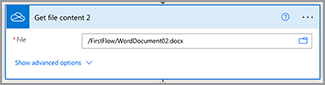

# Crie seu primeiro fluxo no Microsoft Power Automate

Saiba como criar seu primeiro fluxo no [Microsoft Power Automate](https://flow.microsoft.com) usando o [Serviços da Adobe PDF](https://us.flow.microsoft.com/pt-br/connectors/shared_adobepdftools/adobe-pdf-services/) conector.

Neste tutorial prático, aprenda a:

* Converter documentos do Word em PDF
* Combinar documentos PDF em um PDF
* Protect um documento PDF com uma senha

## Preparação

### O que você precisa

* **Credenciais de avaliação ou produção para os Serviços da Adobe PDF**
Saiba mais sobre como obter e configurar credenciais no Microsoft Power Automate [aqui](https://experienceleague.adobe.com/docs/document-services/tutorials/pdfservices/getting-credentials-power-automate.html).
* **Microsoft Power Automate com conectores Premium**
Saiba como verificar o nível de licenciamento do Power Automate [aqui](https://docs.microsoft.com/en-us/power-platform/admin/power-automate-licensing/types).
* **OneDrive**
O conector de armazenamento do OneDrive é usado neste tutorial, mas qualquer conector de armazenamento pode ser substituído.

### Arquivos de amostra

Há dois [arquivos de amostra](assets/sample-assets.zip) que você precisa descompactar e carregar no OneDrive:

* WordDocument01.docx
* WordDocument02.docx

### Obtendo credenciais

Para concluir este tutorial, você precisa das suas credenciais já configuradas no Microsoft Power Automate para serviços do Adobe PDF. Se você não concluiu essa etapa, consulte o [instruções aqui](https://experienceleague.adobe.com/docs/document-services/tutorials/pdfservices/getting-credentials-power-automate.html).

## Parte 1: Criar novo fluxo e converter Word em PDF

### Crie o fluxo

Nesta parte, você cria um novo fluxo em [Microsoft Power Automate](https://flow.microsoft.com) usando um fluxo instantâneo, adicione parâmetros, obtenha seus arquivos do OneDrive e converta-os em PDF.

1. Navegue até [Microsoft Power Automate](https://flow.microsoft.com) e faça logon com suas credenciais.
1. Na barra lateral, selecione **[!UICONTROL Criar]**.

   

1. Selecionar **[!UICONTROL Fluxo instantâneo]**.
1. Dê um nome ao seu fluxo.
1. Sob *Escolher como acionar este fluxo*, selecione **[!UICONTROL Acionar manualmente um fluxo]**.
1. Selecione **[!UICONTROL Criar]**.

### Obter conteúdo de arquivos

Em seguida, obtenha o conteúdo dos arquivos de amostra.

>[!PREREQUISITES]
>
>Se você não tiver carregado o [arquivos de amostra](assets/sample-assets.zip) no OneDrive, descompacte-os e carregue-os.


1. No [Power Automate](https://flow.microsoft.com), selecione **[!UICONTROL + Nova etapa]**.
1. Procurar *OneDrive* na barra de pesquisa.
1. Escolha sua conta pessoal ou de trabalho do OneDrive selecionando **[!UICONTROL OneDrive for Business]** ou **[!UICONTROL OneDrive]**.
1. Procurar *Obter conteúdo do arquivo* na barra de pesquisa.
1. No menu **[!UICONTROL Arquivo]** selecione o ícone Pasta para navegar até o *WordDocument01.docx* no OneDrive.

   

### Converter arquivo em PDF

Agora que você tem o conteúdo do arquivo, pode converter o documento em PDF.

1. No [Power Automate](https://flow.microsoft.com), selecione **[!UICONTROL + Nova etapa]**.
1. Procurar *Serviços da Adobe PDF* na barra de pesquisa.
1. Selecionar **[!UICONTROL Serviços da Adobe PDF]**.
1. Procurar *Converter Word em PDF* na barra de pesquisa.
1. No **[!UICONTROL Nome do arquivo]**, nomeie o arquivo como desejado, mas ele deve terminar com *.docx*. Essa extensão é necessária para converter documentos do Word em PDF.
1. Coloque o cursor no **[!UICONTROL Conteúdo do Arquivo]** campo.
1. Usando o **[!UICONTROL Conteúdo dinâmico]** , selecione **[!UICONTROL Conteúdo do arquivo]**.

   

### Salve o arquivo no OneDrive

Depois que o documento for gerado, salve o arquivo no OneDrive.

1. No [Microsoft Power Automate](https://flow.microsoft.com), selecione **[!UICONTROL + Nova etapa]**.
1. Procurar *OneDrive* na barra de pesquisa.
1. Escolha sua conta pessoal ou de trabalho do OneDrive selecionando **[!UICONTROL OneDrive for Business]** ou **[!UICONTROL OneDrive]**.
1. Procurar *Obter conteúdo do arquivo* na barra de pesquisa.
1. Procurar *Criar arquivo* na barra de pesquisa.
1. Selecionar **[!UICONTROL Criar arquivo]**.
1. No menu **[!UICONTROL Caminho da Pasta]** , selecione o ícone de pasta para especificar onde salvar o arquivo no OneDrive.
1. No **[!UICONTROL Nome do arquivo]**, nomeie o arquivo como desejado, mas ele deve terminar com *.docx*. Essa extensão é necessária para converter documentos do Word em PDF.
1. No menu **[!UICONTROL Conteúdo do Arquivo]** , use **[!UICONTROL Conteúdo dinâmico]** para inserir a variável Conteúdo do arquivo PDF.

### Tentar fluxo

1. No canto superior esquerdo, selecione **[!UICONTROL Sem título]** para renomear o fluxo.
1. Selecione **[!UICONTROL Salvar]**.
1. Selecionar **[!UICONTROL Teste]**.
1. Selecionar **[!UICONTROL Manualmente]** e depois **[!UICONTROL Salvar e testar]**.
1. Selecione **[!UICONTROL Continuar]**.
1. Selecionar **[!UICONTROL Executar fluxo]**.

Na pasta do OneDrive, agora você deve ver o PDF convertido.


## Parte 2: Gerar um documento dinâmico a partir de um modelo

A próxima parte baseia-se na Parte 1 e utiliza o *Gerar documento a partir do Word* modelo para mesclar dados dinamicamente no documento.

### Revisar o modelo de documento

Abrir *WordDocument02_.docx* de seus arquivos de amostra no OneDrive. O documento do Word contém várias tags de texto diferentes que representam locais onde os dados são preenchidos no documento.

### Adicionar parâmetros ao acionador

Para ter dados dinâmicos enviados para o documento, você precisa criar alguns parâmetros para que o acionador solicite valores.

1. Ao editar seu fluxo, selecione **[!UICONTROL Acionar manualmente um fluxo]** para expandir a ação.
1. Selecionar **[!UICONTROL Adicionar uma entrada]**.
1. Selecionar **[!UICONTROL Texto]**.
1. Nomeie o campo *Nome*.

Repita as etapas 2 a 4 para adicionar os seguintes campos:

* Sobrenome
* Salário


### Obter conteúdo de arquivo de um modelo

Para gerar um documento, primeiro é necessário obter o conteúdo do arquivo do modelo do Word.

1. No Power Automate, selecione + **[!UICONTROL Nova etapa]**.
1. Procurar *OneDrive* na barra de pesquisa.
1. Escolha sua conta pessoal ou de trabalho do OneDrive selecionando **[!UICONTROL OneDrive for Business]** ou **[!UICONTROL OneDrive]**.
1. Procurar *Obter conteúdo do arquivo* na barra de pesquisa.
1. No menu **[!UICONTROL Arquivo]** selecione o ícone Pasta para navegar até o *WordDocument02.docx* no OneDrive.



### Gerar documento a partir do modelo

1. No Power Automate, selecione **[!UICONTROL + Nova etapa]**.
1. Procurar *Serviços da Adobe PDF* na barra de pesquisa.
1. Selecionar **[!UICONTROL Serviços da Adobe PDF]**.
1. Selecione o **[!UICONTROL Gerar documento a partir de um modelo do Word]** ação .
1. No menu **[!UICONTROL Nome do Arquivo de Modelo]** , nomeie o arquivo como desejado, mas ele deve terminar com *.docx*.

#### Mesclar dados

Usando o *Gerar documento a partir de um modelo do Word* ação, você pode mesclar dados no documento a partir de qualquer uma das diferentes variáveis anteriormente no fluxo usando o conteúdo dinâmico.

Copie os dados JSON abaixo no **Mesclar Dados** campo:

```
{
    "FirstName": "",
    "LastName": "",
    "Salary": ""
}
```

1. Posicione o cursor no campo entre as duas aspas do *FirstName* valor.
1. Usando o **[!UICONTROL Conteúdo dinâmico]** , insira o *Nome* valor da ação Acionar manualmente um fluxo.

   

1. Repita as etapas 7 a 8 para a **[!UICONTROL LastName]** e **[!UICONTROL Salário]** campos.
1. No menu **[!UICONTROL Conteúdo do Arquivo de Modelo]** , use o **[!UICONTROL Conteúdo dinâmico]** para inserir o **[!UICONTROL Conteúdo do arquivo]** valor do *Obter conteúdo do arquivo* etapa.


>[!TIP]
>
>O *Gerar documento a partir de um modelo do Word* a ação usa a API de geração de documento Adobe. Se quiser saber mais sobre como criar modelos, aqui estão alguns recursos:
>
>* [Saiba mais sobre a geração de documentos do Adobe](https://developer.adobe.com/document-services/apis/doc-generation/)
>* [Marcador de geração de documento Adobe para Microsoft Word](https://appsource.microsoft.com/en-US/product/office/WA200002654)
>* [Documentação da API de geração de documento Adobe](https://developer.adobe.com/document-services/docs/overview/document-generation-api/)


### Salve o arquivo no OneDrive

Depois que o documento for gerado, você poderá salvar o arquivo no OneDrive.

1. No Power Automate, selecione **+ [!UICONTROL Nova etapa]**.
1. Procurar *OneDrive* na barra de pesquisa.
1. Escolha sua conta pessoal ou de trabalho do OneDrive selecionando **[!UICONTROL OneDrive for Business]** ou **[!UICONTROL OneDrive]**.
1. Procurar *Criar arquivo* na barra de pesquisa.
1. Selecionar **[!UICONTROL Criar arquivo]**.
1. No menu **[!UICONTROL Caminho da Pasta]** , selecione o ícone de pasta para especificar onde salvar o arquivo no OneDrive.
1. No menu **[!UICONTROL Nome do arquivo]** defina o nome do arquivo. Como a saída é um PDF, o nome do arquivo deve terminar com a extensão .pdf.
1. Use o **[!UICONTROL Conteúdo dinâmico]** para inserir a variável Conteúdo do arquivo PDF no **[!UICONTROL Conteúdo do Arquivo]** campo.

### Tentar fluxo


1. Selecione **[!UICONTROL Salvar]**.
1. Selecionar **[!UICONTROL Teste]**.
1. Selecionar **[!UICONTROL Manualmente]** e depois **[!UICONTROL Salvar e testar]**.
1. Selecione **[!UICONTROL Continuar]**.
1. Inserir valores para *Nome*, *Sobrenome* e *Salário*.
1. Selecionar **[!UICONTROL Executar fluxo]**.

Na pasta do OneDrive, agora você verá um PDF gerado do documento do Word. Ao abrir o documento PDF no OneDrive, você verá que os dados foram mesclados nos locais de tags de texto.


## Parte 3: Combine PDF em um

Agora que você gerou e converteu um documento do Word em um PDF, a próxima parte é combinar vários documentos do PDF.

>[!NOTE]
>
>Nas ações anteriores, você salvou uma cópia do documento como um arquivo no OneDrive. Para usar ferramentas como Mesclar PDF, não é necessário salvar o arquivo no OneDrive. Em vez disso, você pode passar a saída diretamente de uma ação para a seguinte, o que é melhor do que salvar no OneDrive após cada ação. Mas, para fins de demonstração, você está salvando esses arquivos no OneDrive.

### Adicionar etapa PDF de mesclagem

1. Ao editar seu fluxo, selecione **[!UICONTROL + Próxima etapa]** para adicionar uma ação ao final do fluxo.
1. Procurar *Serviços da Adobe PDF* na barra de pesquisa.
1. Selecionar **[!UICONTROL Serviços da Adobe PDF]**.
1. Selecione o **[!UICONTROL Mesclar PDF]** ação.
1. No menu **[!UICONTROL Nome do Arquivo PDF de Mesclagem]** insira o nome de arquivo desejado (ou seja,*CombinedDocument.pdf*).
1. No menu **[!UICONTROL Conteúdo do Arquivo -1]** , use o **[!UICONTROL Conteúdo dinâmico]** para inserir o *Conteúdo do Arquivo PDF* valor do **[!UICONTROL Converter Word em PDF]** etapa.
1. Para adicionar o próximo documento, selecione **+ [!UICONTROL adicionar novo item]**.
1. No menu **[!UICONTROL Conteúdo do Arquivo - 2]** , use o **[!UICONTROL Conteúdo dinâmico]** para inserir o **[!UICONTROL Conteúdo do Arquivo de Saída]** valor do *Gerar documento a partir de um modelo do Word* etapa.


### Salvar PDF mesclado no OneDrive

Depois que o documento for combinado, você poderá salvá-lo no OneDrive.

1. No Power Automate, selecione **+ [!UICONTROL Nova etapa]**.
1. Procurar *OneDrive* na barra de pesquisa.
1. Escolha sua conta pessoal ou de trabalho do OneDrive selecionando **[!UICONTROL OneDrive for Business]** ou **[!UICONTROL OneDrive]**.
1. Procurar *Criar arquivo* na barra de pesquisa.
1. Selecionar **[!UICONTROL Criar arquivo]**.
1. No menu **[!UICONTROL Caminho da Pasta]** , selecione o ícone de pasta para especificar onde salvar o arquivo no OneDrive.
1. No menu **[!UICONTROL Nome do arquivo]** defina o nome do arquivo. Como a saída é um PDF, o nome do arquivo deve terminar com .pdf.
1. No menu **[!UICONTROL Conteúdo do Arquivo]** , use **[!UICONTROL Conteúdo dinâmico]** para inserir o *Conteúdo do Arquivo PDF* valor do **[!UICONTROL Mesclar PDF]** etapa.

   

### Tentar fluxo

1. Selecione **[!UICONTROL Salvar]**.
1. Selecionar **[!UICONTROL Teste]**.
1. Selecionar **[!UICONTROL Manualmente]** e depois **[!UICONTROL Salvar e testar]**.
1. Selecione **[!UICONTROL Continuar]**.
1. Inserir valores para *Nome*, *Sobrenome* e *Salário*.
1. Selecionar **[!UICONTROL Executar fluxo]**.

Na pasta do OneDrive, você verá o PDF combinado com páginas do primeiro e do segundo documento.

## Parte 4: Documento do Protect PDF

Depois de gerar o documento, você pode protegê-lo da edição, incluindo uma etapa adicional antes de salvar no OneDrive.

### Proteger PDFs

1. Ao editar seu fluxo no Power Automate, selecione **+** entre as **[!UICONTROL Mesclar PDF]** e a **[!UICONTROL Criar arquivo 3]** ação.

   

1. Selecionar **[!UICONTROL Adicionar uma ação]**.
1. Procurar *Serviços da Adobe PDF* na barra de pesquisa.
1. Selecionar **[!UICONTROL Serviços da Adobe PDF]**.
1. Selecione o **[!UICONTROL PDF Protect da visualização]** ação.
1. No menu **[!UICONTROL Nome do arquivo]** defina o nome como o nome desejado, desde que ele termine com a extensão .pdf.
1. Defina o **[!UICONTROL Senha]** à senha especificada para abrir o documento.
1. No menu **[!UICONTROL Conteúdo do Arquivo]** , use o **[!UICONTROL Conteúdo dinâmico]** para inserir o *Conteúdo do Arquivo PDF* valor do **[!UICONTROL Mesclar PDF]** etapa.

### Atualizar salvamento no OneDrive

Quando o documento estiver protegido, você poderá salvar o arquivo no OneDrive. Neste exemplo, você está atualizando o **Criar arquivo 3** ação com um novo *Conteúdo do Arquivo* valor.

1. Selecione o cursor no menu **[!UICONTROL Conteúdo do Arquivo]** no campo **[!UICONTROL Criar arquivo 3]** ação.
1. Use o **[!UICONTROL Conteúdo dinâmico]** para inserir o *Conteúdo do Arquivo PDF* valor do **PDF Protect da visualização** etapa.

### Tentar fluxo

1. Selecione **[!UICONTROL Salvar]**.
1. Selecionar **[!UICONTROL Teste]**.
1. Selecionar **[!UICONTROL Manualmente]** e depois **[!UICONTROL Salvar e testar]**.
1. Selecione **[!UICONTROL Continuar]**.
1. Inserir valores para *Nome*, *Sobrenome* e *Salário*.
1. Selecionar **[!UICONTROL Executar fluxo]**.

Na pasta do OneDrive, você verá o PDF combinado que agora solicita que você insira uma senha para exibir o documento.

## Próximas etapas

Neste tutorial, você converteu um documento do Word em um PDF, gerou um documento com base em dados, mesclou documentos e os protegeu com uma senha. Para saber mais, explore algumas das outras ações disponíveis no conector de serviços da Adobe PDF no Microsoft Power Automate:

* Veja os modelos pré-criados disponíveis no Microsoft Power Automate.
* Aprenda com [artigos](https://medium.com/adobetech/tagged/microsoft-power-automate) no blog Adobe Tech.
* Revisar [documentação](https://developer.adobe.com/document-services/docs/overview/document-generation-api/) para a API de geração de documentos do Adobe.
