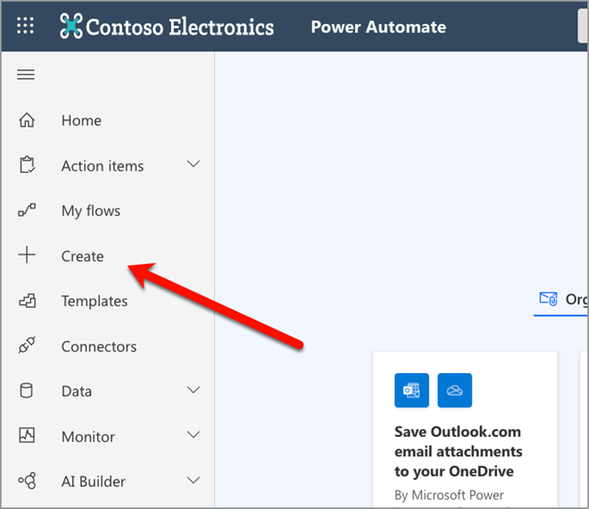

# Crie seu primeiro fluxo no Microsoft Power Automate

Saiba como criar seu primeiro fluxo no [Microsoft Power Automate](https://flow.microsoft.com) usando o [Serviços da Adobe PDF](https://us.flow.microsoft.com/pt-br/connectors/shared_adobepdftools/adobe-pdf-services/) conector.

Neste tutorial prático, saiba como:

* Converter documentos do Word em PDF
* Combine documentos PDF em um PDF
* Protect um documento PDF com uma senha

## Preparação

### Do que você precisa

* **Credenciais de avaliação ou produção dos Serviços do Adobe PDF**
Saiba mais sobre como obter e configurar credenciais no Microsoft Power Automate [aqui](https://experienceleague.adobe.com/docs/document-services/tutorials/pdfservices/getting-credentials-power-automate.html).
* **Microsoft Power Automate com conectores Premium**
Saiba como verificar o nível de licenciamento do Power Automate [aqui](https://docs.microsoft.com/en-us/power-platform/admin/power-automate-licensing/types).
* **OneDrive**
O conector de armazenamento do OneDrive é usado neste tutorial, mas qualquer conector de armazenamento pode ser substituído.

### Arquivos de amostra

Há dois [arquivos de amostra](assets/sample-assets.zip) que você precisa descompactar e carregar no OneDrive:

* WordDocument01.docx
* WordDocument02.docx

### Obtendo credenciais

Para concluir este tutorial, você precisa de suas credenciais já configuradas no Microsoft Power Automate para Serviços do Adobe PDF. Se você não concluiu essa etapa, consulte o [instruções aqui](https://experienceleague.adobe.com/docs/document-services/tutorials/pdfservices/getting-credentials-power-automate.html).

## Parte 1: Criar novo fluxo e converter Word em PDF

### Criar o fluxo

Nesta parte, você cria um novo fluxo em [Microsoft Power Automate](https://flow.microsoft.com) usando um fluxo instantâneo, adicione parâmetros, obtenha seus arquivos do OneDrive e converta-os em PDF.

1. Navegue até [Microsoft Power Automate](https://flow.microsoft.com) e faça logon com suas credenciais.
1. Na barra lateral, selecione **[!UICONTROL Criar]**.

   

1. Selecionar **[!UICONTROL Fluxo instantâneo]**.
1. Dê um nome ao seu fluxo.
1. Em *Escolha como acionar este fluxo*, selecione **[!UICONTROL Acionar um fluxo manualmente]**.
1. Selecione **[!UICONTROL Criar]**.

### Obter o conteúdo dos arquivos

Em seguida, obtenha o conteúdo dos arquivos de amostra.

>[!PREREQUISITES]
>
>Se você não carregou o [arquivos de amostra](assets/sample-assets.zip) no OneDrive, descompacte-os e faça upload deles.


1. Entrada [Power Automate](https://flow.microsoft.com), selecione **[!UICONTROL + Nova etapa]**.
1. Procurar por *OneDrive* na barra de pesquisa.
1. Escolha sua conta pessoal ou de trabalho do OneDrive selecionando **[!UICONTROL OneDrive for Business]** ou **[!UICONTROL OneDrive]**.
1. Procurar por *Obter conteúdo do arquivo* na barra de pesquisa.
1. No menu **[!UICONTROL Arquivo]** , selecione o ícone Pasta para navegar até o *WordDocument01.docx* no OneDrive.

   

### Converter arquivo em PDF

Agora que você tem o conteúdo do arquivo, pode converter o documento em PDF.

1. Entrada [Power Automate](https://flow.microsoft.com), selecione **[!UICONTROL + Nova etapa]**.
1. Procurar por *Serviços da Adobe PDF* na barra de pesquisa.
1. Selecionar **[!UICONTROL Serviços da Adobe PDF]**.
1. Procurar por *Converter Word em PDF* na barra de pesquisa.
1. Entrada **[!UICONTROL Nome do arquivo]**, nomeie o arquivo conforme desejado, mas ele deve terminar com *.docx*. Essa extensão é necessária para converter documentos do Word em PDF.
1. Posicione o cursor no **[!UICONTROL Conteúdo do arquivo]** campo.
1. Usando o **[!UICONTROL Conteúdo dinâmico]** painel, selecione **[!UICONTROL Conteúdo do arquivo]**.

   

### Salve o arquivo no OneDrive

Depois que o documento for gerado, salve o arquivo de volta no OneDrive.

1. Entrada [Microsoft Power Automate](https://flow.microsoft.com), selecione **[!UICONTROL + Nova etapa]**.
1. Procurar por *OneDrive* na barra de pesquisa.
1. Escolha sua conta pessoal ou de trabalho do OneDrive selecionando **[!UICONTROL OneDrive for Business]** ou **[!UICONTROL OneDrive]**.
1. Procurar por *Obter conteúdo do arquivo* na barra de pesquisa.
1. Procurar por *Criar arquivo* na barra de pesquisa.
1. Selecionar **[!UICONTROL Criar arquivo]**.
1. No menu **[!UICONTROL Caminho da Pasta]** , selecione o ícone de pasta para especificar onde salvar o arquivo no OneDrive.
1. Entrada **[!UICONTROL Nome do arquivo]**, nomeie o arquivo conforme desejado, mas ele deve terminar com *.docx*. Essa extensão é necessária para converter documentos do Word em PDF.
1. No menu **[!UICONTROL Conteúdo do arquivo]** , use **[!UICONTROL Conteúdo dinâmico]** para inserir a variável de Conteúdo de Arquivo PDF.

### Tentar fluxo

1. No canto superior esquerdo, selecione **[!UICONTROL Sem título]** para renomear o fluxo.
1. Clique em **[!UICONTROL Salvar]**.
1. Selecionar **[!UICONTROL Teste]**.
1. Selecionar **[!UICONTROL Manualmente]** e depois **[!UICONTROL Salvar e testar]**.
1. Selecione **[!UICONTROL Continuar]**.
1. Selecionar **[!UICONTROL Executar Fluxo]**.

Na pasta do OneDrive, agora você deve ver o PDF convertido.


## Parte 2: Gerar um documento dinâmico usando um modelo

A presente parte baseia-se na Parte 1 e utiliza a *Gerar documento a partir do Word* modelo para mesclar dados dinamicamente em seu documento.

### Revise o modelo de documento

Abrir *WordDocument02_.docx* de seus arquivos de amostra no OneDrive. O documento do Word contém várias tags de texto diferentes que representam os locais onde os dados são preenchidos no documento.

### Adicionar parâmetros ao gatilho

Para que os dados dinâmicos sejam inseridos no documento, você precisa criar alguns parâmetros para que o acionador solicite valores.

1. Ao editar o fluxo, selecione **[!UICONTROL Acionar um fluxo manualmente]** para expandir a ação.
1. Selecionar **[!UICONTROL Adicionar uma entrada]**.
1. Selecionar **[!UICONTROL Texto]**.
1. Nomeie o campo *Nome*.

Repita as etapas 2 e 4 para adicionar os seguintes campos:

* Sobrenome
* Salário


### Obter conteúdo de arquivo de um modelo

Para gerar um documento, primeiro você precisa obter o conteúdo do arquivo do modelo do Word.

1. No Power Automate, selecione + **[!UICONTROL Nova etapa]**.
1. Procurar por *OneDrive* na barra de pesquisa.
1. Escolha sua conta pessoal ou de trabalho do OneDrive selecionando **[!UICONTROL OneDrive for Business]** ou **[!UICONTROL OneDrive]**.
1. Procurar por *Obter conteúdo do arquivo* na barra de pesquisa.
1. No menu **[!UICONTROL Arquivo]** , selecione o ícone Pasta para navegar até o *WordDocument02.docx* no OneDrive.


### Gerar documento a partir do modelo

1. No Power Automate, selecione **[!UICONTROL + Nova etapa]**.
1. Procurar por *Serviços da Adobe PDF* na barra de pesquisa.
1. Selecionar **[!UICONTROL Serviços da Adobe PDF]**.
1. Selecione o **[!UICONTROL Gerar documento a partir do modelo do Word]** ação.
1. No menu **[!UICONTROL Nome do arquivo de modelo]** , nomeie o arquivo conforme desejado, mas deve terminar com *.docx*.

#### Mesclar dados

Usando o *Gerar documento a partir do modelo do Word* , você pode mesclar dados em seu documento a partir de qualquer uma das diferentes variáveis anteriormente no fluxo, usando o Conteúdo dinâmico.

Copie os dados JSON abaixo na **Mesclar Dados** campo:

```
{
    "FirstName": "",
    "LastName": "",
    "Salary": ""
}
```

1. Coloque o cursor no campo entre as duas aspas do *FirstName* valor.
1. Usando o **[!UICONTROL Conteúdo dinâmico]** , insira o *Nome* valor do acionador Manualmente aciona uma ação de fluxo.

   

1. Repita as etapas de 7 a 8 para a **[!UICONTROL LastName]** e **[!UICONTROL Salário]** campos.
1. No menu **[!UICONTROL Conteúdo do arquivo de modelo]** , use o **[!UICONTROL Conteúdo dinâmico]** painel para inserir o **[!UICONTROL Conteúdo do arquivo]** valor do *Obter conteúdo do arquivo* etapa.


>[!TIP]
>
>O *Gerar documento a partir do modelo do Word* a ação usa a API de geração de documento Adobe. Se você quiser saber mais sobre como criar modelos, veja alguns recursos:
>
>* [Saiba mais sobre a geração de documento Adobe](https://developer.adobe.com/document-services/apis/doc-generation/)
>* [Marcador de geração de documento Adobe para Microsoft Word](https://appsource.microsoft.com/en-US/product/office/WA200002654)
>* [Documentação da API de geração de documento Adobe](https://developer.adobe.com/document-services/docs/overview/document-generation-api/)

### Salve o arquivo no OneDrive

Depois que o documento for gerado, você poderá salvar o arquivo novamente no OneDrive.

1. No Power Automate, selecione **+ [!UICONTROL Nova etapa]**.
1. Procurar por *OneDrive* na barra de pesquisa.
1. Escolha sua conta pessoal ou de trabalho do OneDrive selecionando **[!UICONTROL OneDrive for Business]** ou **[!UICONTROL OneDrive]**.
1. Procurar por *Criar arquivo* na barra de pesquisa.
1. Selecionar **[!UICONTROL Criar arquivo]**.
1. No menu **[!UICONTROL Caminho da Pasta]** , selecione o ícone de pasta para especificar onde salvar o arquivo no OneDrive.
1. No menu **[!UICONTROL Nome do arquivo]** , defina o nome do arquivo. Como a saída é um PDF, o nome do arquivo deve terminar com a extensão .pdf.
1. Use o **[!UICONTROL Conteúdo dinâmico]** para inserir a variável de Conteúdo de Arquivo PDF no **[!UICONTROL Conteúdo do arquivo]** campo.

### Tentar fluxo


1. Clique em **[!UICONTROL Salvar]**.
1. Selecionar **[!UICONTROL Teste]**.
1. Selecionar **[!UICONTROL Manualmente]** e depois **[!UICONTROL Salvar e testar]**.
1. Selecione **[!UICONTROL Continuar]**.
1. Inserir valores para *Nome*, *Sobrenome* e *Salário*.
1. Selecionar **[!UICONTROL Executar Fluxo]**.

Na pasta do OneDrive, agora você vê um PDF gerado a partir do documento do Word. Ao abrir o documento do PDF no OneDrive, você vê que os dados foram mesclados nos locais da tag de texto.


## Parte 3: Combine PDF em um

Agora que você gerou e converteu um documento do Word em um PDF, a próxima parte é combinar vários documentos do PDF juntos.

>[!NOTE]
>
>Nas ações anteriores, você salvou uma cópia do documento como um arquivo no OneDrive. Para usar ferramentas como Mesclar PDF, não é necessário salvar o arquivo no OneDrive. Em vez disso, você pode passar a saída diretamente de uma ação para a seguinte, o que é melhor do que salvar no OneDrive após cada ação. Mas, para fins de demonstração, você está salvando esses arquivos no OneDrive.

### Adicionar etapa PDF de mesclagem

1. Ao editar o fluxo, selecione **[!UICONTROL + Próxima etapa]** para adicionar uma ação no final do fluxo.
1. Procurar por *Serviços da Adobe PDF* na barra de pesquisa.
1. Selecionar **[!UICONTROL Serviços da Adobe PDF]**.
1. Selecione o **[!UICONTROL Mesclar PDF]** ação.
1. No menu **[!UICONTROL Mesclar nome do arquivo PDF]** digite o nome de arquivo desejado (ou seja,*CombinedDocument.pdf*).
1. No menu **[!UICONTROL Conteúdo do Arquivo -1]** , use o **[!UICONTROL Conteúdo dinâmico]** painel para inserir o *Conteúdo do Arquivo PDF* valor do **[!UICONTROL Converter Word em PDF]** etapa.
1. Para adicionar o próximo documento, selecione **+ [!UICONTROL adicionar novo item]**.
1. No menu **[!UICONTROL Conteúdo do Arquivo - 2]** , use o **[!UICONTROL Conteúdo dinâmico]** painel para inserir o **[!UICONTROL Conteúdo do arquivo de saída]** valor do *Gerar documento a partir do modelo do Word* etapa.


### Salvar PDF mesclado no OneDrive

Após a combinação do documento, é possível salvá-lo novamente no OneDrive.

1. No Power Automate, selecione **+ [!UICONTROL Nova etapa]**.
1. Procurar por *OneDrive* na barra de pesquisa.
1. Escolha sua conta pessoal ou de trabalho do OneDrive selecionando **[!UICONTROL OneDrive for Business]** ou **[!UICONTROL OneDrive]**.
1. Procurar por *Criar arquivo* na barra de pesquisa.
1. Selecionar **[!UICONTROL Criar arquivo]**.
1. No menu **[!UICONTROL Caminho da Pasta]** , selecione o ícone de pasta para especificar onde salvar o arquivo no OneDrive.
1. No menu **[!UICONTROL Nome do arquivo]** , defina o nome do arquivo. Como a saída é um PDF, o nome do arquivo deve terminar com .pdf.
1. No menu **[!UICONTROL Conteúdo do arquivo]** , use **[!UICONTROL Conteúdo dinâmico]** painel para inserir o *Conteúdo do Arquivo PDF* valor do **[!UICONTROL Mesclar PDF]** etapa.

   

### Tentar fluxo

1. Clique em **[!UICONTROL Salvar]**.
1. Selecionar **[!UICONTROL Teste]**.
1. Selecionar **[!UICONTROL Manualmente]** e depois **[!UICONTROL Salvar e testar]**.
1. Selecione **[!UICONTROL Continuar]**.
1. Inserir valores para *Nome*, *Sobrenome* e *Salário*.
1. Selecionar **[!UICONTROL Executar Fluxo]**.

Na pasta do OneDrive, você verá o PDF combinado com as páginas do primeiro e do segundo documentos.

## Parte 4: Documento do Protect PDF

Depois de gerar o documento, você pode protegê-lo contra edição incluindo uma etapa extra antes de salvar no OneDrive.

### Proteger PDFs

1. Ao editar o fluxo no Power Automate, selecione **+** entre os **[!UICONTROL Mesclar PDF]** ação e a **[!UICONTROL Criar arquivo 3]** ação.

   

1. Selecionar **[!UICONTROL Adicionar uma ação]**.
1. Procurar por *Serviços da Adobe PDF* na barra de pesquisa.
1. Selecionar **[!UICONTROL Serviços da Adobe PDF]**.
1. Selecione o **[!UICONTROL Protect PDF da visualização]** ação.
1. No menu **[!UICONTROL Nome do arquivo]** , defina o nome como o nome desejado, desde que ele termine com a extensão .pdf.
1. Defina o **[!UICONTROL Senha]** à senha especificada para abrir o documento.
1. No menu **[!UICONTROL Conteúdo do arquivo]** , use o **[!UICONTROL Conteúdo dinâmico]** painel para inserir o *Conteúdo do Arquivo PDF* valor do **[!UICONTROL Mesclar PDF]** etapa.

### Atualizar e salvar no OneDrive

Quando o documento estiver protegido, você poderá salvar o arquivo novamente no OneDrive. Neste exemplo, você está atualizando o **Criar arquivo 3** ação com um novo *Conteúdo do arquivo* valor.

1. Selecione o cursor no menu **[!UICONTROL Conteúdo do arquivo]** no campo **[!UICONTROL Criar arquivo 3]** ação.
1. Use o **[!UICONTROL Conteúdo dinâmico]** painel para inserir o *Conteúdo do Arquivo PDF* valor do **Protect PDF da visualização** etapa.

### Tentar fluxo

1. Clique em **[!UICONTROL Salvar]**.
1. Selecionar **[!UICONTROL Teste]**.
1. Selecionar **[!UICONTROL Manualmente]** e depois **[!UICONTROL Salvar e testar]**.
1. Selecione **[!UICONTROL Continuar]**.
1. Inserir valores para *Nome*, *Sobrenome* e *Salário*.
1. Selecionar **[!UICONTROL Executar Fluxo]**.

Na pasta do OneDrive, você verá o PDF combinado que agora solicita que você insira uma senha para exibir o documento.

## Próximas etapas

Neste tutorial, você converteu um documento do Word em um PDF, gerou um documento com base em dados, mesclou documentos e os protegeu com uma senha. Para saber mais, explore algumas das outras ações disponíveis no Conector de Serviços do Adobe PDF no Microsoft Power Automate:

* Veja os modelos pré-criados disponíveis no Microsoft Power Automate.
* Aprenda com [artigos](https://medium.com/adobetech/tagged/microsoft-power-automate) no Blog Adobe Tech.
* Revisão [documentação](https://developer.adobe.com/document-services/docs/overview/document-generation-api/) para a API de geração de documento Adobe.
