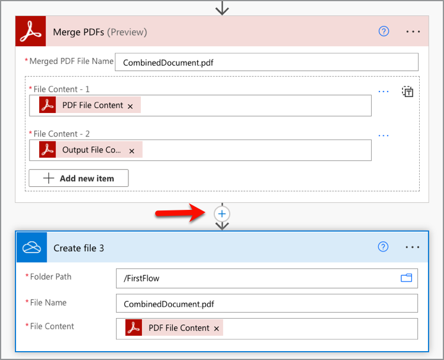

# Crie seu primeiro fluxo no Microsoft Power Automate

Saiba como criar seu primeiro fluxo no [Microsoft Power Automate](https://flow.microsoft.com) usando o conector dos [Serviços do Adobe PDF](https://us.flow.microsoft.com/en-us/connectors/shared_adobepdftools/adobe-pdf-services/).

Neste tutorial prático, saiba como:

* Converter documentos do Word em PDF
* Combine documentos PDF em um PDF
* Protect um documento PDF com uma senha

## Preparação

### Do que você precisa

* **Credenciais de avaliação ou produção dos Serviços do Adobe PDF**
Saiba mais sobre como obter e configurar credenciais no Microsoft Power Automate [aqui](https://experienceleague.adobe.com/en/docs/acrobat-services-learn/tutorials/pdfservices/getting-credentials-power-automate).
* **Microsoft Power Automate com conectores Premium**
Saiba como verificar o nível de licenciamento do Power Automate [aqui](https://docs.microsoft.com/en-us/power-platform/admin/power-automate-licensing/types).
* **OneDrive**
O conector de armazenamento do OneDrive é usado neste tutorial, mas qualquer conector de armazenamento pode ser substituído.

### Arquivos de amostra

Há dois [arquivos de exemplo](assets/sample-assets.zip) que você precisa descompactar e carregar no OneDrive:

* WordDocument01.docx
* WordDocument02.docx

### Obtendo credenciais

Para concluir este tutorial, você precisa de suas credenciais já configuradas no Microsoft Power Automate para Serviços do Adobe PDF. Se você não concluiu esta etapa, consulte as [instruções aqui](https://experienceleague.adobe.com/en/docs/acrobat-services-learn/tutorials/pdfservices/getting-credentials-power-automate).

## Parte 1: Criar novo fluxo e converter Word em PDF

### Criar o fluxo

Nesta parte, você cria um novo fluxo no [Microsoft Power Automate](https://flow.microsoft.com) usando um fluxo instantâneo, adiciona parâmetros, obtém seus arquivos do OneDrive e os converte em PDF.

1. Navegue até o [Microsoft Power Automate](https://flow.microsoft.com) e faça logon com suas credenciais.
1. Na barra lateral, selecione **[!UICONTROL Criar]**.

   

1. Selecione **[!UICONTROL Fluxo Instantâneo]**.
1. Dê um nome ao seu fluxo.
1. Em *Escolha como disparar este fluxo*, selecione **[!UICONTROL Acionar manualmente um fluxo]**.
1. Selecione **[!UICONTROL Criar]**.

### Obter o conteúdo dos arquivos

Em seguida, obtenha o conteúdo dos arquivos de amostra.

>[!PREREQUISITES]
>
>Se você não carregou os [arquivos de amostra](assets/sample-assets.zip) no OneDrive, descompacte-os e carregue-os.


1. No [Power Automate](https://flow.microsoft.com), selecione **[!UICONTROL + Nova etapa]**.
1. Pesquise por *OneDrive* na barra de pesquisa.
1. Escolha sua conta pessoal ou de trabalho do OneDrive selecionando **[!UICONTROL OneDrive for Business]** ou **[!UICONTROL OneDrive]**.
1. Pesquise *Obter conteúdo do arquivo* na barra de pesquisa.
1. No campo **[!UICONTROL Arquivo]**, selecione o ícone de pasta para navegar até o arquivo *WordDocument01.docx* no OneDrive.

   

### Converter arquivo em PDF

Agora que você tem o conteúdo do arquivo, pode converter o documento em PDF.

1. No [Power Automate](https://flow.microsoft.com), selecione **[!UICONTROL + Nova etapa]**.
1. Pesquise *Serviços do Adobe PDF* na barra de pesquisa.
1. Selecione **[!UICONTROL Serviços do Adobe PDF]**.
1. Pesquise por *Converter Word em PDF* na barra de pesquisa.
1. Em **[!UICONTROL Nome do Arquivo]**, nomeie o arquivo como desejado, mas deve terminar com *.docx*. Essa extensão é necessária para converter documentos do Word em PDF.
1. Coloque o cursor no campo **[!UICONTROL Conteúdo do Arquivo]**.
1. Usando o painel **[!UICONTROL Conteúdo dinâmico]**, selecione **[!UICONTROL Conteúdo do arquivo]**.

   

### Salve o arquivo no OneDrive

Depois que o documento for gerado, salve o arquivo de volta no OneDrive.

1. No [Microsoft Power Automate](https://flow.microsoft.com), selecione **[!UICONTROL + Nova etapa]**.
1. Pesquise por *OneDrive* na barra de pesquisa.
1. Escolha sua conta pessoal ou de trabalho do OneDrive selecionando **[!UICONTROL OneDrive for Business]** ou **[!UICONTROL OneDrive]**.
1. Pesquise *Obter conteúdo do arquivo* na barra de pesquisa.
1. Pesquise por *Criar arquivo* na barra de pesquisa.
1. Selecione **[!UICONTROL Criar arquivo]**.
1. No campo **[!UICONTROL Caminho da Pasta]**, selecione o ícone de pasta para especificar onde salvar o arquivo no OneDrive.
1. Em **[!UICONTROL Nome do Arquivo]**, nomeie o arquivo como desejado, mas deve terminar com *.docx*. Essa extensão é necessária para converter documentos do Word em PDF.
1. No campo **[!UICONTROL Conteúdo do Arquivo]**, use o painel **[!UICONTROL Conteúdo dinâmico]** para inserir a variável de Conteúdo de Arquivo PDF.

### Tentar fluxo

1. No canto superior esquerdo, selecione **[!UICONTROL Sem título]** para renomear o fluxo.
1. Clique em **[!UICONTROL Salvar]**.
1. Selecione **[!UICONTROL Teste]**.
1. Selecione **[!UICONTROL Manualmente]** e depois **[!UICONTROL Salvar e Testar]**.
1. Selecione **[!UICONTROL Continuar]**.
1. Selecione **[!UICONTROL Executar Fluxo]**.

Na pasta do OneDrive, agora você deve ver o PDF convertido.


## Parte 2: Gerar um documento dinâmico usando um modelo

Esta próxima parte se baseia na Parte 1 e usa o modelo *Gerar documento do Word* para mesclar dados dinamicamente no documento.

### Revise o modelo de documento

Abra o *WordDocument02_.docx* dos seus arquivos de amostra no OneDrive. O documento do Word contém várias tags de texto diferentes que representam os locais onde os dados são preenchidos no documento.

### Adicionar parâmetros ao gatilho

Para que os dados dinâmicos sejam inseridos no documento, você precisa criar alguns parâmetros para que o acionador solicite valores.

1. Ao editar o fluxo, selecione **[!UICONTROL Disparar manualmente um fluxo]** para expandir a ação.
1. Selecione **[!UICONTROL Adicionar uma entrada]**.
1. Selecione **[!UICONTROL Texto]**.
1. Nomeie o campo *Nome*.

Repita as etapas 2 e 4 para adicionar os seguintes campos:

* Sobrenome
* Salário


### Obter conteúdo de arquivo de um modelo

Para gerar um documento, primeiro você precisa obter o conteúdo do arquivo do modelo do Word.

1. No Power Automate, selecione + **[!UICONTROL Nova etapa]**.
1. Pesquise por *OneDrive* na barra de pesquisa.
1. Escolha sua conta pessoal ou de trabalho do OneDrive selecionando **[!UICONTROL OneDrive for Business]** ou **[!UICONTROL OneDrive]**.
1. Pesquise *Obter conteúdo do arquivo* na barra de pesquisa.
1. No campo **[!UICONTROL Arquivo]**, selecione o ícone de pasta para navegar até o arquivo *WordDocument02.docx* no OneDrive.


### Gerar documento a partir do modelo

1. No Power Automate, selecione **[!UICONTROL + Nova etapa]**.
1. Pesquise *Serviços do Adobe PDF* na barra de pesquisa.
1. Selecione **[!UICONTROL Serviços do Adobe PDF]**.
1. Selecione a ação **[!UICONTROL Gerar documento a partir do modelo do Word]**.
1. No campo **[!UICONTROL Nome do Arquivo de Modelo]**, nomeie o arquivo como desejado, mas deve terminar com *.docx*.

#### Mesclar dados

Usando a ação *Gerar documento a partir do modelo do Word*, você pode mesclar dados em seu documento a partir de qualquer uma das diferentes variáveis anteriormente no fluxo usando o conteúdo dinâmico.

Copie os dados JSON abaixo para o campo **Mesclar Dados**:

```
{
    "FirstName": "",
    "LastName": "",
    "Salary": ""
}
```

1. Coloque o cursor no campo entre as duas aspas do valor *FirstName*.
1. Usando o painel **[!UICONTROL Conteúdo Dinâmico]**, insira o valor *Nome* do acionador Manual de uma ação de fluxo.

   

1. Repita as etapas 7 a 8 para os campos **[!UICONTROL LastName]** e **[!UICONTROL Salário]**.
1. No campo **[!UICONTROL Conteúdo do Arquivo de Modelo]**, use o painel **[!UICONTROL Conteúdo dinâmico]** para inserir o valor **[!UICONTROL Conteúdo do arquivo]** da etapa *Obter conteúdo do arquivo*.


>[!TIP]
>
>A ação *Gerar documento a partir do modelo do Word* usa a API de Geração de Documento do Adobe. Se você quiser saber mais sobre como criar modelos, veja alguns recursos:
>
>* [Saiba mais sobre a Geração de Documento do Adobe](https://developer.adobe.com/document-services/apis/doc-generation/)
>* [Marcador de Geração de Documento Adobe para Microsoft Word](https://appsource.microsoft.com/en-US/product/office/WA200002654)
>* [Documentação da API de Geração de Documento do Adobe](https://developer.adobe.com/document-services/docs/overview/document-generation-api/)

### Salve o arquivo no OneDrive

Depois que o documento for gerado, você poderá salvar o arquivo novamente no OneDrive.

1. No Power Automate, selecione **+ [!UICONTROL Nova etapa]**.
1. Pesquise por *OneDrive* na barra de pesquisa.
1. Escolha sua conta pessoal ou de trabalho do OneDrive selecionando **[!UICONTROL OneDrive for Business]** ou **[!UICONTROL OneDrive]**.
1. Pesquise por *Criar arquivo* na barra de pesquisa.
1. Selecione **[!UICONTROL Criar arquivo]**.
1. No campo **[!UICONTROL Caminho da Pasta]**, selecione o ícone de pasta para especificar onde salvar o arquivo no OneDrive.
1. No campo **[!UICONTROL Nome do Arquivo]**, defina o nome do arquivo. Como a saída é um PDF, o nome do arquivo deve terminar com a extensão .pdf.
1. Use o painel **[!UICONTROL Conteúdo dinâmico]** para inserir a variável de Conteúdo de Arquivo de PDF no campo **[!UICONTROL Conteúdo de Arquivo]**.

### Tentar fluxo


1. Clique em **[!UICONTROL Salvar]**.
1. Selecione **[!UICONTROL Teste]**.
1. Selecione **[!UICONTROL Manualmente]** e depois **[!UICONTROL Salvar e Testar]**.
1. Selecione **[!UICONTROL Continuar]**.
1. Insira valores para *Nome*, *Sobrenome* e *Salário*.
1. Selecione **[!UICONTROL Executar Fluxo]**.

Na pasta do OneDrive, agora você vê um PDF gerado a partir do documento do Word. Ao abrir o documento do PDF no OneDrive, você vê que os dados foram mesclados nos locais da tag de texto.


## Parte 3: Combine PDF em um

Agora que você gerou e converteu um documento do Word em um PDF, a próxima parte é combinar vários documentos do PDF juntos.

>[!NOTE]
>
>Nas ações anteriores, você salvou uma cópia do documento como um arquivo no OneDrive. Para usar ferramentas como Mesclar PDF, não é necessário salvar o arquivo no OneDrive. Em vez disso, você pode passar a saída diretamente de uma ação para a seguinte, o que é melhor do que salvar no OneDrive após cada ação. Mas, para fins de demonstração, você está salvando esses arquivos no OneDrive.

### Adicionar etapa PDF de mesclagem

1. Ao editar o fluxo, selecione **[!UICONTROL + Próxima etapa]** para adicionar uma ação no final do fluxo.
1. Pesquise *Serviços do Adobe PDF* na barra de pesquisa.
1. Selecione **[!UICONTROL Serviços do Adobe PDF]**.
1. Selecione a ação **[!UICONTROL Mesclar PDF]**.
1. No campo **[!UICONTROL Nome do Arquivo PDF de Mesclagem]**, insira o nome do arquivo desejado (por exemplo, *CombinedDocument.pdf*).
1. No campo **[!UICONTROL Conteúdo do Arquivo -1]**, use o painel **[!UICONTROL Conteúdo dinâmico]** para inserir o valor de *Conteúdo do Arquivo de PDF* da etapa **[!UICONTROL Converter Word em PDF]**.
1. Para adicionar o próximo documento, selecione **+ [!UICONTROL adicionar novo item]**.
1. No campo **[!UICONTROL Conteúdo do Arquivo - 2]**, use o painel **[!UICONTROL Conteúdo dinâmico]** para inserir o valor **[!UICONTROL Conteúdo do Arquivo de Saída]** da etapa *Gerar documento a partir do modelo do Word*.


### Salvar PDF mesclado no OneDrive

Após a combinação do documento, é possível salvá-lo novamente no OneDrive.

1. No Power Automate, selecione **+ [!UICONTROL Nova etapa]**.
1. Pesquise por *OneDrive* na barra de pesquisa.
1. Escolha sua conta pessoal ou de trabalho do OneDrive selecionando **[!UICONTROL OneDrive for Business]** ou **[!UICONTROL OneDrive]**.
1. Pesquise por *Criar arquivo* na barra de pesquisa.
1. Selecione **[!UICONTROL Criar arquivo]**.
1. No campo **[!UICONTROL Caminho da Pasta]**, selecione o ícone de pasta para especificar onde salvar o arquivo no OneDrive.
1. No campo **[!UICONTROL Nome do Arquivo]**, defina o nome do arquivo. Como a saída é um PDF, o nome do arquivo deve terminar com .pdf.
1. No campo **[!UICONTROL Conteúdo do Arquivo]**, use o painel **[!UICONTROL Conteúdo dinâmico]** para inserir o valor de *Conteúdo de Arquivo PDF* da etapa **[!UICONTROL Mesclar PDF]**.

   

### Tentar fluxo

1. Clique em **[!UICONTROL Salvar]**.
1. Selecione **[!UICONTROL Teste]**.
1. Selecione **[!UICONTROL Manualmente]** e depois **[!UICONTROL Salvar e Testar]**.
1. Selecione **[!UICONTROL Continuar]**.
1. Insira valores para *Nome*, *Sobrenome* e *Salário*.
1. Selecione **[!UICONTROL Executar Fluxo]**.

Na pasta do OneDrive, você verá o PDF combinado com as páginas do primeiro e do segundo documentos.

## Parte 4: Documento do Protect PDF

Depois de gerar o documento, você pode protegê-lo contra edição incluindo uma etapa extra antes de salvar no OneDrive.

### Proteger PDF

1. Ao editar seu fluxo no Power Automate, selecione **+** entre a ação **[!UICONTROL Mesclar PDF]** e a ação **[!UICONTROL Criar arquivo 3]**.

   

1. Selecione **[!UICONTROL Adicionar uma ação]**.
1. Pesquise *Serviços do Adobe PDF* na barra de pesquisa.
1. Selecione **[!UICONTROL Serviços do Adobe PDF]**.
1. Selecione a ação **[!UICONTROL PDF Protect em Exibição]**.
1. No campo **[!UICONTROL Nome do Arquivo]**, defina o nome como o nome desejado, desde que ele termine com uma extensão .pdf.
1. Defina o campo **[!UICONTROL Senha]** com a senha especificada para abrir o documento.
1. No campo **[!UICONTROL Conteúdo do Arquivo]**, use o painel **[!UICONTROL Conteúdo Dinâmico]** para inserir o valor de *Conteúdo de Arquivo PDF* da etapa **[!UICONTROL Mesclar PDF]**.

### Atualizar e salvar no OneDrive

Quando o documento estiver protegido, você poderá salvar o arquivo novamente no OneDrive. Neste exemplo, você está atualizando a ação **Criar arquivo 3** preexistente com um novo valor de *Conteúdo de Arquivo*.

1. Selecione o cursor no campo **[!UICONTROL Conteúdo do Arquivo]** na ação **[!UICONTROL Criar arquivo 3]**.
1. Use o painel **[!UICONTROL Conteúdo Dinâmico]** para inserir o valor de *Conteúdo de Arquivo de PDF* da etapa **PDF Protect de Exibição**.

### Tentar fluxo

1. Clique em **[!UICONTROL Salvar]**.
1. Selecione **[!UICONTROL Teste]**.
1. Selecione **[!UICONTROL Manualmente]** e depois **[!UICONTROL Salvar e Testar]**.
1. Selecione **[!UICONTROL Continuar]**.
1. Insira valores para *Nome*, *Sobrenome* e *Salário*.
1. Selecione **[!UICONTROL Executar Fluxo]**.

Na pasta do OneDrive, você verá o PDF combinado que agora solicita que você insira uma senha para exibir o documento.

## Próximas etapas

Neste tutorial, você converteu um documento do Word em um PDF, gerou um documento com base em dados, mesclou documentos e os protegeu com uma senha. Para saber mais, explore algumas das outras ações disponíveis no Conector de Serviços do Adobe PDF no Microsoft Power Automate:

* Veja os modelos pré-criados disponíveis no Microsoft Power Automate.
* Aprenda com os [artigos](https://medium.com/adobetech/tagged/microsoft-power-automate) no Blog da Adobe Tech.
* Revise a [documentação](https://developer.adobe.com/document-services/docs/overview/document-generation-api/) sobre a API de geração de documento Adobe.
