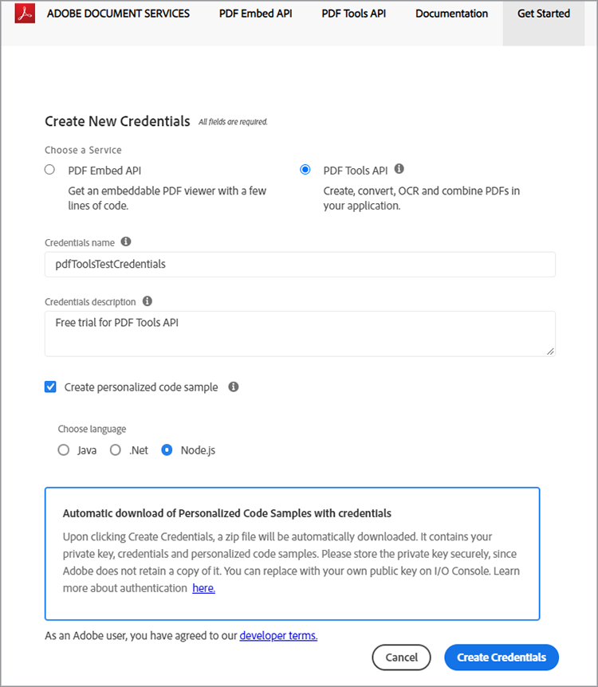
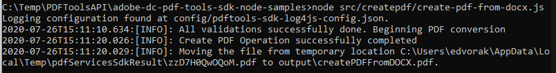

# Crie um PDF do HTML ou MS Office em alguns minutos com a API de serviços de PDF e o Node.js


A digitalização de fluxos de trabalho de documentos nunca foi tão fácil com a nova API de serviços do Adobe PDF, que fornece aos desenvolvedores um espaço livre para escolher entre vários serviços poderosos de manipulação de PDF para atender às necessidades de fluxos de trabalho comerciais complicados. Arquiteturas complicadas, estratégias de implementação e aumento de tecnologia podem ser otimizados com esses serviços da Web baseados em nuvem prontamente disponíveis.

Dentro da API de Serviços PDF, existem vários serviços disponíveis para criar e manipular PDF ou exportar de PDF para MS Office e outros formatos.

* Crie um arquivo de PDF a partir de um HTML estático ou dinâmico, MS Word, PowerPoint, Excel e muito mais
* Export PDF para MS Word, PowerPoint, Excel e muito mais
* OCR para reconhecer texto em arquivos PDF e ativar a pesquisa de documentos
* PDF do Protect com uma senha ao abrir documentos
* Combine páginas de PDF ou documentos de PDF em um único PDF
* Compacte PDF para reduzir o tamanho para compartilhamento por email ou online
* Linearizar para otimizar um PDF para uma rápida visualização na Web
* Organizar páginas de PDF com serviços de inserção, substituição, reordenação, exclusão e rotação

Os desenvolvedores podem começar em apenas alguns minutos com os arquivos de amostra prontos para executar, fornecidos para acessar todos os serviços Web disponíveis. Veja como começar.

## Obtenção de credenciais e download de arquivos de amostra

A primeira etapa é obter uma credencial (chave de API) para desbloquear o uso. [Inscreva-se para a avaliação gratuita aqui](https://www.adobe.com/go/dcsdks_credentials) e clique em &#39;Começar&#39; para criar suas novas credenciais.


É importante escolher uma “Conta pessoal” para se cadastrar na avaliação gratuita:


Na próxima etapa, você escolherá o Serviço de API de Serviços do PDF e adicionará um nome e uma descrição para suas credenciais.

Há uma caixa de seleção para “Criar amostra de código personalizada”. Escolha esta opção para que suas novas credenciais sejam adicionadas automaticamente aos arquivos de amostra, ignorando a etapa manual.

Em seguida, escolha Node.js como o idioma para receber as amostras específicas de Node.js e clique no botão “Criar credenciais”.



Você receberá um arquivo .zip para download, chamado PDFToolsSDK-Node.jsSamples.zip, que pode ser salvo no sistema de arquivos local.

## Adicionando suas credenciais às amostras de código

Se você escolher a opção para “Criar amostra de código personalizada”, não precisará adicionar manualmente sua ID de cliente aos arquivos de amostra de código e poderá pular a próxima etapa e ir diretamente para a seção Executando amostras de código abaixo.

Se você não tiver escolhido a opção para “Criar amostra de código personalizada”, copie a ID do cliente (chave de API) do console do Adobe.io:


Descompacte o conteúdo de PDFToolsSDK-Node.jsSamples.zip.

Acesse o diretório raiz na pasta adobe-dc-pdf-tools-sdk-node-samples.

Abra pdftools-api-credentials.json com qualquer editor de texto ou IDE.

Cole a credencial no campo para a ID do cliente no código:

```javascript
{
 "client_credentials": {
  "client_id": "abcdefghijklmnopqrstuvwxyz",
```

Salve o arquivo e continue para a próxima etapa para executar as amostras de código.

## Executando sua primeira amostra de código

Usando o prompt de comando, acesse o diretório raiz na pasta adobe-dc-pdf-tools-sdk-node-samples.

Digite npm install:

C:\Temp\PDFToolsAPI\adobe-dc-pdf-tools-sdk-node-samples>instalação do npm

Agora você está pronto para executar os arquivos de amostra!

Para sua primeira amostra, crie um PDF:

Ainda no prompt de comando, execute o exemplo create PDF com o seguinte comando:

C:\Temp\PDFToolsAPI\adobe-dc-pdf-tools-sdk-node-samples>nó src/createpdf/create-pdf-from-docx.js

Exemplo de saída:



Seu PDF será criado no local designado na saída, que por padrão é o diretório pdfServicesSdkResult.

## Recursos e próximas etapas

* Para obter ajuda e suporte adicionais, visite o fórum da comunidade de [[!DNL Acrobat Services] APIs](https://community.adobe.com/t5/document-cloud-sdk/bd-p/Document-Cloud-SDK?page=1&sort=latest_replies&filter=all) do Adobe

Documentação [API de Serviços PDF](https://www.adobe.com/go/pdftoolsapi_doc)

* [Perguntas frequentes](https://community.adobe.com/t5/contentarchivals/contentarchivedpage/message-uid/10726197) sobre a API de Serviços PDF
* [Fale conosco](https://www.adobe.com/go/pdftoolsapi_requestform) em caso de dúvidas sobre licenciamento e preços
* Artigos relacionados:

   * [A nova API de serviços de PDF oferece ainda mais recursos para fluxos de trabalho de documentos](https://community.adobe.com/t5/acrobat-services-api-discussions/new-pdf-tools-api-brings-more-capabilities-for-document-services/m-p/11294170)
   * [Versão de julho do  [!DNL Adobe Acrobat Services]: Serviços PDF de Incorporação e PDF](https://medium.com/adobetech/july-release-of-adobe-document-services-pdf-embed-and-pdf-tools-17211bf7776d)
