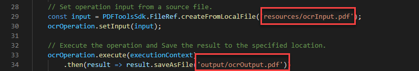

# Uso da API de serviços do Adobe PDF para arquivos PDF OCR

Com o OCR (reconhecimento óptico de caracteres), você pode desbloquear PDF digitalizados para extrair texto e criar arquivos pesquisáveis. Com nossas eficientes APIs na nuvem, você pode integrar o OCR a qualquer fluxo de trabalho de documento para encontrar a solução perfeita para arquivar, copiar texto e criar índices de documentos pesquisáveis. Crie arquivos pesquisáveis de repositórios PDF digitalizados para desbloquear informações importantes e poupar tempo com pesquisa rápida. Ou aplique OCR às suas PDF de digitalizações carregadas para permitir que elas sejam editadas para uso em fluxos de trabalho de integração.

Os desenvolvedores podem começar em apenas alguns minutos com os arquivos de amostra prontos para serem executados fornecidos para OCR.

Neste tutorial, você aborda as noções básicas de como executar sua primeira operação OCR da API de serviços do PDF usando arquivos de exemplo para as linguagens Node.js, Java e .Net.

## Etapa 1: Criar suas credenciais e configurar seu ambiente

Use os tutoriais de introdução abaixo para criar suas credenciais de API, baixar arquivos de amostra e configurar seu ambiente.

[Introdução à API de serviços PDF e Java](gettingstartedjava.md)

[Introdução à API de serviços do PDF e .Net](gettingstartednet.md)

[Introdução à API de serviços PDF e Node.js](createpdffromhtml.md)

## Execute o exemplo de OCR fornecido nos arquivos de amostra

Nossa operação de OCR permite o idioma inglês por padrão, mas também oferece suporte para alemão, francês, dinamarquês e [outros idiomas](https://opensource.adobe.com/pdftools-sdk-docs/release/latest/howtos.html#ocr-with-explicit-language). O padrão é a localidade en-us.

Quando você passa opções com a operação de OCR, incluindo uma localidade específica, o método também aceita o parâmetro &#39;type&#39;, que tem duas opções:

* SEARCHABLE_IMAGE: Modifica a imagem original durante o processo de limpeza (por exemplo, desenhe-a) antes de colocar uma camada de texto invisível sobre ela. Esse tipo remove artefatos indesejados e pode resultar em um documento mais legível em alguns cenários.

* SEARCHABLE_IMAGE_EXACT: Garante que o texto seja pesquisável e selecionável. Essa opção mantém a imagem original e coloca uma camada de texto invisível sobre ela. Recomendado para casos que exigem máxima fidelidade à imagem original.

**Java**

1. Abra um prompt de comando.

1. Altere os diretórios no diretório de código de amostra.

   Por exemplo, C:\Temp\PDFToolsAPI\adobe-dc-pdf-tools-sdk-java-samples>.

1. Execute o seguinte comando:

   `mvn -f pom.xml exec:java -Dexec.mainClass=com.adobe.platform.operation.samples.ocrpdf.OcrPDF`

Seu PDF será criado no diretório src/main/resources.

**.Net**

1. Abra um prompt de comando.

1. Altere os diretórios no diretório de código de amostra.

   Por exemplo, C:\Temp\PDFToolsAPI\adobe-dc-pdf-tools-sdk-NetSamples

1. Transforme os diretórios novamente no diretório OcrPDF.

1. Execute o seguinte comando:

   `dotnet run OcrPDF.csproj`

Seu PDF será criado no mesmo diretório.

**Node.js**

1. Abra um prompt de comando.

1. Altere os diretórios no diretório de código de amostra.

   Por exemplo, C:\Temp\PDFToolsAPI\adobe-dc-pdf-tools-sdk-node-samples

1. Execute o seguinte comando:

   `node src/ocr/ocr-pdf.js`

Seu PDF será criado no local designado na saída, que por padrão é o diretório de saída.

## Considerações finais

Com essas etapas simples usando os arquivos de amostra, você deve ter um exemplo de trabalho no qual pode trabalhar. Além do exemplo de OCR que usamos neste tutorial, há outro exemplo de OCR usando as opções de tipo e localidade suportadas discutidas anteriormente.

A partir daqui, você pode simplesmente substituir seus arquivos de entrada e saída localizados na amostra para usar seu próprio PDF para finalizar sua prova de conceito para seu próprio caso de uso.

## Recursos e próximas etapas

* Para obter ajuda e suporte adicionais, visite o Adobe [[!DNL Acrobat Services] APIs](https://community.adobe.com/t5/document-cloud-sdk/bd-p/Document-Cloud-SDK?page=1&amp;sort=latest_replies&amp;filter=all) fórum da comunidade

* API de serviços PDF [Documentação](https://www.adobe.com/go/pdftoolsapi_doc)

* [Perguntas frequentes](https://community.adobe.com/t5/document-cloud-sdk/faq-for-document-services-pdf-tools-api/m-p/10726197) para perguntas sobre a API de serviços do PDF

* [Fale conosco](https://www.adobe.com/go/pdftoolsapi_requestform) para perguntas sobre licenciamento e preços
