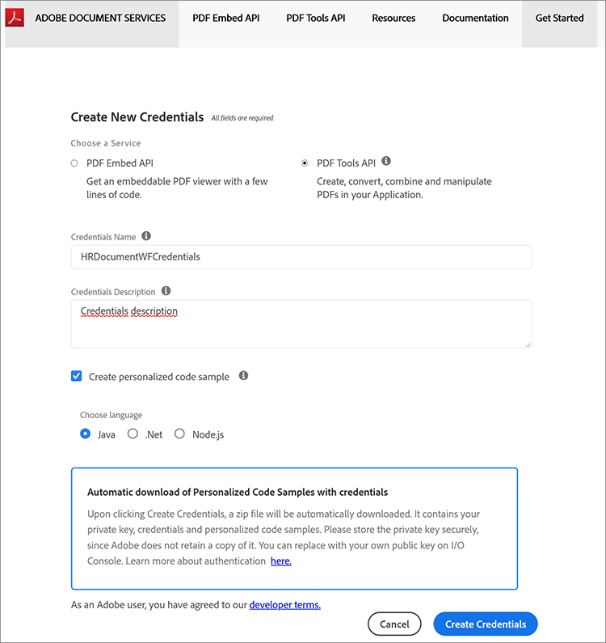
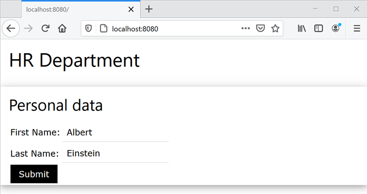

# Fluxos de trabalho de documentos de RH em Java


Muitas empresas exigem documentação sobre uma nova contratação, como contratos de local de trabalho para funcionários que trabalham em casa. Tradicionalmente, as empresas gerenciavam esses documentos fisicamente em formas difíceis de gerenciar e armazenar. Ao alternar para documentos eletrônicos, os arquivos PDF são a escolha ideal, pois são mais seguros e menos modificáveis do que outros tipos de arquivo. Além disso, são compatíveis com assinaturas digitais.

## O que você pode aprender

Neste tutorial prático, aprenda a implementar um formulário de RH baseado na Web que salva um contrato de local de trabalho em PDF com aprovação em um aplicativo Java Spring MVC simples.

## APIs e recursos relevantes

* [API de serviços PDF](https://opensource.adobe.com/pdftools-sdk-docs/release/latest/index.html)

* [API do Adobe Sign](https://www.adobe.io/apis/documentcloud/sign.html)

* [Código do projeto](https://github.com/dawidborycki/adobe-sign)

## Gerar credenciais de API

Comece inscrevendo-se para a avaliação gratuita da API de Serviços do Adobe PDF. Acesse o menu [Adobe](https://www.adobe.io/apis/documentcloud/dcsdk/gettingstarted.html?ref=getStartedWithServicesSDK) [site](https://www.adobe.io/apis/documentcloud/dcsdk/gettingstarted.html?ref=getStartedWithServicesSDK) e clique no botão *Começar* botão abaixo *Criar novas credenciais*. A avaliação gratuita fornece 1.000 transações de documentos que podem ser usadas durante seis meses. Na próxima página (veja abaixo), escolha o serviço (API de Serviços do PDF), defina o nome das credenciais (por exemplo, HRDocumentWFCredentials) e insira uma descrição.

Selecione a linguagem (Java para este exemplo) e verifique *Criar amostras de código personalizadas*. A última etapa garante que as amostras de código já contenham o arquivo pdftools-api-credentials.json pré-preenchido que você usa, juntamente com a chave privada para autenticar seu aplicativo na API.

Por fim, clique no botão *Criar credenciais* botão. Isso gera as credenciais e o download das amostras começa automaticamente.



Para garantir que as credenciais estejam funcionando, abra as amostras baixadas. Aqui, você está usando o IntelliJ IDEA. Quando você abre o código-fonte, o ambiente de desenvolvimento integrado (IDE) solicita o mecanismo de construção. O Maven é usado nesta amostra, mas você também pode trabalhar com o Gradle, dependendo de suas preferências.

Em seguida, execute o `mvn clean install` Objetivo Maven para construir os arquivos jar.

Por fim, execute o exemplo do Combinar PDF, conforme mostrado abaixo. O código gera o PDF dentro da pasta de saída.


## Criando o aplicativo Spring MVC

Dadas as credenciais, você cria o aplicativo. Este exemplo usa o Spring Initializr.

Primeiro, defina as configurações do projeto para usar a linguagem Java 8 e o empacotamento Jar (consulte a captura de tela abaixo).


Em segundo lugar, adicione Spring Web (da Web) e Thymeleaf (dos Template Engines):


Depois de criar o projeto, vá para o arquivo pom.xml e complete a seção dependências com pdftools-sdk e log4j-slf4j-impl:

```
<dependencies>
    <dependency>
        <groupId>org.springframework.boot</groupId>
        <artifactId>spring-boot-starter-thymeleaf</artifactId>
    </dependency>
    <dependency>
        <groupId>org.springframework.boot</groupId>
        <artifactId>spring-boot-starter-web</artifactId>
    </dependency>

    <dependency>
        <groupId>org.springframework.boot</groupId>
        <artifactId>spring-boot-starter-test</artifactId>
        <scope>test</scope>
    </dependency>

</dependencies>
```

Em seguida, complete a pasta raiz do projeto com dois arquivos baixados com o código de exemplo:

* pdftools-api-credentials.json

* private.key

## Renderizando um formulário da Web

Para renderizar o formulário da Web, modifique o aplicativo com o controlador que renderiza o formulário de dados pessoais e manipule a publicação do formulário. Portanto, primeiro modifique o aplicativo com a classe de modelo PersonForm:

```
package com.hr.docsigning;
import javax.validation.constraints.NotNull;
import javax.validation.constraints.Size;

public class PersonForm {
    @NotNull
    @Size(min=2, max=30)
    private String firstName;

    @NotNull
    @Size(min=2, max=30)
    private String lastName;

    public String getFirstName() {
            return this.firstName;
    }


    public void setFirstName(String firstName) {
            this.firstName = firstName;
    }

    public String getLastName() {
           return this.lastName;
    }

    public void setLastName(String lastName) {
            this.lastName = lastName;
    }

    public String GetFullName() {
           return this.firstName + " " + this.lastName;
    }
}
```

Esta classe contém duas propriedades: `firstName` e `lastName`. Além disso, use essa validação simples para verificar se eles têm entre dois e 30 caracteres.

Dada a classe do modelo, você pode criar o controlador (consulte PersonController.java a partir do código complementar):

```
package com.hr.docsigning;
import org.springframework.stereotype.Controller;
import org.springframework.validation.BindingResult;
import org.springframework.web.bind.annotation.GetMapping;
import org.springframework.web.bind.annotation.PostMapping;
import javax.validation.Valid;


@Controller
public class PersonController {
    @GetMapping("/")
    public String showForm(PersonForm personForm) {
        return "form";
    }
}
```

O controlador tem apenas um método: showForm. Ele é responsável pela renderização do formulário usando o modelo de HTML localizado em resources/templates/form.html:

```
<html>
<head>
    <link rel="stylesheet" href="https://www.w3schools.com/w3css/4/w3.css">
</head>
 
<body>
<div class="w3-container">
    <h1>HR Department</h1>
</div>
 
<form class="w3-panel w3-card-4" action="#" th:action="@{/}"
        th:object="${personForm}" method="post">
    <h2>Personal data</h2>
    <table>
        <tr>
            <td>First Name:</td>
            <td><input type="text" class="w3-input"
                placeholder="First name" th:field="*{firstName}" /></td>
            <td class="w3-text-red" th:if="${#fields.hasErrors('firstName')}"
                th:errors="*{firstName}"></td>
        </tr>
        <tr>
            <td>Last Name:</td>
            <td><input type="text" class="w3-input"
                placeholder="Last name" th:field="*{lastName}" /></td>
            <td class="w3-text-red" th:if="${#fields.hasErrors('lastName')}"
                th:errors="*{lastName}"></td>
        </tr>
        <tr>
            <td><button class="w3-button w3-black" type="submit">Submit</button></td>
        </tr>
    </table>
</form>
</body>
</html>
```

Para renderizar conteúdo dinâmico, o mecanismo de renderização de modelo Thymeleaf é empregado. Assim, após executar o aplicativo, você verá o seguinte:


## Gerar o PDF com conteúdo dinâmico

Agora, gere o documento do PDF que contém o contrato virtual preenchendo dinamicamente os campos selecionados após renderizar o formulário de dados pessoais. Especificamente, você deve preencher os dados da pessoa no contrato pré-criado.

Aqui, para simplificar, você tem apenas um cabeçalho, um subcabeçalho e uma constante de string: “Este contrato foi preparado para \&lt;full name=&quot;&quot; of=&quot;&quot; the=&quot;&quot; person=&quot;&quot;>“.

Para atingir esse objetivo, comece com Adobe [Criar um PDF a partir do HTML dinâmico](https://opensource.adobe.com/pdftools-sdk-docs/release/latest/howtos.html#create-a-pdf-from-dynamic-html) exemplo. Analisando esse código de exemplo, você verá que o processo de preenchimento dinâmico do campo de HTML funciona da seguinte maneira.

Primeiro, você deve preparar a página de HTML, que possui conteúdo estático e dinâmico. A parte dinâmica é atualizada usando JavaScript. Ou seja, a API de serviços de PDF injeta o objeto JSON em seu HTML.

Você obtém as propriedades JSON usando a função JavaScript que é chamada quando o documento HTML é carregado. Esta função JavaScript atualiza os elementos DOM selecionados. Aqui está o exemplo que preenche o elemento span, mantendo os dados da pessoa (consulte src\\main\\resources\\contract\\index.html do código complementar):

```
<html>
<head>
    <link rel="stylesheet" href="https://www.w3schools.com/w3css/4/w3.css">
</head>
 
<body onload="updateFullName()">
    <script src="./json.js"></script>
    <script type="text/javascript">
        function updateFullName()
        {
            var document = window.document;
            document.getElementById("personFullName").innerHTML = String(
                window.json.personFullName);
        }
    </script>
 
    <div class="w3-container ">
        <h1>HR Department</h1>
 
        <h2>Contract details</h2>
 
        <p>This contract was prepared for:
            <strong><span id="personFullName"></span></strong>
        </p>
    </div>
</body>
</html>
```

Em seguida, você deve compactar o HTML com todos os arquivos JavaScript e CSS dependentes. A API de serviços de PDF não aceita arquivos de HTML. Em vez disso, requer um arquivo zip como entrada. Nesse caso, o arquivo compactado será armazenado em src\\main\\resources\\contract\\index.zip.

Depois, você pode complementar o `PersonController` com outro método que lida com solicitações POST:

```
@PostMapping("/")
public String checkPersonInfo(@Valid PersonForm personForm,
    BindingResult bindingResult) {
    if (bindingResult.hasErrors()) {
        return "form";
    }
 
    CreateContract(personForm);
 
    return "contract-actions";
}
```

O método acima cria um contrato PDF usando os dados pessoais fornecidos e renderiza a exibição de ações do contrato. A última fornece links para o PDF gerado e para assinar o PDF.

Agora, vamos ver como o `CreateContract` funciona (a lista completa está abaixo). O método se baseia em dois campos:

* `LOGGER`, do log4j, para depurar informações sobre quaisquer exceções

* `contractFilePath`, contendo o caminho do arquivo para o PDF gerado

O `CreateContract` o método configura as credenciais e cria o PDF a partir do HTML. Para transmitir e preencher os dados da pessoa no contrato, use o `setCustomOptionsAndPersonData` auxiliar. Esse método recupera os dados da pessoa do formulário e os envia para o PDF gerado por meio do objeto JSON explicado acima.

Além disso, `setCustomOptionsAndPersonData` mostra como controlar a aparência do PDF desativando o cabeçalho e o rodapé. Quando essas etapas estiverem concluídas, você salva o arquivo PDF em output/contract.pdf e, eventualmente, exclui o arquivo gerado anteriormente.

```
private static final Logger LOGGER = LoggerFactory.getLogger(PersonController.class);
private String contractFilePath = "output/contract.pdf"; 
private void CreateContract(PersonForm personForm) {
    try {
        // Initial setup, create credentials instance.
        Credentials credentials = Credentials.serviceAccountCredentialsBuilder()
                .fromFile("pdftools-api-credentials.json")
                .build();

        //Create an ExecutionContext using credentials 
       //and create a new operation instance.
        ExecutionContext executionContext = ExecutionContext.create(credentials);
        CreatePDFOperation htmlToPDFOperation = CreatePDFOperation.createNew();

        // Set operation input from a source file.
        FileRef source = FileRef.createFromLocalFile(
           "src/main/resources/contract/index.zip");
       htmlToPDFOperation.setInput(source);

        // Provide any custom configuration options for the operation
        // You pass person data here to dynamically fill out the HTML
        setCustomOptionsAndPersonData(htmlToPDFOperation, personForm);

        // Execute the operation.
        FileRef result = htmlToPDFOperation.execute(executionContext);

        // Save the result to the specified location. Delete previous file if exists
        File file = new File(contractFilePath);
        Files.deleteIfExists(file.toPath());

        result.saveAs(file.getPath());

    } catch (ServiceApiException | IOException | 
             SdkException | ServiceUsageException ex) {
        LOGGER.error("Exception encountered while executing operation", ex);
    }
}
 
private static void setCustomOptionsAndPersonData(
    CreatePDFOperation htmlToPDFOperation, PersonForm personForm) {
    //Set the dataToMerge field that needs to be populated 
    //in the HTML before its conversion
    JSONObject dataToMerge = new JSONObject();
    dataToMerge.put("personFullName", personForm.GetFullName());
 
    // Set the desired HTML-to-PDF conversion options.
    CreatePDFOptions htmlToPdfOptions = CreatePDFOptions.htmlOptionsBuilder()
        .includeHeaderFooter(false)
        .withDataToMerge(dataToMerge)
        .build();
    htmlToPDFOperation.setOptions(htmlToPdfOptions);
}
```

Ao gerar o contrato, você também pode mesclar os dados dinâmicos específicos da pessoa com os termos fixos do contrato. Para fazer isso, siga as instruções [Criar um PDF a partir de um HTML estático](https://opensource.adobe.com/pdftools-sdk-docs/release/latest/howtos.html#create-a-pdf-from-dynamic-html) exemplo. Como alternativa, você pode [mesclar dois PDF](https://opensource.adobe.com/pdftools-sdk-docs/release/latest/howtos.html#create-a-pdf-from-static-html).

## Apresentando o arquivo PDF para download

Agora você pode apresentar o link para o PDF gerado para o usuário baixar. Para fazer isso, primeiro crie o arquivo contract-actions.html (consulte resources/templates contract-actions.html do código complementar):

```
<html>
<head>
    <link rel="stylesheet" href="https://www.w3schools.com/w3css/4/w3.css">
</head>
 
<div class="w3-container ">
    <h1>HR Department</h1>
 
    <h2>Contract file</h2>
 
    <p>Click <a href="/pdf">here</a> to download your contract</p>
</div>
</body>
</html>
```

Depois, você implementa o `downloadContract` no âmbito do `PersonController` seguinte forma:

```
@RequestMapping("/pdf")
public void downloadContract(HttpServletResponse response)
{
    Path file = Paths.get(contractFilePath);
 
    response.setContentType("application/pdf");
    response.addHeader(
        "Content-Disposition", "attachment; filename=contract.pdf");

    try
    {
        Files.copy(file, response.getOutputStream());
        response.getOutputStream().flush();
    }
    catch (IOException ex) 
    {
        ex.printStackTrace();
    }
}
```

Depois de executar o aplicativo, você obtém o seguinte fluxo. A primeira tela mostra o formulário de dados pessoais. Para testar, preencha-o com quaisquer valores entre dois e 30 caracteres:



Depois de clicar no botão *Enviar* , o formulário é validado e o PDF é gerado com base no HTML (resources/contract/index.html). O aplicativo exibe outra exibição (detalhes do contrato), na qual você pode baixar o PDF:


O PDF, após a renderização no navegador da Web, tem a seguinte aparência. Ou seja, os dados pessoais inseridos são propagados para o PDF:


## Habilitar assinaturas e segurança

Quando o contrato estiver pronto, o Adobe Sign poderá adicionar assinaturas digitais que representem aprovação. A autenticação do Adobe Sign funciona de maneira um pouco diferente do OAuth. Agora vamos ver como integrar o aplicativo com o Adobe Sign. Para fazer isso, prepare o token de acesso para seu aplicativo. Em seguida, você escreve o código do cliente usando o Adobe Sign Java SDK.

Para obter um token de autorização, você deve executar várias etapas:

Primeiro, registre um [conta de desenvolvedor](https://acrobat.adobe.com/br/pt/sign/developer-form.html).

Crie o aplicativo CLIENTE no [Portal do Adobe Sign](https://www.adobe.io/apis/documentcloud/sign/docs.html#!adobedocs/adobe-sign/master/gstarted/create_app.md).

Configure o OAuth para o aplicativo conforme descrito [aqui](https://www.adobe.io/apis/documentcloud/sign/docs.html#!adobedocs/adobe-sign/master/gstarted/configure_oauth.md) e [aqui](https://secure.eu1.adobesign.com/public/static/oauthDoc.jsp). Anote o identificador do cliente e o segredo do cliente. Depois, você pode usar `https://www.google.com` como o URI de redirecionamento e os seguintes escopos:

* user_login: self

* agreement_read: account

* agreement_write: account

* agreement_send: account

Prepare um URL da seguinte maneira usando sua ID de cliente em vez de \&lt;client_id>:

```
https://secure.eu1.adobesign.com/public/oauth?redirect_uri=https://www.google.com
&response_type=code
&client_id=<CLIENT_ID>
&scope=user_login:self+agreement_read:account+agreement_write:account+agreement_send:account
```

Digite o URL acima no navegador da Web. Você é redirecionado para google.com e o código é exibido na barra de endereço como code=\&lt;your_code>, por exemplo:

```
https://www.google.com/?code=<YOUR_CODE>&api_access_point=https://api.eu1.adobesign.com/&web_access_point=https://secure.eu1.adobesign.com%2F
```

Observe os valores fornecidos para \&lt;your_code> e api_access_point.

Para enviar uma solicitação de POST HTTP que fornece o token de acesso, use a ID de cliente, \&lt;your_code>e api_access_point. Você pode usar [Postman](https://helpx.adobe.com/sign/kb/how-to-create-access-token-using-postman-adobe-sign.html) ou cURL:

```
curl --location --request POST "https://**api.eu1.adobesign.com**/oauth/token"
\\

\--data-urlencode "client_secret=**\<CLIENT_SECRET\>**" \\

\--data-urlencode "client_id=**\<CLIENT_ID\>**" \\

\--data-urlencode "code=**\<YOUR_CODE\>**" \\

\--data-urlencode "redirect_uri=**https://www.google.com**" \\

\--data-urlencode "grant_type=authorization_code"
```

O exemplo de resposta é o seguinte:

```
{
    "access_token":"3AAABLblqZhByhLuqlb-…",
    "refresh_token":"3AAABLblqZhC_nJCT7n…",
    "token_type":"Bearer",
    "expires_in":3600
}
```

Anote seu access_token. Você precisa dele para autorizar o código do seu cliente.

## Usando o Adobe Sign Java SDK

Depois de ter o token de acesso, você poderá enviar chamadas de API REST para o Adobe Sign. Para simplificar esse processo, use o Adobe Sign Java SDK. O código-fonte está disponível no link [Repositório GitHub do Adobe](https://github.com/adobe-sign/AdobeSignJavaSdk).

Para integrar este pacote com o aplicativo, você deve clonar o código. Em seguida, crie o pacote Maven (pacote mvn) e instale os seguintes arquivos no projeto (você pode encontrá-los no código complementar na pasta adobe-sign-sdk):

* target/swagger-java-client-1.0.0.jar

* target/lib/gson-2.8.1.jar

* target/lib/gson-fire-1.8.0.jar

* target/lib/hamcrest-core-1.3.jar

* target/lib/junit-4.12.jar

* target/lib/logging-interceptor-2.7.5.jar

* target/lib/okhttp-2.7.5.jar

* target/lib/okio-1.6.0.jar

* target/lib/swagger-annotations-1.5.15.jar

No IntelliJ IDEA, você pode adicionar esses arquivos como dependências usando *Estrutura do projeto* (Estrutura de arquivo/projeto).

## Enviar o PDF para assinatura

Agora você está pronto para enviar o contrato para assinatura. Para fazer isso, primeiro complete o contract-details.html com outro hiperlink para a solicitação de envio:

```
<html>
<head>
    <link rel="stylesheet" href="https://www.w3schools.com/w3css/4/w3.css">
</head>
 
<div class="w3-container ">
    <h1>HR Department</h1>
 
    <h2>Contract file</h2>
 
    <p>Click <a href="/pdf"> here</a> to download your contract</p>
 
    
</div>
</body>
</html>
```

Em seguida, adicione outro controle, `AdobeSignController`, no qual você implementa `sendContractMethod` (consulte código complementar). O método funciona da seguinte maneira:

Em primeiro lugar, `ApiClient` para obter o ponto de extremidade da API.

```
ApiClient apiClient = new ApiClient();

//Default baseUrl to make GET /baseUris API call.
String baseUrl = "https://api.echosign.com/";
String endpointUrl = "/api/rest/v6";
apiClient.setBasePath(baseUrl + endpointUrl);

// Provide an OAuth Access Token as "Bearer access token" in authorization
String authorization = "Bearer ";

// Get the baseUris for the user and set it in apiClient.
BaseUrisApi baseUrisApi = new BaseUrisApi(apiClient);
BaseUriInfo baseUriInfo = baseUrisApi.getBaseUris(authorization);
apiClient.setBasePath(baseUriInfo.getApiAccessPoint() + endpointUrl);
```

Em seguida, o método usa o arquivo contract.pdf para criar o documento temporário:

```
// Get PDF file
String filePath = "output/";
String fileName = "contract.pdf";
File file = new File(filePath + fileName);
String mimeType = "application/pdf";
 
//Get the id of the transient document.
TransientDocumentsApi transientDocumentsApi =
    new TransientDocumentsApi(apiClient);
TransientDocumentResponse response = transientDocumentsApi.createTransientDocument(authorization,
    file, null, null, fileName, mimeType);
String transientDocumentId = response.getTransientDocumentId();
```

Em seguida, você deve criar um contrato. Para fazer isso, use o arquivo contract.pdf e defina o estado do contrato como IN_PROCESS para enviar o arquivo imediatamente. Além disso, você escolhe a assinatura eletrônica:

```
// Create AgreementCreationInfo
AgreementCreationInfo agreementCreationInfo = new AgreementCreationInfo();
 
// Add file
FileInfo fileInfo = new FileInfo();
fileInfo.setTransientDocumentId(transientDocumentId);
agreementCreationInfo.addFileInfosItem(fileInfo);
 
// Set state to IN_PROCESS, so the agreement is be sent immediately
agreementCreationInfo.setState(AgreementCreationInfo.StateEnum.IN_PROCESS);
agreementCreationInfo.setName("Contract");
agreementCreationInfo.setSignatureType(AgreementCreationInfo.SignatureTypeEnum.ESIGN);
```

Em seguida, adicione os destinatários do contrato da seguinte maneira. Aqui você está adicionando dois destinatários (consulte as seções Funcionário e Gerente):

```
// Provide emails of recipients to whom agreement is be sent
// Employee
ParticipantSetInfo participantSetInfo = new ParticipantSetInfo();
ParticipantSetMemberInfo participantSetMemberInfo = new ParticipantSetMemberInfo();
participantSetMemberInfo.setEmail("");
participantSetInfo.addMemberInfosItem(participantSetMemberInfo);
participantSetInfo.setOrder(1);
participantSetInfo.setRole(ParticipantSetInfo.RoleEnum.SIGNER);
agreementCreationInfo.addParticipantSetsInfoItem(participantSetInfo);
 
// Manager
participantSetInfo = new ParticipantSetInfo();
participantSetMemberInfo = new ParticipantSetMemberInfo();
participantSetMemberInfo.setEmail("");
participantSetInfo.addMemberInfosItem(participantSetMemberInfo);
participantSetInfo.setOrder(2);
participantSetInfo.setRole(ParticipantSetInfo.RoleEnum.SIGNER);
agreementCreationInfo.addParticipantSetsInfoItem(participantSetInfo);
```

Por fim, envie o contrato usando o `createAgreement` do Adobe Sign Java SDK:

```
// Create agreement using the transient document.
AgreementsApi agreementsApi = new AgreementsApi(apiClient);
AgreementCreationResponse agreementCreationResponse = agreementsApi.createAgreement(
    authorization, agreementCreationInfo, null, null);
 
System.out.println("Agreement sent, ID: " + agreementCreationResponse.getId());
```

Após executar este código, você receberá um email (para o endereço especificado no código como `<email_address>)` com a solicitação de assinatura do contrato. O email contém o hiperlink, que direciona os destinatários ao portal do Adobe Sign para que executem a assinatura. Você vê o documento no portal do Adobe Sign Developer (veja a figura abaixo) e também pode rastrear o processo de assinatura programaticamente usando o [getAgreementInfo](https://github.com/adobe-sign/AdobeSignJavaSdk/blob/master/docs/AgreementsApi.md#getAgreementInfo) método.

Por fim, você também pode proteger seu PDF por senha usando a API de serviços PDF, conforme mostrado nestas [exemplos](https://github.com/adobe/pdfservices-java-sdk-samples/tree/master/src/main/java/com/adobe/pdfservices/operation/samples/protectpdf).


## Próximas etapas

Como você pode ver, ao aproveitar os quickstarts, é possível implementar um formulário da Web simples para criar um PDF aprovado em Java com a API de serviços da Adobe PDF. As APIs do Adobe PDF se integram perfeitamente aos seus aplicativos cliente existentes.

Levando o exemplo adiante, você pode criar formulários que os destinatários podem assinar remotamente e com segurança. Quando você precisa de várias assinaturas, é possível até mesmo rotear formulários automaticamente para uma série de pessoas em um fluxo de trabalho. A integração de seus funcionários foi aprimorada e seu departamento de RH vai adorar você.

Fazer Check-out [[!DNL Adobe Acrobat Services]](https://www.adobe.io/apis/documentcloud/dcsdk/) para adicionar uma grande quantidade de recursos de PDF aos seus aplicativos hoje.
