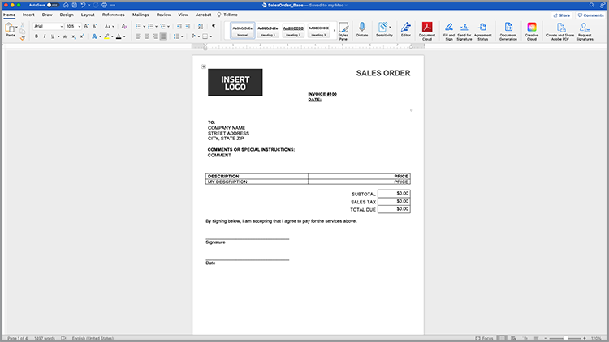
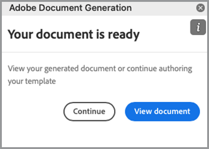

# Acelere seu processo de vendas


De white papers a contratos e acordos, vários documentos são necessários durante toda a jornada de compra. Neste tutorial, saiba como o [[!DNL Adobe Acrobat Services]](https://developer.adobe.com/document-services/) pode integrar experiências de documento ao longo desta jornada para ajudar a acelerar as vendas.

## Gerar contratos e ordens de venda a partir dos dados

Os acordos de vendas, contratos e outros documentos podem variar muito com base em critérios específicos. Por exemplo, um contrato de venda pode incluir apenas determinados termos com base em critérios exclusivos, como estar em um país ou estado específico ou incluir determinados produtos como parte do contrato. Criar manualmente esses documentos ou manter muitas variações de modelos diferentes pode aumentar significativamente os custos legais associados à revisão manual de alterações.

A [API de Geração de Documento do Adobe](https://developer.adobe.com/document-services/apis/doc-generation/) permite que você obtenha dados do CRM ou de outro sistema de dados para gerar dinamicamente documentos de venda com base nesses dados.

## Obter credenciais

Comece registrando as credenciais gratuitas dos Serviços da Adobe PDF:

1. Navegue [aqui](https://documentcloud.adobe.com/dc-integration-creation-app-cdn/main.html) para registrar suas credenciais.
1. Faça logon usando sua Adobe ID.
1. Defina o nome da credencial (por exemplo, Demonstração de Acordos de Vendas).

   

1. Escolha um idioma para baixar o código de amostra (por exemplo, Node.js).
1. Marque para concordar com os **[!UICONTROL termos do desenvolvedor]**.
1. Selecione **[!UICONTROL Criar credenciais]**.
Um arquivo é baixado no seu computador com um arquivo ZIP contendo os arquivos de amostra, pdfservices-api-credentials.json e private.key para autenticação.

   

1. Selecione **[!UICONTROL Obter suplemento do Microsoft Word]** ou vá para [AppSource](https://appsource.microsoft.com/en-cy/product/office/WA200002654) para instalar.

   >[!NOTE]
   >
   >A instalação do suplemento do Word requer que você tenha permissão para instalar suplementos no Microsoft 365. Se você não tiver permissão, entre em contato com o administrador do Microsoft 365.

## Seus dados

Se estiver extraindo dados de um sistema de dados específico, você deve gerar a saída desses dados como dados JSON ou gerar seu próprio esquema. Esse cenário usa o seguinte conjunto de dados de amostra pré-criado:

```
{
    "salesOrder": {
        "comment": "Make sure to call 555-555-1234 when you arrive. The front door is broken."
    },
    "company": {
        "name":"Home Services Co.",
        "address": {
            "city": "Homestead",
            "state": "NY",
            "zip": "14623",
            "streetAddress": "123 Demohome Street"
        }
    },
    "customer": {
        "address": {
            "city": "Seattle",
            "state": "WA",
            "zip": "98052",
            "streetAddress": "20341 Whitworth Institute 405 N. Whitworth"
        },
        "email": "mailto:jane-doe@xyz.edu",
        "jobTitle": "Professor",
        "name": "Jane Doe",
        "telephone": "(425) 123-4567",
        "url": "http://www.janedoe.com"
    },
    "tax": {
        "state":"WA",
        "rate": 0.08
    },
    "referencesOrder": [
        {
            "description": "Carpet Cleaning Service - 3BR 2BA",
            "totalPaymentDue": {
                "price": 359.54
            },
            "orderedItem": {
                "description": "Carpet Cleaning Service"
            }
        },
        {
            "description": "Home Cleaning Service - 3BR 2BA",
            "totalPaymentDue": {
                "price": 299.99
            },
            "orderedItem": {
                "description": "House Cleaning Service"
            }
        }
    ]
}
```

## Adicionar tags básicas ao documento

Este cenário usa um documento de Pedido de Venda, que pode ser baixado [aqui](https://github.com/benvanderberg/adobe-document-generation-samples/blob/main/SalesOrder/Exercise/SalesOrder_Base.docx?raw=true).



1. Abra o documento de exemplo *SalesOrder.docx* no Microsoft Word.
1. Se o seu plug-in de Geração de Documento estiver instalado, selecione **[!UICONTROL Geração de Documento]** na Faixa de Opções. Se você não vir Geração de documento na faixa de opções, siga estas instruções.
1. Selecione **[!UICONTROL Começar]**.
1. Copie os dados de exemplo JSON gravados acima no campo *Dados JSON*.

   

Em seguida, navegue até o painel Marcador de geração de documento para inserir marcas no documento.

1. Selecione o texto que você deseja substituir (por exemplo, *NOME DA EMPRESA*).
1. No painel *Marcador de geração de documento*, procure “name”.
1. Na lista de tags, selecione nome em empresa.
1. Selecione **[!UICONTROL Inserir Texto]**.

   

   Este processo coloca uma marca chamada `{{company.name}}` porque ela está no caminho do JSON.

   ```
   {
   …
   "company": {
       "name":"Home Services Co.",
       …
   },
   …
   }
   ```

Repita essas ações para algumas das tags adicionais no documento, como ENDEREÇO, CIDADE, ESTADO, CEP e assim por diante.

## Visualizar o documento gerado

Diretamente no Microsoft Word, você pode visualizar o documento gerado com base nos dados JSON de amostra.

1. No painel *Marcador de geração de documento*, selecione **[!UICONTROL Gerar documento]**. A primeira vez que você for solicitado a fazer logon com sua Adobe ID. Selecione **[!UICONTROL Entrar]** e preencha as solicitações para fazer logon com suas credenciais.

   

1. Selecione **[!UICONTROL Exibir documento]**.

   

1. Uma janela do navegador é aberta, permitindo visualizar os resultados do documento.

   

Você pode ver as tags no documento que foram substituídas pelos dados dos dados de amostra originais.


## Adicionar uma tabela ao modelo

Neste próximo cenário, adicione uma lista de produtos a uma tabela no documento.

1. Insira o cursor onde a tabela deve ser colocada.
1. No painel *Marcador de geração de documento*, selecione **[!UICONTROL Avançado]**.
1. Expanda **[!UICONTROL Tabelas e Listas]**.
1. No campo *Registros de tabela*, selecione *referencesOrder*, que é uma matriz que lista todos os itens de produto.
1. No campo Selecionar registros da coluna, digite para incluir o campo *descrição* e *totalPaymentDue.price*.
1. Selecione **[!UICONTROL Inserir tabela]**.

   

Edite a tabela para ajustar estilos, tamanhos e outros parâmetros como faria com qualquer outra tabela no Microsoft Word.

## Adicionar cálculo numérico

Os cálculos numéricos permitem calcular somas e outros cálculos com base em um conjunto de dados, como uma matriz. Neste cenário, adicione um campo para calcular o subtotal.

1. Selecione o *$0.00* próximo ao título do subtotal.
1. No painel *[!UICONTROL Marcador de geração de documento]*, expanda os **[!UICONTROL Cálculos numéricos]**.
1. Em *[!UICONTROL Selecionar tipo de cálculo]*, escolha **[!UICONTROL Agregação]**.
1. Em *[!UICONTROL Selecionar tipo]*, escolha **[!UICONTROL Soma]**.
1. Em *[!UICONTROL Selecionar registros]*, escolha **[!UICONTROL ReferencesOrder]**.
1. Em *[!UICONTROL Selecionar item para executar agregação]&#x200B;**, escolha &#x200B;** [!UICONTROL totalPaymentsDue.price]**.
1. Selecione **[!UICONTROL Inserir Cálculo]**.

Esse processo insere uma tag de cálculo que fornece a soma dos valores. Cálculos mais avançados podem ser feitos usando cálculos JSONata. Por exemplo:

* Subtotal: `${{expr($sum(referencesOrder.totalPaymentDue.price))}}`
Calcula a soma de referencesOrder.totalPaymentDue.price.

* Imposto sobre Vendas: `${{expr($sum(referencesOrder.totalPaymentDue.price)*0.08)}}`
Calcula o preço e multiplica por 8% para calcular o imposto.

* Total Devido: `${{expr($sum(referencesOrder.totalPaymentDue.price)*1.08)}}`
Calcula o preço e multiplica por 1,08 para calcular o subtotal + imposto.

## Adicionar termos condicionais

As seções condicionais permitem incluir apenas uma frase ou um parágrafo quando uma determinada condição for atendida. Nesse cenário, apenas uma seção é incluída se corresponder a um determinado estado.

1. No documento, encontre a seção chamada *DECLARAÇÕES DE PRIVACIDADE DA CALIFÓRNIA*.
1. Selecione a seção com o cursor.

   

1. No *[!UICONTROL Marcador de geração de documento]*, selecione **[!UICONTROL Avançado]**.
1. Expanda o **[!UICONTROL conteúdo condicional]**.
1. No campo *[!UICONTROL Selecionar registros]*, procure e selecione **[!UICONTROL customer.address.state]**.
1. No campo *[!UICONTROL Selecionar operador]*, selecione **=**.
1. No *[!UICONTROL campo Valor]*, digite *CA*.
1. Selecione **[!UICONTROL Inserir Condição]**.

A seção Califórnia será exibida somente no documento gerado se customer.address.state = CA.

Em seguida, selecione a seção para WASHINGTON PRIVACY STATEMENTS e repita as etapas acima, substituindo o valor CA por WA.

## Adicionar uma imagem dinâmica

A API de geração de documento permite inserir imagens dinamicamente dos dados. Isso é útil quando você tem diferentes submarcas e deseja alterar logotipos, imagens de retrato ou imagens para torná-las mais relevantes para um determinado setor.

As imagens podem ser passadas por um URL no conteúdo de dados ou base64. Este exemplo usa um URL.

1. Posicione o cursor no ponto em que deseja incluir uma imagem.
1. No painel *[!UICONTROL Marcador de geração de documento]*, selecione **[!UICONTROL Avançado]**.
1. Expanda **[!UICONTROL Imagens]**.
1. No campo *[!UICONTROL Selecionar marcas]*, escolha o **[!UICONTROL logotipo]**.
1. No campo *[!UICONTROL Texto alternativo opcional]*, forneça uma descrição (ou seja, o logotipo). Esse processo insere um alocador de espaço de imagem parecido com o seguinte:

   

No entanto, você deseja definir a imagem dinamicamente em uma imagem que já esteja no layout, o que pode ser feito da seguinte maneira:

1. Clique com o botão direito do mouse na imagem de espaço reservado inserida.

   

1. Selecione **[!UICONTROL Editar texto alternativo]**.
1. No painel, copie o texto parecido com este:
   `{ "location-path": "logo", "image-props": { "alt-text": "Logo" }}`
1. Selecione uma imagem diferente no documento que você deseja que seja dinâmico.

   

1. Clique com o botão direito na imagem e selecione **[!UICONTROL Editar texto alternativo]**.
1. Cole o valor no painel.

Esse processo substitui a imagem por uma imagem que está na variável de logotipo nos dados.

## Adicionar tags para o Acrobat Sign

O Adobe Acrobat Sign permite que você capture assinaturas eletrônicas em seus documentos. O Acrobat Sign oferece uma maneira fácil de arrastar e soltar campos na interface da Web, mas você também pode controlar a posição dos campos de assinatura e outros usando uma Tag de texto. Com o Adobe Document Generation Tagger, você pode inserir facilmente esses campos de Tag de texto.

1. Navegue até onde a assinatura é necessária no documento de amostra.
1. Insira o cursor onde a assinatura é necessária.
1. No painel *[!UICONTROL Marcador de Geração de Documento do Adobe]*, selecione **[!UICONTROL Adobe Sign]**.
1. No campo *[!UICONTROL Especificar número de destinatários]*, defina o número de destinatários (neste exemplo, é um).
1. No campo *[!UICONTROL Recipients]*, selecione **[!UICONTROL Signer-1]**.
1. No tipo *[!UICONTROL Campo]*, selecione **[!UICONTROL Assinatura]**.
1. Selecione **[!UICONTROL Inserir Marca de Texto do Adobe Sign]**.

Uma tag é inserida no documento.


O Acrobat Sign fornece vários outros tipos de campos que você pode inserir, como campos de data.

1. No tipo *Campo*, selecione **[!UICONTROL Data]**.
1. Mova o cursor acima do local Data no documento.
1. Selecione **[!UICONTROL Inserir Marca de Texto do Adobe Sign]**.


## Gerar seu contrato

Agora você marcou o documento e está pronto para começar. A próxima seção explica como gerar um documento usando as amostras da API de geração de documento do Node.js, mas elas funcionarão em qualquer idioma.

Abra o pdfservices-node-sdk-samples-master que foi baixado quando você registrou suas credenciais. Os arquivos pdfservices-api-credentials.json e private.key devem ser incluídos nesses arquivos.

1. Abra um Terminal para instalar dependências usando a instalação do npm.
1. Copie o data.json de exemplo na pasta resources.
1. Copie o modelo do Word para a pasta de recursos.
1. Crie um novo arquivo no diretório raiz da pasta de amostras chamada generate-salesOrder.js.

```
const PDFServicesSdk = require('@adobe/pdfservices-node-sdk');
const fs = require('fs');
const path = require('path');

var dataFileName = path.join('resources', '<INSERT JSON FILE');
var outputFileName = path.join('output', 'salesOrder_'+Date.now()+".pdf");
var inputFileName = path.join('resources', '<INSERT DOCX>');

//Loads credentials from the file that you created.
const credentials =  PDFServicesSdk.Credentials
    .serviceAccountCredentialsBuilder()
    .fromFile("pdfservices-api-credentials.json")
    .build();

// Setup input data for the document merge process
const jsonString = fs.readFileSync(dataFileName),
jsonDataForMerge = JSON.parse(jsonString);

// Create an ExecutionContext using credentials
const executionContext = PDFServicesSdk.ExecutionContext.create(credentials);

// Create a new DocumentMerge options instance
const documentMerge = PDFServicesSdk.DocumentMerge,
documentMergeOptions = documentMerge.options,
options = new documentMergeOptions.DocumentMergeOptions(jsonDataForMerge, documentMergeOptions.OutputFormat.PDF);

// Create a new operation instance using the options instance
const documentMergeOperation = documentMerge.Operation.createNew(options)

// Set operation input document template from a source file.
const input = PDFServicesSdk.FileRef.createFromLocalFile(inputFileName);
documentMergeOperation.setInput(input);

// Execute the operation and Save the result to the specified location.
documentMergeOperation.execute(executionContext)
.then(result => result.saveAsFile(outputFileName))
.catch(err => {
    if(err instanceof PDFServicesSdk.Error.ServiceApiError
        || err instanceof PDFServicesSdk.Error.ServiceUsageError) {
        console.log('Exception encountered while executing operation', err);
    } else {
        console.log('Exception encountered while executing operation', err);
    }
});
```

1. Substitua `<INSERT JSON FILE>` pelo nome do arquivo JSON em /resources.
1. Substitua `<INSERT DOCX>` pelo nome do arquivo DOCX.
1. Para executar, use o Terminal para executar o nó generate-salesOrder.js.

O arquivo de saída deve estar na pasta /output com o documento gerado corretamente.

## Mais opções

Depois que o documento for gerado, você poderá executar ações adicionais, como:

* Proteger documento com uma senha
* Compactar PDF se houver imagens grandes
* Capturar assinaturas eletrônicas no documento

Para saber mais sobre algumas das outras ações disponíveis, examine os scripts na pasta /src nos arquivos de amostra. Você também pode saber mais revisando a documentação das diferentes ações.

## Casos de uso adicionais

O [!DNL Adobe Acrobat Services] pode ajudar a simplificar muitas partes de um ciclo de vendas com fluxos de trabalho de documentos digitais:

* Use a API incorporada do Adobe PDF para incorporar white papers e outros conteúdos em sites e, ao mesmo tempo, medir e coletar análises sobre a audiência
* Usar o Acrobat Sign para capturar assinaturas eletrônicas nos contratos gerados
* Extraia dados de contrato de seus documentos PDF usando a API do Adobe PDF Extract

## Aprendizagem adicional

Tem interesse em saber mais? Veja algumas maneiras adicionais de usar o [!DNL Adobe Acrobat Services]:

* Saiba mais sobre [documentação](https://developer.adobe.com/document-services/docs/overview/)
* Veja mais tutoriais no Adobe Experience League
* Use os scripts de amostra na pasta /src para ver como aproveitar o PDF
* Siga o [Blog de Tecnologia do Adobe](https://medium.com/adobetech/tagged/adobe-document-cloud) para obter as dicas e truques mais recentes
* Assine os [Clipes de Papel (a transmissão ao vivo mensal)](https://www.youtube.com/playlist?list=PLcVEYUqU7VRe4sT-Bf8flvRz1XXUyGmtF) para saber mais sobre a automação usando o [!DNL Adobe Acrobat Services].
======
* Saiba mais sobre [documentação](https://developer.adobe.com/document-services/docs/overview/)
* Veja mais tutoriais no Adobe Experience League
* Use os scripts de amostra na pasta /src para ver como aproveitar o PDF
* Siga o [Blog de Tecnologia do Adobe](https://medium.com/adobetech/tagged/adobe-document-cloud) para obter as dicas e truques mais recentes
* Assine os [Clipes de Papel (a transmissão ao vivo mensal)](https://www.youtube.com/playlist?list=PLcVEYUqU7VRe4sT-Bf8flvRz1XXUyGmtF) para saber mais sobre a automação usando o [!DNL Adobe Acrobat Services]
