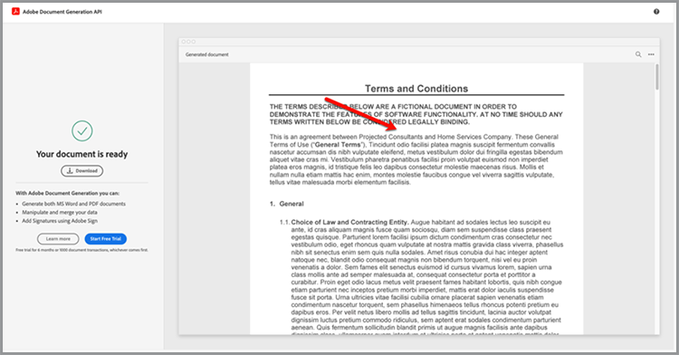
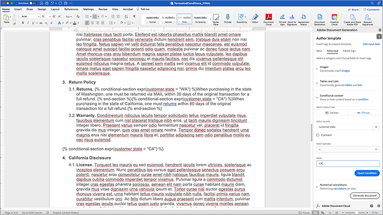

# Automatizar fluxos de trabalho legais


Em um cenário ideal, os termos do contrato são aceitos sem nenhuma modificação. No entanto, muitas vezes os contratos precisam de personalização, o que exige revisão legal. As revisões legais criam custos significativos e retardam o processo de entrega dos termos do contrato. O uso de modelos predefinidos que mudam com base no idioma aprovado ajuda as equipes jurídicas a gerenciar e executar os termos do contrato com mais segurança.

Este tutorial usa um contrato legal que varia de estado para estado. Para solucionar essas variações, um modelo de contrato com seções condicionais é criado, e são incluídos somente quando determinados critérios são atendidos. O documento gerado pode ser um documento do Word ou PDF. Você também pode aprender algumas das maneiras de proteger seu documento usando a API de serviços do Adobe PDF ou o Acrobat Sign.

## Obter credenciais

Comece registrando as credenciais gratuitas dos Serviços da Adobe PDF:

1. Navegar [aqui](https://documentcloud.adobe.com/dc-integration-creation-app-cdn/main.html) para registrar suas credenciais.
1. Faça logon usando sua Adobe ID.
1. Defina o nome da credencial.

   

1. Escolha um idioma para baixar o código de exemplo (por exemplo, Node.js).
1. Marque para concordar com **[!UICONTROL termos do desenvolvedor]**.
1. Selecionar **[!UICONTROL Criar credenciais]**.
Um arquivo é baixado no seu computador com um arquivo ZIP contendo os arquivos de amostra, pdfservices-api-credentials.json e private.key para autenticação.

   

1. Selecionar **[!UICONTROL Obter suplemento do Microsoft Word]** ou vá para [AppSource](https://appsource.microsoft.com/en-cy/product/office/WA200002654) para instalar.

   >[!NOTE]
   >
   >A instalação do suplemento do Word requer que você tenha permissão para instalar suplementos no Microsoft 365. Se você não tiver permissão, entre em contato com o administrador do Microsoft 365.

## Seus dados

Nesse cenário, informações são passadas para ajudar a gerar o documento e informar se determinadas seções devem ser incluídas ou não:

```
{
    "customer": {
        "name": "Home Services Company",
        "street": "123 Any Street",
        "city": "Anywhere",
        "state": "CA",
        "zip": "12345",
        "country":"USA",
        "signer": {
            "email": "johnnyechostone@gmail.com",
            "firstName": "John",
            "lastName": "Echostone"
        }
    },
    "company": {
        "name": "Projected Consultants",
        "signer": {
            "email": "maryburostone@gmail.com",
            "firstName": "Mary",
            "lastName": "Burostone"
        }
    },
    "conditions": {
        "includeGeneralTerms": true,
        "includeConsumerDiscloure": true
    }
}
```

Nos dados, há informações sobre o cliente, seu nome, quem está assinando, o estado em que se encontram e assim por diante. Além disso, há seções para informações sobre a empresa que está gerando os sinalizadores de contrato e condição que são usadas para incluir determinadas seções do contrato.

## Adicionar tags básicas ao documento

Este cenário usa um documento de Termos e condições, que pode ser baixado [aqui](https://github.com/benvanderberg/adobe-document-generation-samples/blob/main/Agreement/exercise/TermsAndConditions_Sample.docx?raw=true).


1. Abra o *TermsAndConditions.docx* documento de amostra no Microsoft Word.
1. Se a opção [Geração de documento](https://appsource.microsoft.com/en-cy/product/office/WA200002654) estiver instalado, selecione **[!UICONTROL Geração de documento]** na Faixa de Opções. Se você não vir Geração de documento na faixa de opções, siga estas instruções.
1. Selecionar **[!UICONTROL Começar]**.
1. Copie os dados de amostra JSON gravados acima no campo Dados JSON.

   

Navegue até a guia *Document Generation Tagger* para inserir tags no documento.

## Inserir o nome da empresa

1. Selecione o texto que você deseja substituir. Neste cenário, você está substituindo a EMPRESA na seção de abertura do documento.
1. Entrada *Document Generation Tagger*, procure por “nome”.
1. Em Empresa, escolha *nome*.

   

1. Selecionar **[!UICONTROL Inserir texto]**.

Isso coloca uma tag chamada `{{company.name}}` porque a tag está nesse caminho no JSON.

```
{
    "company": {
        "name": "Projected Consultants",
        ...
    }
    ...
}
```

Em seguida, repita essa etapa na seção de abertura do texto CLIENTE. Repetir **etapas 1-4**, substituindo CLIENTE por “nome” em cliente. A saída deve ser `{{customer.name}}`, refletindo que o texto vem de baixo do objeto do cliente.

A API de geração de documento Adobe também permite que você inclua tags nos cabeçalhos e rodapés e no final, onde os títulos das assinaturas precisam ir.

Repita este processo novamente com **etapas 1-4** para o texto EMPRESA e CLIENTE no rodapé.


Por fim, você precisa **repita as etapas de 1 a 4** para substituir FIRST NAME e LAST NAME na seção Customer da página de assinatura pelas tags de `{{customer.signer.firstName}}` e `{{customer.signer.lastName}}` respectivamente. Não se preocupe se a marca de formatação for longa e fluir novamente para a próxima linha, pois ela será substituída quando o documento for gerado.

O início do documento e o rodapé devem ficar semelhantes a estes:

* Seção inicial:


* Rodapé:


* Página de assinatura:


Agora que as tags foram inseridas no documento, você está pronto para visualizar o contrato gerado.

## Visualizar o documento gerado

Diretamente no Microsoft Word, você pode visualizar o documento gerado com base nos dados JSON de amostra.

1. Entrada *Document Generation Tagger*, selecione **[!UICONTROL Gerar documento]**.
1. A primeira vez que você for solicitado a fazer logon com sua Adobe ID. Selecionar **[!UICONTROL Fazer logon]** e preencha os prompts para fazer logon com suas credenciais.

   

1. Selecionar **[!UICONTROL Exibir documento]**.

   

1. Uma janela do navegador é aberta, permitindo visualizar os resultados do documento.

   

## Adicionar termos condicionais para cada estado

Nesta próxima seção, você define apenas determinadas seções a serem incluídas com base em determinados critérios de dados de entrada. No documento de amostra, as seções 4 e 5 dizem respeito apenas a um estado específico. Para esse cenário, somente os termos específicos do estado devem ser incluídos quando um cliente reside nesse estado. Além disso, a numeração no Microsoft Word não deve incluir essa seção se ela for removida. Use o recurso de conteúdo condicional da API de geração de documento para marcar isso.


1. No documento, selecione a seção Divulgação da Califórnia e todos os submarcadores.

   

1. Entrada *[!UICONTROL Document Generation Tagger]*, selecione **[!UICONTROL Avançado]**.
1. Expandir **[!UICONTROL Conteúdo condicional]**.
1. Entrada *[!UICONTROL Selecionar registros]* pesquisar e selecionar **[!UICONTROL customer.state]**.
1. Entrada *[!UICONTROL Selecionar operador]* , selecione **=**.
1. Entrada *[!UICONTROL Valor]* campo, tipo *CA*.
1. Selecionar **[!UICONTROL Inserir Condição]**.

A seção agora é delimitada com algumas tags chamadas de tags de seção condicional. Quando você adicionou tags, a tag de seção condicional pode ter sido adicionada como uma linha numerada. É possível remover isso espaçando o cursor antes da marca de formatação, caso contrário, os itens serão numerados como se a marca não estivesse lá quando o documento for gerado. A seção que é condicional termina com o `` tag.


**Repita as etapas de 1 a 7** para a *Divulgação de Washington* , que substitui o *CA* valor com *WA* para indicar que a seção é mostrada somente se o estado do cliente for Washington.


## Teste com seções condicionais

Quando as seções condicionais estiverem prontas, você poderá visualizar o documento selecionando **Gerar documento**.

Ao gerar o documento, observe que a seção incluída é apenas aquela que atende aos critérios de dados. No exemplo abaixo, como o estado era igual a CA, apenas a seção Califórnia está incluída.


Uma outra mudança notável é que a numeração para a seção subsequente, Uso de Serviços e Software, tem o número 5. Isso significa que quando a seção Washington é omitida, a numeração continua.


Para testar se o modelo se comporta corretamente quando o cliente está no estado de Washington em vez da Califórnia, altere os dados de amostra do modelo:

1. Entrada *Document Generation Tagger*, selecione **[!UICONTROL Editar dados de entrada]**.

   

1. Selecionar **[!UICONTROL Editar]**.

1. Nos dados JSON, altere *CA* até *WA*.

   

1. Selecionar **[!UICONTROL Gerar tags]**.
1. Selecionar **[!UICONTROL Gerar documento]** para regenerar o documento.

Observe que o documento inclui apenas a seção do estado de Washington.


## Adição de uma sentença condicional

Como as seções condicionais, você também pode ter frases específicas que são incluídas quando certas condições são atendidas. Para este exemplo, a política de devolução é diferente entre Califórnia e Washington.

1. Na seção 3.1, selecione a primeira frase “Ao fazer compras no estado de Washington, deve-se retornar via CORREIO dentro de 30 dias da transação original para um reembolso total.”.
1. Entrada *[!UICONTROL Document Generation Tagger]*, selecione **[!UICONTROL Avançado]**.
1. Expandir **[!UICONTROL Conteúdo condicional]**.
1. Em *[!UICONTROL Tipo de conteúdo]*, selecione **[!UICONTROL Frase]**.
1. Entrada *[!UICONTROL Selecionar registros]* pesquisar e selecionar **[!UICONTROL customer.state]**.
1. Entrada *[!UICONTROL Selecionar operador]* , selecione **=**.
1. Entrada *[!UICONTROL Valor]* campo, tipo *CA*.
1. Selecionar **[!UICONTROL Inserir Condição]**.

Embora o nome da tag seja o mesmo, a principal diferença entre Frase e Seção é que uma frase faz com que a seção não inclua novas linhas. As tags condition-section e -end-section devem estar no mesmo parágrafo.



## Adicionar tags para o Acrobat Sign

O Acrobat Sign permite enviar contratos para assinatura ou incorporar à experiência da Web para que alguém os visualize e assine facilmente. O Adobe Document Generation Tagger no Microsoft Word permite que você pré-marque facilmente documentos antes que sejam enviados com o Acrobat Sign, para que as assinaturas sejam sempre colocadas no local certo. Nesse cenário, há dois signatários que precisam de um local para assinar e datar o documento.

1. Navegue até onde o cliente deve assinar.
1. Posicione o cursor no local onde a assinatura precisa ir.

   

1. Entrada *[!UICONTROL Document Generation Tagger]*, selecione **[!UICONTROL Adobe Sign]**.
1. Entrada *[!UICONTROL Especificar o número de destinatários]* , defina o número de destinatários (este exemplo usa 2).
1. Entrada *[!UICONTROL Destinatários]* , selecione **[!UICONTROL Signer-1]**.
1. Entrada *[!UICONTROL Campo]* texto, selecione **[!UICONTROL Assinatura]**.
1. Selecionar **[!UICONTROL Inserir tag de texto do Adobe Sign]**.

   

>[!NOTE]
>
>Se a opção **Inserir tag de texto do Adobe Sign** parece estar ausente, role para baixo.

Insere um campo de assinatura no qual o primeiro signatário precisa assinar.


Em seguida, insira um campo de dados para o signatário que será preenchido automaticamente ao assinar.

1. Mova o cursor para onde a data deve ser colocada.

   

1. Defina o Tipo de campo como Data.
1. Selecionar **[!UICONTROL Inserir tag de texto do Adobe Sign]**.

A tag Date inserida é bastante longa: `{{Date 3_es_:signer1:date:format(mm/dd/yyyy):font(size=Auto)}}`. A tag de texto do Acrobat Sign deve permanecer na mesma linha, o que é diferente das tags de Geração de documento. O `:format()` e `font()` parâmetros são opcionais, portanto, para este cenário, podemos encurtar a tag para `{{Date 3_es_:signer1:date}}`.

Repita as etapas acima da guia *Assinatura da empresa* seção. Ao fazer isso, você deve alterar o campo Destinatários para **Signer-2**, caso contrário, todos os campos de assinatura serão atribuídos à mesma pessoa.

## Gerar seu contrato

Agora você marcou o documento e está pronto para começar. Nesta próxima seção, saiba como gerar um documento usando as amostras da API de geração de documento para Node.js. Esses exemplos funcionam em todos os idiomas.

Abra o arquivo pdfservices-node-sdk-samples-master que você baixou ao registrar suas credenciais. Esses arquivos incluem os arquivos pdfservices-api-credentials.json e private.key.

1. Abra seu **[!UICONTROL Terminal]** para instalar dependências usando `npm install`.
1. Copiar sua amostra *data.json* no *resources* pasta.
1. Copie o modelo do Word que você criou para o *resources* pasta.
1. Crie um novo arquivo no diretório raiz da pasta de amostras chamada *generate-salesOrder.js*.

   ```
   const PDFServicesSdk = require('@adobe/pdfservices-node-sdk').
   const fs = require('fs');
   const path = require('path');
   
   var dataFileName = path.join('resources', '<INSERT JSON FILE');
   var outputFileName = path.join('output', 'salesOrder_'+Date.now()+".pdf");
   var inputFileName = path.join('resources', '<INSERT DOCX>');
   
   //Loads credentials from the file that you created.
   const credentials =  PDFServicesSdk.Credentials
      .serviceAccountCredentialsBuilder()
      .fromFile("pdfservices-api-credentials.json")
      .build();
   
   // Setup input data for the document merge process
   const jsonString = fs.readFileSync(dataFileName),
   jsonDataForMerge = JSON.parse(jsonString);
   
   // Create an ExecutionContext using credentials
   const executionContext = PDFServicesSdk.ExecutionContext.create(credentials);
   
   // Create a new DocumentMerge options instance
   const documentMerge = PDFServicesSdk.DocumentMerge,
   documentMergeOptions = documentMerge.options,
   options = new documentMergeOptions.DocumentMergeOptions(jsonDataForMerge, documentMergeOptions.OutputFormat.PDF);
   
   // Create a new operation instance using the options instance
   const documentMergeOperation = documentMerge.Operation.createNew(options)
   
   // Set operation input document template from a source file.
   const input = PDFServicesSdk.FileRef.createFromLocalFile(inputFileName);
   documentMergeOperation.setInput(input);
   
   // Execute the operation and Save the result to the specified location.
   documentMergeOperation.execute(executionContext)
   .then(result => result.saveAsFile(outputFileName))
   .catch(err => {
      if(err instanceof PDFServicesSdk.Error.ServiceApiError
         || err instanceof PDFServicesSdk.Error.ServiceUsageError) {
         console.log('Exception encountered while executing operation', err);
      } else {
         console.log('Exception encountered while executing operation', err);
      }
   });
   ```

1. Substituir `<JSON FILE>` com o nome do arquivo JSON em /resources.
1. Substituir `<INSERT DOCX>` com o nome do arquivo DOCX.
1. Para executar, use **[!UICONTROL Terminal]** para executar o nó `generate-salesOrder.js`.

O arquivo de saída está na pasta /output com o documento gerado corretamente.

Você pode alterar o formato alterando a linha abaixo. O formato DOCX é útil se este documento for enviado para ser editado no Word ou para revisão de contrato.

Fazer do PDF:

```
options = new documentMergeOptions.DocumentMergeOptions(jsonDataForMerge,
documentMergeOptions.OutputFormat.PDF);
```

Word:

```
options = new documentMergeOptions.DocumentMergeOptions(jsonDataForMerge, documentMergeOptions.OutputFormat.DOCX);
```

Você também deve alterar o nome do arquivo de saída para .pdf ou .docx no formato de saída PDF ou DOCX, respectivamente:

```
var outputFileName = path.join('output', 'salesOrder_'+Date.now()+".docx");
```

## Enviar contrato para assinatura

[Adobe Acrobat Sign](https://www.adobe.com/br/sign.html) permite enviar contratos para um ou vários destinatários para que eles visualizem e assinem documentos. Juntamente com uma experiência de usuário fácil de usar para enviar um documento para assinatura, há APIs REST disponíveis que permitem usar Word, PDF, HTML e outros formatos e enviá-los para assinatura.

O exemplo abaixo mostra como usar a página de documentação da API REST para pegar o documento gerado anteriormente e enviá-lo para assinatura. Primeiro, saiba como fazer isso por meio da interface da Web do Acrobat Sign e, em seguida, como fazer isso com a API REST.

## Obter uma conta da Acrobat Sign

Se você não tiver uma conta da Acrobat Sign, cadastre-se em uma conta de desenvolvedor e revise a documentação [aqui](https://developer.adobe.com/adobesign-api/)e selecione **Inscrição na Conta de Desenvolvedor**. Será solicitado que você preencha um formulário e receba um email de verificação. Depois disso, você será direcionado para um site para definir sua senha e conta, e poderá fazer logon no Acrobat Sign.

## Enviar um contrato pela interface da Web

1. Selecionar **[!UICONTROL Enviar]** na barra de navegação.

   

1. Entrada *Destinatários* especifique dois endereços de email. É uma prática recomendada usar um endereço de email que não esteja associado à sua conta da Acrobat Sign.

   

1. Definir um **[!UICONTROL Nome do contrato]** e **[!UICONTROL Mensagem]**.
1. Selecionar **[!UICONTROL Adicionar arquivos]** e faça upload do arquivo gerado do seu computador.
1. Selecione **[!UICONTROL Visualizar e adicionar campos de assinatura]**.
1. Selecione **[!UICONTROL Próximo]**.
1. Ao rolar para baixo até a página de assinatura, você pode ver os campos de assinatura inseridos com base nas tags.

   

1. Clique em **[!UICONTROL Enviar]**.
1. No email, é exibida uma mensagem com um link para exibir e assinar.

   

1. Selecionar **[!UICONTROL Revisar e assinar]**.
1. Selecionar **[!UICONTROL Continuar]** para aceitar os termos de uso.
1. Selecionar **[!UICONTROL Início]** para ir para onde precisa assinar.

   

1. Selecionar **[!UICONTROL Clique aqui para assinar]**.

   

1. Digite sua assinatura.

   

1. Selecionar **[!UICONTROL Aplicar]**.
1. Selecionar **[!UICONTROL Clique para assinar]**.

Um email é enviado para o próximo signatário. Repita as etapas de 9 a 16 para visualizar e assinar o segundo signatário.

Uma vez que o contrato é concluído, uma cópia assinada dele é enviada por email a cada uma das partes. Além disso, um contrato assinado pode ser recuperado na interface da Web do Acrobat Sign no **Gerenciar** página.


Em seguida, saiba como fazer o mesmo cenário por meio da documentação da API REST.

## Obter credenciais

1. Navegue até [Documentação do Acrobat Sign REST](https://secure.na1.adobesign.com/public/docs/restapi/v6).
1. Expandir *transientDocuments* e a [POST /transientDocuments](https://benprojecteddemo.na1.adobesign.com/public/docs/restapi/v6#!/transientDocuments/createTransientDocument).
1. Selecionar **[!UICONTROL OAUTH ACCESS-TOKEN]**.

   

1. Verifique as permissões de OAUTH para *agreement_write*, *agreement_sign*, *widget_write* e *library_write*.
1. Selecionar **[!UICONTROL Autorizar]**.
1. Por meio de uma janela pop-up, será solicitado que você faça logon com sua conta da Acrobat Sign. Efetue login no usuário usando seu nome de usuário e senha de administrador.
1. Você será solicitado a permitir o acesso à Documentação REST. Selecionar **[!UICONTROL Permitir acesso]**.

Um token de transmissão é adicionado à **Autorização** campo.

Para saber mais sobre como criar um token de autorização para o Acrobat Sign, siga a etapa descrita [aqui](https://opensource.adobe.com/acrobat-sign/developer_guide/helloworld.html).

## Carregar um documento temporário

Como o token de autorização é adicionado das etapas anteriores, você precisa carregar um documento para fazer a chamada de API:

1. Entrada *Arquivo* , carregue o documento PDF gerado nas etapas anteriores.

   

1. Selecionar **[!UICONTROL Experimente!]**.
1. Entrada **[!UICONTROL Corpo da resposta]**, copie o *transientDocumentId* valor.

O *transientDocumentId* é usado para fazer referência a um documento armazenado temporariamente no Acrobat Sign para que possa ser referenciado em chamadas de API subsequentes.

## Enviar para assinatura

Após o upload de um documento, é necessário enviar o contrato para assinatura.

1. Expanda a seção do contrato e as seções do contrato POST.
1. No menu *AgreementInfo* preencha-o com o seguinte JSON:

   ```
   {
   "fileInfos": [
      {
         "transientDocumentId": "3AAABLblqZhAJeoswpyslef8_toTGT1WgBLk3TlhfJXy_uSLlKyre2hjF0-J1meBDn0PlShk0uQy6JghlqEoqXNnskq7YawteF6QWtHefP9wN2CW_Xbt0O9kq1tkpznG0a5-mEm4bYAV1FGOnD1mt_ooYdzKxm7KzTB11DLX2-81Zbe2Z1suy7oXiWNR3VSb-zMfIb5D4oIxF8BiNfN0q08RwT108FcB1bx4lekkATGld3nRbf8ApVPhB72VNrAIF0F1rAFBWTtfgvBKZaxrYSyZq73R_neMdvZEtxWTk5fii_bLVe7VdNZMcO55sofH61eQC_QIIsoYswZP4rw6dsTa68ZRgKUNs"
      }
   ],
   "name": "Terms and Conditions",
   "participantSetsInfo": [
      {
         "memberInfos": [
         {
            "email": "adobesigndemo+customer@outlook.com"
         }
         ],
         "order": 1,
         "role": "SIGNER"
      },
      {
         "memberInfos": [
            {
               "email": "adobesigndemo+company@outlook.com"
            }
         ],
         "order": 1,
         "role": "SIGNER"
         }
   ],
   "signatureType": "ESIGN",
   "state": "IN_PROCESS"
   }
   ```

1. Selecionar **[!UICONTROL Experimente!]**.

**API de contratos POST** retorna uma ID para o contrato. Para obter um modelo para o esquema de modelo JSON, selecione **Esquema de Modelo Mínimo**. Uma lista completa de parâmetros está disponível no **Esquema de Modelo Completo** seção.

## Verificar o status do contrato

Depois de obter uma ID de contrato, você pode enviar um status de contrato.

1. Expandir **[!UICONTROL GET /agreements/{agreementId}]**.
1. Como talvez você precise de um escopo OAUTH adicional, selecione **[!UICONTROL OAUTH-ACCESS-TOKEN]** novamente.
1. Copie a agreementId da resposta de chamada da API anterior no campo agreementId.
1. Selecionar **[!UICONTROL Experimente!]**.

Agora você tem informações sobre esse contrato.

```
{
    "id": "CBJCHBCAABAAc6LyP4SVuKXP_pNstzIzyripanRdz4IB",
    "name": "Terms and Conditions",
    "groupId": "CBJCHBCAABAAoyMb1yIgczAGhBuJeHf99mglPtM7ElEu",
    "type": "AGREEMENT",
    "participantSetsInfo": [
      {
        "id": "CBJCHBCAABAAzZE-IcHHkt05-AVbxas4Jz7DUl3oEBO6",
        "memberInfos": [
          {
            "email": "adobesigndemo+customer@outlook.com",
            "id": "CBJCHBCAABAAyWgMMReqbxUFM7ctI5xz16c2kOmEy-IQ",
            "securityOption": {
              "authenticationMethod": "NONE"
            }
          }
        ],
        "role": "SIGNER",
        "order": 1
      },
      {
        "id": "CBJCHBCAABAAaRHz3gY2W0w5n_6pj1GMMuZAfhBihc1j",
        "memberInfos": [
          {
            "email": "adobesigndemo+company@outlook.com",
            "id": "CBJCHBCAABAAOZQwjPwJXFiX8YDKPYtzMpftsmxYrIo9",
            "securityOption": {
              "authenticationMethod": "NONE"
            }
          }
        ],
        "role": "SIGNER",
        "order": 1
      }
    ],
    "senderEmail": "adobesigndemo+new@outlook.com",
    "createdDate": "2022-03-22T02:59:36Z",
    "lastEventDate": "2022-03-22T02:59:41Z",
    "signatureType": "ESIGN",
    "locale": "en_US",
    "status": "OUT_FOR_SIGNATURE",
    "documentVisibilityEnabled": true,
    "hasFormFieldData": false,
    "hasSignerIdentityReport": false,
    "documentRetentionApplied": false
  }
```

O método mais eficiente para receber notificações quando as atualizações são alteradas é por meio de Webhooks, sobre os quais você pode saber mais [aqui](https://opensource.adobe.com/acrobat-sign/developer_guide/webhookapis.html.

## Armazenar um documento assinado

Depois que o documento é assinado, ele pode ser recuperado usando o arquivo GET /agreements/combinedDocument.

1. Expandir **[!UICONTROL GET /agreements/{agreementId}/combinedDocument]**.
1. Definir **[!UICONTROL agreementId]** para a *agreementId* fornecida pela chamada de API anterior.
1. Selecionar **[!UICONTROL Experimente!]**.

Parâmetros adicionais para anexar um relatório de auditoria ou documentos de suporte podem ser definidos usando os parâmetros attachSupportingDocuments e attachAuditReport.

No menu **Corpo da resposta**, ele pode ser baixado no computador e armazenado onde você quiser.

## Mais opções

Além de gerar um documento e enviá-lo para assinatura, ações adicionais estão disponíveis.

Por exemplo, se o documento não tiver uma assinatura, a API de serviços do Adobe PDF oferecerá muitas maneiras de transformar documentos após a geração do contrato, como:

* Proteger documento com uma senha
* Compactar PDF se houver imagens grandes
* Para saber mais sobre outras ações disponíveis, examine os scripts na pasta /src nos arquivos de amostra da API de Serviços do Adobe PDF. Você também pode saber mais revisando a documentação das diferentes ações que podem ser usadas.

Além disso, o Acrobat Sign oferece várias funções adicionais, como:

* Incorporar a experiência de assinatura em um aplicativo
* Adicionar métodos de verificação de identidade para signatários
* Definir configurações de notificação por email
* Baixar documentos separados individuais como parte de um contrato

## Aprendizagem adicional

Tem interesse em saber mais? Veja algumas maneiras adicionais de usar [!DNL Adobe Acrobat Services]:

* Saiba mais com [documentação](https://developer.adobe.com/document-services/docs/overview/)
* Veja mais tutoriais no Adobe Experience League
* Use os scripts de exemplo na pasta /src para saber como usar o PDF
* Seguir [Blog Adobe Tech](https://medium.com/adobetech/tagged/adobe-document-cloud) para obter as dicas e truques mais recentes
* Assinar [Clipes de papel (a transmissão ao vivo mensal)](https://www.youtube.com/playlist?list=PLcVEYUqU7VRe4sT-Bf8flvRz1XXUyGmtF) para saber mais sobre automação usando [!DNL Adobe Acrobat Services].
