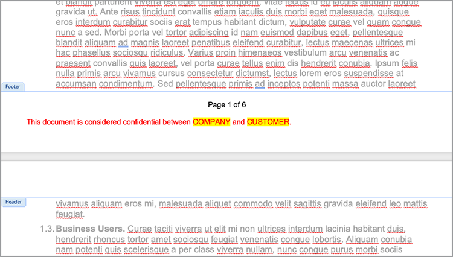

# Automatize fluxos de trabalho jurídicos


Em um cenário ideal, os termos do contrato são aceitos sem nenhuma modificação. No entanto, muitas vezes, os contratos precisam de personalização, o que exige análise legal. As revisões legais criam custos significativos e atrasam o processo de entrega dos termos do contrato. O uso de modelos predefinidos que mudam com base no idioma aprovado ajuda as equipes jurídicas a gerenciar e executar com mais segurança os termos do contrato.

Este tutorial usa um contrato legal que varia de estado para estado. Para lidar com essas variações, é criado um modelo de contrato com seções condicionais, que são incluídas somente quando determinados critérios são atendidos. O documento gerado pode ser um documento do Word ou PDF. Você também pode aprender algumas maneiras de proteger seu documento usando a API de serviços da Adobe PDF ou o Acrobat Sign.

## Obter credenciais

Comece registrando as credenciais gratuitas dos Serviços Adobe PDF:

1. Navegar [aqui](https://documentcloud.adobe.com/dc-integration-creation-app-cdn/main.html) para registrar suas credenciais.
1. Faça logon usando sua Adobe ID.
1. Defina o nome da credencial.

   

1. Escolha um idioma para baixar o código de amostra (por exemplo, Node.js).
1. Marque para concordar com **[!UICONTROL termos de desenvolvedor]**.
1. Selecionar **[!UICONTROL Criar credenciais]**.
Um arquivo é baixado no computador com um arquivo ZIP contendo os arquivos de exemplo pdfservices-api-credentials.json e private.key para autenticação.

   

1. Selecionar **[!UICONTROL Baixe o suplemento do Microsoft Word]** ou vá para [AppSource](https://appsource.microsoft.com/en-cy/product/office/WA200002654) para instalar.

   >[!NOTE]
   >
   >A instalação do suplemento do Word requer que você tenha permissão para instalar suplementos no Microsoft 365. Se você não tiver permissão, entre em contato com o administrador do Microsoft 365.

## Seus dados

Nesse cenário, as informações são passadas para ajudar a gerar o documento e informar se determinadas seções devem ser incluídas ou não:

```
{
    "customer": {
        "name": "Home Services Company",
        "street": "123 Any Street",
        "city": "Anywhere",
        "state": "CA",
        "zip": "12345",
        "country":"USA",
        "signer": {
            "email": "johnnyechostone@gmail.com",
            "firstName": "John",
            "lastName": "Echostone"
        }
    },
    "company": {
        "name": "Projected Consultants",
        "signer": {
            "email": "maryburostone@gmail.com",
            "firstName": "Mary",
            "lastName": "Burostone"
        }
    },
    "conditions": {
        "includeGeneralTerms": true,
        "includeConsumerDiscloure": true
    }
}
```

Nos dados, há informações sobre o cliente, seu nome, quem está assinando, o estado em que se encontra e assim por diante. Além disso, há seções para informações sobre a empresa que está gerando os sinalizadores de contrato e condição que são usadas para incluir certas seções do contrato.

## Adicionar tags básicas ao documento

Este cenário usa um documento de Termos e condições, que pode ser baixado [aqui](https://github.com/benvanderberg/adobe-document-generation-samples/blob/main/Agreement/exercise/TermsAndConditions_Sample.docx?raw=true).


1. Abra o *TermsAndConditions.docx* documento de amostra no Microsoft Word.
1. Se a [Geração de documento](https://appsource.microsoft.com/en-cy/product/office/WA200002654) plug-in instalado, selecione **[!UICONTROL Geração de documento]** na Faixa de Opções. Se você não vir Geração de documento na faixa de opções, siga estas instruções.
1. Selecionar **[!UICONTROL Introdução]**.
1. Copie os dados de amostra JSON gravados acima no campo Dados JSON.

   

Navegue até o *Marcador de Geração de Documento* para inserir marcas no documento.

## Inserir o nome da empresa

1. Selecione o texto que deseja substituir. Nesse cenário, você está substituindo a EMPRESA na seção de abertura do documento.
1. No *Marcador de Geração de Documento*, procure por &quot;nome&quot;.
1. Em empresa, escolha *nome*.

   

1. Selecionar **[!UICONTROL Inserir texto]**.

Isso coloca uma tag chamada `{{company.name}}` porque a tag está sob esse caminho no JSON.

```
{
    "company": {
        "name": "Projected Consultants",
        ...
    }
    ...
}
```

Em seguida, repita essa etapa na seção de abertura do texto CLIENTE. Repetir **etapas 1-4**, substituindo CLIENTE por &quot;nome&quot; em cliente. A saída deve ser `{{customer.name}}`, refletindo que o texto está vindo de baixo do objeto do cliente.

A API de geração de documento do Adobe também permite incluir marcas nos cabeçalhos e rodapés e no final, onde os títulos das assinaturas precisam ir.

Repita esse processo novamente com **etapas 1-4** para o texto EMPRESA e CLIENTE no rodapé.



Finalmente, você precisa **repita as etapas 1 a 4** para substituir FIRST NAME e LAST NAME na seção Customer da página de assinatura pelas tags para `{{customer.signer.firstName}}` e `{{customer.signer.lastName}}` respectivamente. Não se preocupe se a tag for longa e refluir para a próxima linha, pois a tag será substituída quando o documento for gerado.

O início do documento e o rodapé devem ter a seguinte aparência:

* Seção inicial:


* Rodapé:


* Página de assinatura:


Agora que as tags são colocadas no documento, você está pronto para visualizar o contrato gerado.

## Visualizar o documento gerado

Diretamente no Microsoft Word, você pode visualizar o documento gerado com base nos dados JSON de amostra.

1. No *Marcador de Geração de Documento*, selecione **[!UICONTROL Gerar documento]**.
1. A primeira vez que você for solicitado a fazer logon com sua Adobe ID. Selecionar **[!UICONTROL Fazer logon]** e conclua as solicitações para fazer logon com suas credenciais.

   

1. Selecionar **[!UICONTROL Exibir documento]**.

   

1. Uma janela do navegador é aberta, permitindo visualizar os resultados do documento.

   

## Adicionar termos condicionais para cada estado

Nesta próxima seção, você define apenas determinadas seções a serem incluídas com base em determinados critérios de dados de entrada. No documento de amostra, as seções 4 e 5 se referem somente a um estado específico. Nesse cenário, somente os termos específicos do estado devem ser incluídos quando um cliente reside nesse estado. Além disso, a numeração no Microsoft Word não deve incluir essa seção se ela for removida. Use o recurso de conteúdo condicional da API de geração de documento para marcar isso.


1. No documento, selecione a seção Divulgação da Califórnia e todos os submarcadores.

   

1. No *[!UICONTROL Marcador de Geração de Documento]*, selecione **[!UICONTROL Avançado]**.
1. Expandir **[!UICONTROL Conteúdo condicional]**.
1. No *[!UICONTROL Selecionar registros]* , pesquise e selecione **[!UICONTROL customer.state]**.
1. No *[!UICONTROL Selecionar operador]* , selecione **=**.
1. No *[!UICONTROL Valor]* campo, tipo *CA*.
1. Selecionar **[!UICONTROL Inserir Condição]**.

A seção agora é encapsulada com algumas tags chamadas tags de seção condicional. Quando você adicionou as tags, pode ter adicionado a tag de seção condicional como uma linha numerada. Você pode remover isso aplicando um espaçamento inverso antes da tag, caso contrário, ela numerará os itens como se a tag não estivesse lá quando o documento for gerado. A seção condicional termina com o `` tag.


**Repita as etapas de 1 a 7** para *Divulgação Washington* , que substitui a *CA* valor com *WA* para representar que a seção é mostrada somente se o estado do cliente for Washington.


## Teste com seções condicionais

Quando as seções condicionais estiverem prontas, você poderá visualizar o documento selecionando **Gerar documento**.

Ao gerar o documento, observe que a seção incluída é apenas aquela que atende aos critérios de dados. No exemplo abaixo, como o estado era igual a CA, apenas a seção Califórnia é incluída.


Uma outra alteração notável é que a numeração para a seção subsequente, Uso de Serviços e Softwares, tem o número 5. Isso significa que quando a seção de Washington é omitida, a numeração continua.


Para testar se o modelo se comporta corretamente quando o cliente está no estado de Washington em vez de na Califórnia, altere os dados de amostra do modelo:

1. No *Marcador de Geração de Documento*, selecione **[!UICONTROL Editar dados de entrada]**.

   

1. Selecionar **[!UICONTROL Editar]**.

1. Nos dados JSON, altere *CA* para *WA*.

   

1. Selecionar **[!UICONTROL Gerar marcas]**.
1. Selecionar **[!UICONTROL Gerar documento]** para gerar novamente o documento.

Observe que o documento inclui apenas a seção do estado de Washington.


## Adicionar uma sentença condicional

Como as seções condicionais, você também pode ter frases específicas que são incluídas quando certas condições são atendidas. Neste exemplo, a política de retorno é diferente entre Califórnia e Washington.

1. Na seção 3.1, selecione a primeira frase &quot;Ao comprar no estado de Washington, um deve ser devolvido via CORREIO no prazo de 30 dias após a transação original para um reembolso total.&quot;.
1. No *[!UICONTROL Marcador de Geração de Documento]*, selecione **[!UICONTROL Avançado]**.
1. Expandir **[!UICONTROL Conteúdo condicional]**.
1. Sob *[!UICONTROL Tipo de conteúdo]*, selecione **[!UICONTROL Frase]**.
1. No *[!UICONTROL Selecionar registros]* , pesquise e selecione **[!UICONTROL customer.state]**.
1. No *[!UICONTROL Selecionar operador]* , selecione **=**.
1. No *[!UICONTROL Valor]* campo, tipo *CA*.
1. Selecionar **[!UICONTROL Inserir Condição]**.

Embora o nome da tag seja o mesmo, a principal diferença entre Frase e Seção é que uma frase não inclui novas linhas. A tag condition-section e a tag -end-section devem estar no mesmo parágrafo.


## Adicionar tags para o Acrobat Sign

O Acrobat Sign permite que você envie contratos para assinatura ou incorpore-os à experiência da Web para que alguém visualize e assine facilmente. O Marcador de geração de documento do Adobe no Microsoft Word permite pré-marcar documentos com facilidade antes de enviá-los com o Acrobat Sign, para que as assinaturas sejam sempre colocadas no local correto. Nesse cenário, há dois signatários que precisam de um local para assinar e datar o documento.

1. Navegue até onde o cliente deve assinar.
1. Posicione o cursor onde a assinatura precisa ir.

   

1. No *[!UICONTROL Marcador de Geração de Documento]*, selecione **[!UICONTROL Adobe Sign]**.
1. No *[!UICONTROL Especificar número de destinatários]* defina o número de destinatários (este exemplo usa 2).
1. No *[!UICONTROL Destinatários]* , selecione **[!UICONTROL Signer-1]**.
1. No *[!UICONTROL Campo]* tipo, selecione **[!UICONTROL Assinatura]**.
1. Selecionar **[!UICONTROL Inserir tag de texto do Adobe Sign]**.

   

>[!NOTE]
>
>Se a **Inserir tag de texto do Adobe Sign** parece estar ausente, role para baixo.

Isso coloca um campo de assinatura onde o primeiro signatário precisa assinar.


Em seguida, posicione um campo de dados para o signatário que será preenchido automaticamente ao assinar.

1. Mova o cursor para onde a data deve ser colocada.

   

1. Definir Tipo de campo como Data.
1. Selecionar **[!UICONTROL Inserir tag de texto do Adobe Sign]**.

A marca Data inserida é bastante longa: `{{Date 3_es_:signer1:date:format(mm/dd/yyyy):font(size=Auto)}}`. A tag de texto do Acrobat Sign deve permanecer na mesma linha, que é diferente das tags de Geração de documento. O `:format()` e `font()` parâmetros são opcionais, portanto, para esse cenário, podemos encurtar a tag para `{{Date 3_es_:signer1:date}}`.

Repita as etapas acima da *Assinatura da empresa* seção. Ao fazer isso, altere o campo Destinatários para **Signer-2**, caso contrário, todos os campos de assinatura serão atribuídos à mesma pessoa.

## Gerar seu contrato

Agora você marcou seu documento e está pronto para começar. Nesta próxima seção, saiba mais sobre como gerar um documento usando as amostras da API de geração de documento para Node.js. Essas amostras funcionam em qualquer idioma.

Abra o arquivo pdfservices-node-sdk-samples-master que você baixou ao registrar suas credenciais. Esses arquivos incluem pdfservices-api-credentials.json e private.key.

1. Abra seu **[!UICONTROL Terminal]** para instalar dependências usando `npm install`.
1. Copiar amostra *data.json* no *recursos* pasta.
1. Copie o modelo do Word criado no *recursos* pasta.
1. Crie um novo arquivo no diretório raiz da pasta samples chamada *generate-salesOrder.js*.

   ```
   const PDFServicesSdk = require('@adobe/pdfservices-node-sdk').
   const fs = require('fs');
   const path = require('path');
   
   var dataFileName = path.join('resources', '<INSERT JSON FILE');
   var outputFileName = path.join('output', 'salesOrder_'+Date.now()+".pdf");
   var inputFileName = path.join('resources', '<INSERT DOCX>');
   
   //Loads credentials from the file that you created.
   const credentials =  PDFServicesSdk.Credentials
      .serviceAccountCredentialsBuilder()
      .fromFile("pdfservices-api-credentials.json")
      .build();
   
   // Setup input data for the document merge process
   const jsonString = fs.readFileSync(dataFileName),
   jsonDataForMerge = JSON.parse(jsonString);
   
   // Create an ExecutionContext using credentials
   const executionContext = PDFServicesSdk.ExecutionContext.create(credentials);
   
   // Create a new DocumentMerge options instance
   const documentMerge = PDFServicesSdk.DocumentMerge,
   documentMergeOptions = documentMerge.options,
   options = new documentMergeOptions.DocumentMergeOptions(jsonDataForMerge, documentMergeOptions.OutputFormat.PDF);
   
   // Create a new operation instance using the options instance
   const documentMergeOperation = documentMerge.Operation.createNew(options)
   
   // Set operation input document template from a source file.
   const input = PDFServicesSdk.FileRef.createFromLocalFile(inputFileName);
   documentMergeOperation.setInput(input);
   
   // Execute the operation and Save the result to the specified location.
   documentMergeOperation.execute(executionContext)
   .then(result => result.saveAsFile(outputFileName))
   .catch(err => {
      if(err instanceof PDFServicesSdk.Error.ServiceApiError
         || err instanceof PDFServicesSdk.Error.ServiceUsageError) {
         console.log('Exception encountered while executing operation', err);
      } else {
         console.log('Exception encountered while executing operation', err);
      }
   });
   ```

1. Substituir `<JSON FILE>` com o nome do arquivo JSON em /resources.
1. Substituir `<INSERT DOCX>` com o nome do arquivo DOCX.
1. Para executar, use **[!UICONTROL Terminal]** para executar nó `generate-salesOrder.js`.

O arquivo de saída está na pasta /output com o documento gerado corretamente.

Você pode alterar o formato alterando a linha abaixo. O formato DOCX é útil se este documento for enviado para alguém editar no Word ou para revisão de contrato.

Fazer do PDF:

```
options = new documentMergeOptions.DocumentMergeOptions(jsonDataForMerge,
documentMergeOptions.OutputFormat.PDF);
```

Word:

```
options = new documentMergeOptions.DocumentMergeOptions(jsonDataForMerge, documentMergeOptions.OutputFormat.DOCX);
```

Você também deve alterar o nome do arquivo de saída para .pdf ou .docx no formato de saída PDF ou DOCX, respectivamente:

```
var outputFileName = path.join('output', 'salesOrder_'+Date.now()+".docx");
```

## Enviar contrato para assinatura

[Adobe Acrobat Sign](https://www.adobe.com/br/sign.html) permite enviar contratos a um ou vários destinatários para que eles vejam e assinem documentos. Além de uma experiência do usuário fácil de usar para enviar um documento para assinatura, há APIs REST disponíveis que permitem usar formatos do Word, PDF, HTML e outros formatos e enviá-los para assinatura.

O exemplo abaixo explica como usar a página de documentação da API REST para coletar o documento gerado anteriormente e enviá-lo para assinatura. Primeiro, saiba como fazer isso por meio da interface da Web do Acrobat Sign e, depois, como fazer isso com a API REST.

## Adquira uma conta da Acrobat Sign

Se você não tiver uma conta da Acrobat Sign, cadastre-se para obter uma conta de desenvolvedor e consulte a documentação [aqui](https://developer.adobe.com/adobesign-api/)e selecione **Inscrição na Conta de Desenvolvedor**. Você será solicitado a preencher um formulário e receber um email de verificação. Depois de fazer isso, você será direcionado a um site para definir sua senha e conta, onde poderá fazer logon no Acrobat Sign.

## Enviar um contrato a partir da interface da Web

1. Selecionar **[!UICONTROL Enviar]** na barra de navegação.

   

1. No *Destinatários* especifique dois endereços de email. É prática recomendada usar um endereço de email que não esteja associado à sua conta da Acrobat Sign.

   

1. Defina um **[!UICONTROL Nome do contrato]** e **[!UICONTROL Mensagem]**.
1. Selecionar **[!UICONTROL Adicionar arquivos]** e faça upload do arquivo gerado do seu computador.
1. Selecione **[!UICONTROL Visualizar e adicionar campos de assinatura]**.
1. Selecione **[!UICONTROL Próximo]**.
1. Ao rolar para baixo até a página de assinatura, você pode ver os campos de assinatura inseridos com base nas tags.

   

1. Clique em **[!UICONTROL Enviar]**.
1. No email, é exibida uma mensagem com um link para exibir e assinar.

   

1. Selecionar **[!UICONTROL Revisar e assinar]**.
1. Selecionar **[!UICONTROL Continuar]** para aceitar os termos de uso.
1. Selecionar **[!UICONTROL Iniciar]** para ir para onde precisa assinar.

   

1. Selecionar **[!UICONTROL Clique aqui para assinar]**.

   

1. Digite sua assinatura.

   

1. Selecionar **[!UICONTROL Aplicar]**.
1. Selecionar **[!UICONTROL Clique para assinar]**.

Um email é enviado para o próximo signatário. Repita as etapas 9 a 16 para visualizar e assinar o segundo signatário.

Uma vez que o contrato é concluído, uma cópia assinada do contrato é enviada por email a cada uma das partes. Além disso, um contrato assinado pode ser recuperado da interface da Web do Acrobat Sign no **Gerenciar** página.


Em seguida, saiba como fazer o mesmo cenário por meio da documentação da API REST.

## Obter credenciais

1. Navegue até [Documentação do Acrobat Sign REST](https://secure.na1.adobesign.com/public/docs/restapi/v6).
1. Expandir *transientDocuments* e o [POST /transientDocuments](https://benprojecteddemo.na1.adobesign.com/public/docs/restapi/v6#!/transientDocuments/createTransientDocument).
1. Selecionar **[!UICONTROL OAUTH ACCESS-TOKEN]**.

   

1. Verifique as permissões de OAUTH para *agreement_write*, *agreement_sign*, *widget_write* e *library_write*.
1. Selecionar **[!UICONTROL Autorizar]**.
1. Você será solicitado através de uma janela pop-up a fazer logon com sua conta da Acrobat Sign. Efetue login no usuário seu nome de usuário e senha de administrador.
1. Você será solicitado a permitir o acesso à Documentação REST. Selecionar **[!UICONTROL Permitir acesso]**.

Um token do portador é adicionado ao **Autorização** campo.

Para saber mais sobre como criar um token de autorização para o Acrobat Sign, siga a etapa descrita [aqui](https://opensource.adobe.com/acrobat-sign/developer_guide/helloworld.html).

## Carregar um documento temporário

Como o token de autorização é adicionado das etapas anteriores, você precisa carregar um documento para fazer a chamada de API:

1. No *Arquivo* , carregue o documento PDF gerado nas etapas anteriores.

   

1. Selecionar **[!UICONTROL Experimente!]**.
1. No **[!UICONTROL Corpo da resposta]**, copie o *transientDocumentId* valor.

O *transientDocumentId* é usado para fazer referência a um documento armazenado temporariamente no Acrobat Sign para que possa ser referenciado em chamadas de API subsequentes.

## Enviar para assinatura

Depois que um documento é carregado, você precisa enviar o contrato para assinatura.

1. Expanda as seções de contrato e POST.
1. No menu *AgreementInfo* preencha-o com o seguinte JSON:

   ```
   {
   "fileInfos": [
      {
         "transientDocumentId": "3AAABLblqZhAJeoswpyslef8_toTGT1WgBLk3TlhfJXy_uSLlKyre2hjF0-J1meBDn0PlShk0uQy6JghlqEoqXNnskq7YawteF6QWtHefP9wN2CW_Xbt0O9kq1tkpznG0a5-mEm4bYAV1FGOnD1mt_ooYdzKxm7KzTB11DLX2-81Zbe2Z1suy7oXiWNR3VSb-zMfIb5D4oIxF8BiNfN0q08RwT108FcB1bx4lekkATGld3nRbf8ApVPhB72VNrAIF0F1rAFBWTtfgvBKZaxrYSyZq73R_neMdvZEtxWTk5fii_bLVe7VdNZMcO55sofH61eQC_QIIsoYswZP4rw6dsTa68ZRgKUNs"
      }
   ],
   "name": "Terms and Conditions",
   "participantSetsInfo": [
      {
         "memberInfos": [
         {
            "email": "adobesigndemo+customer@outlook.com"
         }
         ],
         "order": 1,
         "role": "SIGNER"
      },
      {
         "memberInfos": [
            {
               "email": "adobesigndemo+company@outlook.com"
            }
         ],
         "order": 1,
         "role": "SIGNER"
         }
   ],
   "signatureType": "ESIGN",
   "state": "IN_PROCESS"
   }
   ```

1. Selecionar **[!UICONTROL Experimente!]**.

**API de contratos do POST** retorna uma ID para o contrato. Para obter um modelo para o esquema do modelo JSON, selecione **Esquema de Modelo Mínimo**. Uma lista completa de parâmetros está disponível no **Esquema de Modelo Completo** seção.

## Verificar status do contrato

Depois de ter uma ID de contrato, você pode enviar um status de contrato.

1. Expandir **[!UICONTROL GET /agreements/{agreementId}]**.
1. Como você pode precisar de escopo OAUTH adicional, selecione **[!UICONTROL OAUTH-ACCESS-TOKEN]** novamente.
1. Copie a agreementId da resposta da chamada de API anterior no campo agreementId.
1. Selecionar **[!UICONTROL Experimente!]**.

Agora você tem informações sobre esse acordo.

```
{
    "id": "CBJCHBCAABAAc6LyP4SVuKXP_pNstzIzyripanRdz4IB",
    "name": "Terms and Conditions",
    "groupId": "CBJCHBCAABAAoyMb1yIgczAGhBuJeHf99mglPtM7ElEu",
    "type": "AGREEMENT",
    "participantSetsInfo": [
      {
        "id": "CBJCHBCAABAAzZE-IcHHkt05-AVbxas4Jz7DUl3oEBO6",
        "memberInfos": [
          {
            "email": "adobesigndemo+customer@outlook.com",
            "id": "CBJCHBCAABAAyWgMMReqbxUFM7ctI5xz16c2kOmEy-IQ",
            "securityOption": {
              "authenticationMethod": "NONE"
            }
          }
        ],
        "role": "SIGNER",
        "order": 1
      },
      {
        "id": "CBJCHBCAABAAaRHz3gY2W0w5n_6pj1GMMuZAfhBihc1j",
        "memberInfos": [
          {
            "email": "adobesigndemo+company@outlook.com",
            "id": "CBJCHBCAABAAOZQwjPwJXFiX8YDKPYtzMpftsmxYrIo9",
            "securityOption": {
              "authenticationMethod": "NONE"
            }
          }
        ],
        "role": "SIGNER",
        "order": 1
      }
    ],
    "senderEmail": "adobesigndemo+new@outlook.com",
    "createdDate": "2022-03-22T02:59:36Z",
    "lastEventDate": "2022-03-22T02:59:41Z",
    "signatureType": "ESIGN",
    "locale": "en_US",
    "status": "OUT_FOR_SIGNATURE",
    "documentVisibilityEnabled": true,
    "hasFormFieldData": false,
    "hasSignerIdentityReport": false,
    "documentRetentionApplied": false
  }
```

O método mais eficiente para obter notificações quando as atualizações são alteradas é por meio de Webhooks, sobre o qual você pode saber mais [aqui](https://opensource.adobe.com/acrobat-sign/developer_guide/webhookapis.html.

## Armazenar um documento assinado

Depois que o documento é assinado, ele pode ser recuperado usando o arquivo GET /agreements/combinedDocument.

1. Expandir **[!UICONTROL GET /agreements/{agreementId}/combinedDocument]**.
1. Definir **[!UICONTROL agreementId]** ao *agreementId* fornecido pela chamada de API anterior.
1. Selecionar **[!UICONTROL Experimente!]**.

Os parâmetros adicionais para anexar um relatório de auditoria ou documentos de suporte podem ser definidos usando os parâmetros attachSupportingDocuments e attachAuditReport.

No menu **Corpo da resposta**, ele pode ser baixado no computador e armazenado onde você quiser.

## Mais opções

Além de gerar um documento e enviá-lo para assinatura, ações adicionais estão disponíveis.

Por exemplo, se o documento não tiver uma assinatura, a API de serviços da Adobe PDF oferece muitas maneiras de transformar documentos após a geração do contrato, como:

* Proteger documento com uma senha
* Compactar PDF se houver imagens grandes
* Para saber mais sobre outras ações disponíveis, consulte os scripts na pasta /src nos arquivos de amostra da API de serviços do Adobe PDF. Você também pode saber mais revisando a documentação das diferentes ações que podem ser usadas.

Além disso, a Acrobat Sign oferece várias funções adicionais, como:

* Incorporar a experiência de assinatura em um aplicativo
* Adicionar métodos de verificação de identidade para signatários
* Definir configurações de notificação por email
* Baixar documentos separados individuais como parte de um contrato

## Aprendizagem adicional

Quer saber mais? Confira outras maneiras de usar o produto [!DNL Adobe Acrobat Services]:

* Saiba mais com [documentação](https://developer.adobe.com/document-services/docs/overview/)
* Veja mais tutoriais no Adobe Experience League
* Use os scripts de amostra na pasta /src para ver como você pode usar o PDF
* Seguir [Blog da Adobe Tech](https://medium.com/adobetech/tagged/adobe-document-cloud) para obter as dicas e truques mais recentes
* Assine [Clipes de papel (a transmissão mensal em tempo real)](https://www.youtube.com/playlist?list=PLcVEYUqU7VRe4sT-Bf8flvRz1XXUyGmtF) para saber mais sobre como automatizar usando [!DNL Adobe Acrobat Services].
