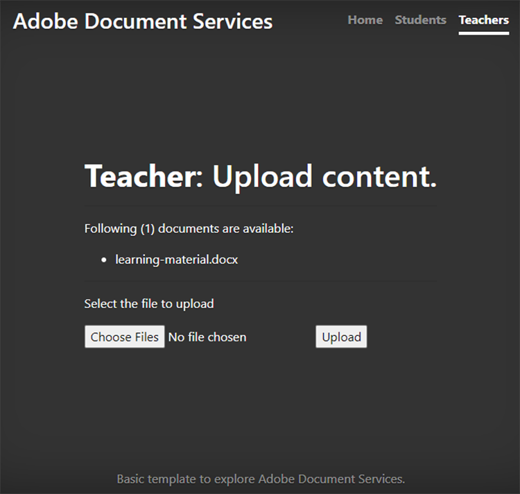

# Colaboração entre aluno e professor


Os institutos educacionais usam documentos do PDF para compartilhar o material de aprendizado com os alunos. Os PDF fornecem um formato de documento intercambiável para professores.

Integração [API de serviços da Adobe PDF](https://www.adobe.io/apis/documentcloud/dcsdk/pdf-tools.html) e [API incorporada do Adobe PDF](https://www.adobe.io/apis/documentcloud/dcsdk/pdf-embed.html) em um aplicativo fornece aos professores e alunos uma plataforma única sobre a qual ensinar e aprender. Por exemplo, seu aplicativo pode permitir que os alunos façam perguntas em suas tarefas e cartões de relatório e colaborem em tarefas em grupo.

Há um SDK oficial para os aplicativos Node.js acessarem a API de serviços do PDF. Isso permite converter documentos como Microsoft Word ou Microsoft Excel em PDF. Além disso, você pode executar operações mais avançadas, como combinar vários relatórios, reorganizar páginas e proteger PDF. Para obter mais detalhes, revise [documentação do produto](https://www.adobe.io/apis/documentcloud/dcsdk/).

## O que você pode aprender

Neste tutorial prático, aprenda a criar uma plataforma de aprendizado online que [permite que professores e alunos compartilhem recursos com facilidade](https://www.adobe.io/apis/documentcloud/dcsdk/student-teacher-collaboration.html) em PDF. Este tutorial usa um [portal de aprendizado](https://github.com/afzaal-ahmad-zeeshan/adobe-pdf-tools-for-teachers) criado usando o tempo de execução do JavaScript Node.js (Node.js) e os serviços PDF.

O portal de aprendizado tem os seguintes recursos:

* Permite que os professores carreguem recursos

* Permite que os alunos selecionem vários documentos para converter em PDF

* Permite a conversão de documentos em PDF

* Fornece uma visualização de PDF para os alunos em um navegador da Web e permite que eles façam anotações nos documentos sem software adicional

* Permite que os alunos deixem comentários e os baixem em seus computadores

Saiba como [!DNL Adobe Acrobat Services] ofereça uma experiência rica para seus alunos com PDF. [!DNL Acrobat Services] As APIs integram-se perfeitamente aos seus aplicativos existentes, assim os alunos podem fazer upload, converter e visualizar arquivos e, em seguida, fazer e salvar comentários, tudo dentro da configuração atual.

## APIs e recursos relevantes

* [API de incorporação do PDF](https://www.adobe.com/devnet-docs/dcsdk_io/viewSDK/index.html)

* [API de serviços PDF](https://opensource.adobe.com/pdftools-sdk-docs/release/latest/index.html)

* [Código do projeto](https://github.com/afzaal-ahmad-zeeshan/adobe-pdf-tools-for-teachers)

## Carregar recursos no portal de aprendizado

Na seção de professores do portal de aprendizado, os professores podem carregar documentos como tarefas e testes. Os documentos podem estar em qualquer formato, como Microsoft Word, Microsoft Excel, HTML, vários formatos de imagem e assim por diante.



Os documentos carregados são armazenados e apresentados aos alunos quando eles abrem sua página da Web.

Para saber como o aplicativo carrega os arquivos, consulte o [código do projeto](https://github.com/afzaal-ahmad-zeeshan/adobe-pdf-tools-for-teachers).

## Conversão de documentos em PDF

Os alunos podem converter um ou vários documentos de qualquer tipo em PDF, como Microsoft Word, Excel e PowerPoint, bem como outros tipos populares de arquivos de texto e imagem. O portal de aprendizado usa os Serviços do PDF para executar a conversão de arquivos em PDF.

Para criar seu próprio portal de aprendizado, você deve primeiro criar suas próprias credenciais. [Inscreva-se](https://www.adobe.io/apis/documentcloud/dcsdk/gettingstarted.html) para usar a API de serviços do PDF gratuitamente por seis meses e até 1.000 transações de documentos. Depois disso, [pay-as-you-go](https://www.adobe.io/apis/documentcloud/dcsdk/pdf-pricing.html) em apenas \$0,05 por transação de documento à medida que a classe aumenta suas atribuições.

Quando um aluno seleciona um documento no painel, ele vê o seguinte:


O aluno simplesmente seleciona os documentos para conversão e clica **Obter relatório**.

O portal de aprendizado converte os documentos em PDF e exibe uma página de relatório, juntamente com uma visualização do arquivo PDF.

Veja o código de exemplo desta etapa:

```
async function createPdf(rawFile, outputPdf) {
    try {
            // configurations
            const credentials =  adobe.Credentials
            .serviceAccountCredentialsBuilder()
            .fromFile("./src/pdftools-api-credentials.json")
            .build();
 
            // Capture the credential from app and show create the context
            const executionContext = adobe.ExecutionContext.create(credentials),
            operation = adobe.CreatePDF.Operation.createNew();
 
            // Pass the content as input (stream)
            const input = adobe.FileRef.createFromLocalFile(rawFile);
            operation.setInput(input);
 
            // Async create the PDF
            let result = await operation.execute(executionContext);
            await result.saveAsFile(outputPdf);
    } catch (err) {
            console.log('Exception encountered while executing operation', err);
    }
}
```

O código de exemplo chama o `createPdf` dentro do manipulador de rota Express para gerar o PDF.

Para saber como esse método é chamado, consulte [o código do projeto](https://github.com/afzaal-ahmad-zeeshan/adobe-pdf-tools-for-teachers/blob/master/src/helpers/pdf.js).

## Visualização dos recursos de aprendizado

A interface do usuário usa a API incorporada PDF para renderizar PDF em um navegador da Web. Essa API está disponível para uso gratuito.

A API incorporada PDF usa uma credencial diferente da API de serviços PDF, portanto, você deve [criar uma credencial](https://www.adobe.io/apis/documentcloud/dcsdk/gettingstarted.html)
antes de poder usá-lo. Depois, você pode usar o PDF Embed completamente gratuito.

Insira o URL do site correto no token. Caso contrário, talvez você não consiga renderizar os PDF com o token.

A interface do usuário usa o [Handlebars](https://handlebarsjs.com/) idioma dos modelos. Ele exibe o PDF em um navegador da Web.

Aqui está o código para esta etapa:

```
<div id="adobe-dc-view" style="height: 750px; width: 700px;"></div>
<script src="https://documentcloud.adobe.com/view-sdk/main.js"></script>
<script type="text/javascript">
    document.addEventListener("adobe_dc_view_sdk.ready", function () {
        var adobeDCView = new AdobeDC.View({ clientId: "<your-credentials-here>", divId: "adobe-dc-view" });
        adobeDCView.previewFile(
            {
                content: {
                    location: { url: "<file-url>" }
                },
                    metaData: { fileName: "<file-name>" }
            },
           );
    });
</script>
 
<p>Material has been generated, <a href="/students/download/{{filename}}" target="_blank">click here</a> to download it.
</p>
```

Esse código exibe a saída de PDF e o link para baixar o relatório de PDF, conforme mostrado na captura de tela abaixo:


Os alunos devem poder baixar o relatório ou trabalhar no material aqui.

## Anotação de documentos PDF

Uma plataforma de aprendizado deve oferecer suporte a anotações básicas, comentários e discussões em PDF. A API de incorporação do PDF fornece todos esses recursos. Isso ativa o suporte a anotações usando `showAnnotationTools`, permitindo que professores e estudantes comentem nos documentos e arquivem comentários como parte da PDF.

Para habilitar anotações em documentos PDF, você só precisa passar o argumento `showAnnotationTools` : verdadeiro para o `previewFile` método. Isso exibe a ferramenta de anotações no visualizador de PDF. Acesse essa ferramenta no menu de três pontos no canto superior direito da visualização.


Nos documentos enviados por professores, os alunos podem destacar o texto, adicionar comentários e assim por diante.


Na captura de tela acima, o usuário é identificado como &quot;Convidado&quot;, mas você pode configurar perfis para usuários, como alunos e professores.

Quando um aluno aplica uma anotação, a API de incorporação do PDF exibe uma **Salvar** ao longo do banner superior. Salvar adiciona as anotações ao arquivo. Tente clicar **Salvar** para ver como o arquivo é salvo com a anotação incorporada no relatório.

Os alunos podem usar anotações para fazer perguntas ou compartilhar comentários sobre o material de aprendizado.

## Monitorar o uso do documento

É importante que professores e escolas vejam como os alunos estão usando as plataformas online. Isso ajuda os professores a apoiar seus alunos com recursos que os ajudam a desempenhar melhor suas tarefas. A API incorporada do PDF integra-se à análise que você pode usar para medir todos os eventos que ocorrem, como quando os usuários estão abrindo, lendo e fechando documentos. Com a API de serviços do PDF, os professores também podem desativar modificações de impressão, download e arquivo para ajudar a manter a integridade acadêmica.

Se tiver uma [Adobe Analytics](https://www.adobe.io/apis/experiencecloud/analytics.html) licença, você pode usar sua [integração pronta para uso](https://experienceleague.adobe.com/docs/document-services/tutorials/pdfembed/controlpdfexperience.html?lang=en#adobe-analytics). Caso contrário, use retornos de chamada para integrar seus Serviços PDF com outros provedores de análise, como [Google](https://experienceleague.adobe.com/docs/document-services/tutorials/pdfembed/controlpdfexperience.html?lang=en#google-analytics).

Para ativar a medição de eventos do documento, anexe os manipuladores de eventos usando o `registerCallback` método com instância de Exibição Adobe DC. Você pode exibir métricas básicas, como abrir um documento ou ler uma página, no console. Você também pode salvar as métricas em um log ou publicá-las em outros armazenamentos de análise.

Aqui está o código de exemplo para anexar os manipuladores de eventos:

```
adobeDCView.registerCallback(
    AdobeDC.View.Enum.CallbackType.EVENT_LISTENER,
    function(event) {
           console.log(event);
    },
    {
           enablePDFAnalytics: true
    }
);
```

Os professores podem ver quantos alunos viram a tarefa, quantos passaram por todas as páginas de suas anotações e outros detalhes valiosos.

Aqui está uma captura de tela do console do navegador da Web:


Essa captura de tela mostra que o aluno abriu o arquivo de atribuição, leu a primeira página — ele não rolou até páginas adicionais ou o documento tinha apenas uma página — e então baixou o arquivo. Você pode coletar essas métricas para realizar análises e estudar o comportamento de seus alunos.

Além disso, [Adobe Analytics](https://business.adobe.com/products/analytics/adobe-analytics.html) está integrado à API PDF Embed, portanto, se você tiver uma assinatura do Adobe Analytics Suite, poderá publicar suas métricas na assinatura. Para publicar as métricas no Adobe Analytics, você só precisa passar sua ID de suíte para o construtor de API incorporado PDF. (Observe que você deve usar suas credenciais de API Incorporada PDF, não suas credenciais de API de Serviços PDF).

Aqui está um exemplo de código que mostra como passar a ID da suíte para o construtor da API PDF Embed:

```
var adobeDCView = new AdobeDC.View({
    clientId: "<your-adobe-dc-credential>",
    divId: "<#element>"
    reportSuiteId: <your-id-here>,
}); 
```

## Próximas etapas

Este tutorial prático analisou como usar a API de serviços do PDF e a API incorporada do PDF para criar um portal de aprendizado, facilitando uma [colaboração entre estudantes e professores](https://www.adobe.io/apis/documentcloud/dcsdk/student-teacher-collaboration.html). Usando esse portal, os professores podem fazer upload do material de aprendizado em qualquer formato e convertê-lo em PDF usando a API de serviços do PDF. Os alunos podem visualizar essas PDF usando a API incorporada do PDF.

Agora que você sabe como anotar relatórios PDF, arquivar as anotações e controlar o uso de relatórios PDF, pode começar a implementar essas soluções em seus próprios projetos.

Você pode usar [!DNL Adobe Acrobat Services] APIs para criar experiências PDF de fácil utilização no seu site. Aproveite o uso da API de serviços da Adobe PDF gratuitamente por seis meses e [pay-as-you-go](https://www.adobe.io/apis/documentcloud/dcsdk/pdf-pricing.html) (por meio do AWS ou de um contrato direto) por apenas \$0,05 por transação de documento. Use gratuitamente o Adobe PDF Embed sem limite de tempo. Crie uma conta gratuita para [começar](https://www.adobe.com/go/dcsdks_credentials) hoje.
