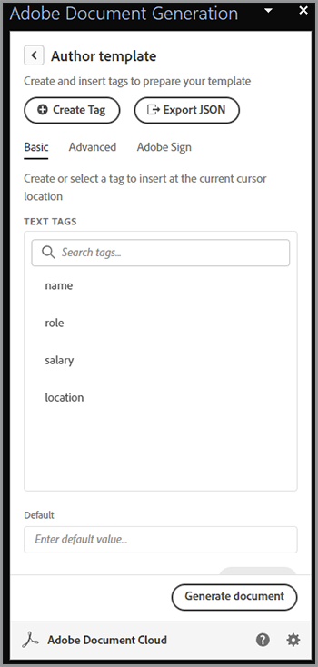
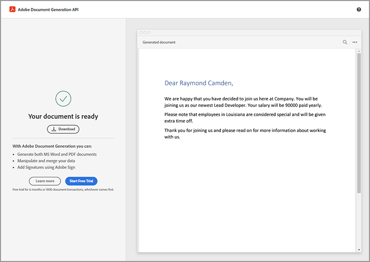

# Modernização da integração do funcionário


Em uma grande organização, a integração de funcionários pode ser um processo grande e lento. Normalmente, há uma mistura de documentação personalizada com material de chapa que deve ser apresentado e assinado por um novo funcionário. Essa mistura de material personalizado e chapa requer várias etapas, dispensando um tempo valioso das pessoas envolvidas no processo. [!DNL Adobe Acrobat Services] e a Acrobat Sign pode modernizar e automatizar essa abordagem, liberando o pessoal de RH para tarefas mais importantes. Vejamos como isso é alcançado.

## O que são [!DNL Adobe Acrobat Services]?

[[!DNL Adobe Acrobat Services]](https://developer.adobe.com/document-services/homepage) são um conjunto de APIs relacionadas ao trabalho com documentos (e não apenas PDF). De modo geral, esse pacote de serviços se enquadra em três categorias principais:

* Em primeiro lugar, [Serviços PDF](https://developer.adobe.com/document-services/apis/pdf-services/) conjunto de ferramentas. Esses são métodos “úteis” para trabalhar com PDF e outros documentos. Os serviços incluem itens como conversão de e para PDF, execução de OCR e otimização, mesclagem e divisão de PDF e assim por diante. É a caixa de ferramentas dos recursos de processamento de documentos.
* [API do PDF Extract](https://developer.adobe.com/document-services/apis/pdf-extract/) O usa técnicas avançadas de IA/ML para analisar um PDF e retornar uma quantidade incrível de detalhes sobre o conteúdo. Isso inclui o texto, o estilo e as informações de posição, e também pode retornar dados tabulares no formato CSV/XLS, bem como recuperar imagens.
* Por último, [API de geração de documento](https://developer.adobe.com/document-services/apis/doc-generation/) permite que os desenvolvedores usem o Microsoft Word como um “modelo”, misturem-se com seus dados (de qualquer origem) e gerem documentos personalizados dinâmicos (PDF e Word).

Os desenvolvedores podem [inscreva-se](https://documentcloud.adobe.com/dc-integration-creation-app-cdn/main.html) e experimente todos esses serviços com uma avaliação gratuita. O [!DNL Acrobat Services] A plataforma usa uma API baseada em REST, mas também oferece suporte a SDKs para Node, Java, .NET e Python (somente Extract no momento).

Embora não seja uma API, os desenvolvedores também podem usar a [PDF Embed API](https://developer.adobe.com/document-services/apis/pdf-embed/), que fornece uma experiência de visualização consistente e flexível de documentos com suas páginas da Web.

## O que é o Acrobat Sign?

[Acrobat Sign](https://www.adobe.com/br/sign.html) é líder mundial em serviços de assinatura eletrônica. É possível enviar documentos para assinatura usando vários fluxos de trabalho diferentes, incluindo várias assinaturas. O Acrobat Sign também é compatível com fluxos de trabalho que exigem assinaturas e informações adicionais. Todos esses recursos são compatíveis com um painel de controle eficiente com um sistema de criação flexível.

Como em [!DNL Acrobat Services], o Acrobat Sign tem um [avaliação gratuita](https://www.adobe.com/sign.html#sign_free_trial) que permite que os desenvolvedores testem o processo de assinatura por meio do painel de controle e com uma API baseada em REST fácil de usar.

## Um cenário de integração

Vamos considerar um cenário real que demonstra como os serviços Adobe podem ajudar. Quando um novo funcionário se junta a uma empresa, ele precisa de informações personalizadas sob medida para sua função. Além disso, eles também precisam de material para toda a empresa. Por fim, eles devem demonstrar a aceitação das políticas corporativas assinando os documentos. Vamos dividir isso em etapas concretas:

* Primeiro, é necessária uma carta de apresentação personalizada que dê boas-vindas ao novo funcionário por nome. A carta deve conter informações sobre o nome, a função, o salário e o local do funcionário.
* A carta personalizada deve ser combinada com um PDF que contenha informações básicas de toda a empresa (pense em várias políticas de RH, benefícios etc.)
* Deve ser incluído um documento final que solicite a assinatura e a data do funcionário.
* Todos os itens acima devem ser apresentados como um documento enviado ao funcionário para assinatura.

Vamos entrar em detalhes sobre como fazer isso.

## Geração de documentos dinâmicos

Adobe [Geração de documento](https://developer.adobe.com/document-services/apis/doc-generation/) A API permite que os desenvolvedores criem documentos dinâmicos usando o Microsoft Word e uma linguagem de modelo simples, como base para gerar PDF e documentos do Word. Aqui está um exemplo de como isso funciona.

Vamos começar com um documento do Word que tem valores codificados. O documento pode ter o estilo que desejar, incluir gráficos, tabelas etc. Aqui está o documento inicial.


A geração de documento funciona adicionando “tokens” a um documento do Word que é substituído pelos seus dados. Embora esses tokens possam ser inseridos manualmente, há uma [Suplemento do Microsoft Word](https://developer.adobe.com/document-services/docs/overview/document-generation-api/wordaddin/) isso torna isso mais fácil de fazer. Abri-lo fornece uma ferramenta para autores definirem tags, ou conjuntos de dados, que podem ser usados no documento.


Você pode fazer upload das informações JSON de um arquivo local, copiar em texto JSON ou selecionar para continuar com os dados iniciais. Isso permite que você defina as tags de maneira ad hoc com base em suas necessidades específicas. Neste exemplo, apenas uma tag para nome, função, salário e local é necessária. Isso é feito usando o **Criar tag** botão:


Após definir a primeira tag, você poderá continuar a definir quantas forem necessárias:



Com as marcas definidas, você seleciona o texto no documento e o substitui pelas marcas quando apropriado. Neste exemplo, as tags são adicionadas para nome, função e salário.


A geração de documentos não é compatível apenas com tags simples, mas também com expressões lógicas. O segundo parágrafo do documento tem texto que se aplica somente a pessoas na Louisiana. Você pode adicionar uma expressão condicional acessando a guia Avançado do Marcador de documento e definindo uma condição. Aqui está como você define uma condição de igualdade simples, mas observe que comparações numéricas e outros tipos de comparação também são suportados.


Isso pode ser inserido e disposto ao redor do parágrafo:


Para testar como isso funciona, selecione **Gerar documento**. Na primeira vez que você fizer isso, precisará fazer logon com uma Adobe ID. Após o logon, é apresentado o JSON padrão, que pode ser editado manualmente.


É gerado um PDF que pode ser visualizado ou baixado.



Embora o Document Tagger permita que você crie e teste rapidamente, uma vez concluído e em produção, você pode usar um dos SDKs para automatizar esse processo. Embora o código real seja diferente com base em necessidades específicas, aqui está um exemplo de como esse código é exibido no Node.js:

```js
 const PDFServicesSdk = require('@adobe/pdfservices-node-sdk');

const credentials =  PDFServicesSdk.Credentials
    .serviceAccountCredentialsBuilder()
    .fromFile("pdfservices-api-credentials.json")
    .build();

// Data would be dynamic...
let data = {
    "name":"Raymond Camden",
    "role":"Lead Developer",
    "salary":9000,
    "location":"Louisiana"
}

// Create an ExecutionContext using credentials.
const executionContext = PDFServicesSdk.ExecutionContext.create(credentials);

// Create a new DocumentMerge options instance.
const documentMerge = PDFServicesSdk.DocumentMerge,
    documentMergeOptions = documentMerge.options,
    options = new documentMergeOptions.DocumentMergeOptions(jsonDataForMerge, documentMergeOptions.OutputFormat.PDF);

// Create a new operation instance using the options instance.
const documentMergeOperation = documentMerge.Operation.createNew(options);

// Set operation input document template from a source file.
const input = PDFServicesSdk.FileRef.createFromLocalFile('documentMergeTemplate.docx');
documentMergeOperation.setInput(input);

// Execute the operation and Save the result to the specified location.
documentMergeOperation.execute(executionContext)
    .then(result => result.saveAsFile('documentOutput.pdf'))
    .catch(err => {
        if(err instanceof PDFServicesSdk.Error.ServiceApiError
            || err instanceof PDFServicesSdk.Error.ServiceUsageError) {
            console.log('Exception encountered while executing operation', err);
        } else {
            console.log('Exception encountered while executing operation', err);
        }
    });
```

Resumindo, o código configura credenciais, cria um objeto de operação e define a entrada e as opções e, em seguida, chama a operação. Finalmente, ele salva o resultado como um PDF. (Os resultados também podem ser exportados como Word.)

A geração de documentos oferece suporte a casos de uso muito mais complexos, incluindo a capacidade de ter tabelas e imagens totalmente dinâmicas. Consulte a [documentação](https://developer.adobe.com/document-services/docs/overview/document-generation-api/) para obter mais detalhes.

## Executando operações de PDF

O [API de serviços PDF](https://developer.adobe.com/document-services/apis/pdf-services/) fornece um grande conjunto de operações “utilitárias” para trabalhar com PDF. Essas operações incluem:

* Criar PDF a partir de documentos do Office
* Exportando PDF para documentos do Office
* Combinação e divisão de PDF
* Aplicar OCR a PDF
* Definir, remover e modificar a proteção para PDF
* Excluir, inserir, reordenar e girar páginas
* Otimização de PDF por meio de compactação ou linearização
* Obtendo propriedades do PDF

Para esse cenário, o resultado da chamada de geração de documento deve ser mesclado com um PDF padrão. Essa operação é bastante simples com os SDKs. Veja um exemplo de em Node.js:

```js
const PDFServicesSdk = require('@adobe/pdfservices-node-sdk');
 
// Initial setup, create credentials instance.
const credentials = PDFServicesSdk.Credentials
    .serviceAccountCredentialsBuilder()
    .fromFile("pdfservices-api-credentials.json")
    .build();
 
// Create an ExecutionContext using credentials and create a new operation instance.
const executionContext = PDFServicesSdk.ExecutionContext.create(credentials),
    combineFilesOperation = PDFServicesSdk.CombineFiles.Operation.createNew();
 
// Set operation input from a source file.
const combineSource1 = PDFServicesSdk.FileRef.createFromLocalFile('documentOutput.pdf'),
      combineSource2 = PDFServicesSdk.FileRef.createFromLocalFile('standardCorporate.pdf');

combineFilesOperation.addInput(combineSource1);
combineFilesOperation.addInput(combineSource2);
 
// Execute the operation and Save the result to the specified location.
combineFilesOperation.execute(executionContext)
    .then(result => result.saveAsFile('combineFilesOutput.pdf'))
    .catch(err => {
        if (err instanceof PDFServicesSdk.Error.ServiceApiError
            || err instanceof PDFServicesSdk.Error.ServiceUsageError) {
            console.log('Exception encountered while executing operation', err);
        } else {
            console.log('Exception encountered while executing operation', err);
        }
    });
```

Esse código pega os dois PDF, os mescla e salva o resultado em um novo PDF. Simples e fácil! Consulte a [docs](https://developer.adobe.com/document-services/docs/overview/pdf-services-api/) por exemplos do que pode ser feito.

## O processo de assinatura

Na parada final do processo de integração, o funcionário deve assinar um contrato declarando que leu e concorda com todas as políticas definidas no. [Acrobat Sign](https://www.adobe.com/br/sign.html) suporta muitos fluxos de trabalho e integrações diferentes, incluindo um automatizado por meio de um [API](https://opensource.adobe.com/acrobat-sign/developer_guide/index.html). Em termos gerais, a parte final do cenário pode ser concluída da seguinte forma:

Primeiro, crie o documento que inclui o formulário que precisa ser assinado. Há várias maneiras de fazer isso, incluindo um visual criado no painel de usuários do Adobe Sign. Outra opção é usar o complemento Document Generation Word para inserir as tags para você. Este exemplo solicita uma assinatura e uma data.


Esse documento pode ser salvo como um PDF e, usando o mesmo método descrito acima, unido com todos os documentos. Esse processo cria um pacote coeso que contém uma saudação personalizada, documentação corporativa padrão e um ajuste de página final para assinatura.

O modelo pode ser carregado no painel do Acrobat Sign e, em seguida, usado para novos contratos. Usando a API REST, esse documento pode ser enviado ao funcionário potencial para solicitar sua assinatura.


## Experimente

Tudo o que está descrito neste artigo pode ser testado agora. O [!DNL Adobe Acrobat Services] API [avaliação gratuita](https://documentcloud.adobe.com/dc-integration-creation-app-cdn/main.html) atualmente fornece 1.000 solicitações gratuitas em um período de seis meses. Acrobat Sign [avaliação gratuita](https://www.adobe.com/sign.html#sign_free_trial) permite enviar contratos com marca-d&#39;água para fins de teste.

Dúvidas? O [fórum de suporte](https://community.adobe.com/t5/document-services-apis/ct-p/ct-Document-Cloud-SDK) é monitorado diariamente por desenvolvedores de Adobe e pessoal de suporte. Finalmente, para mais inspiração, certifique-se de pegar o próximo [Clipes de papel](https://www.youtube.com/playlist?list=PLcVEYUqU7VRe4sT-Bf8flvRz1XXUyGmtF) episódio. Há reuniões ao vivo regulares com notícias, demonstrações e palestras com os clientes.
