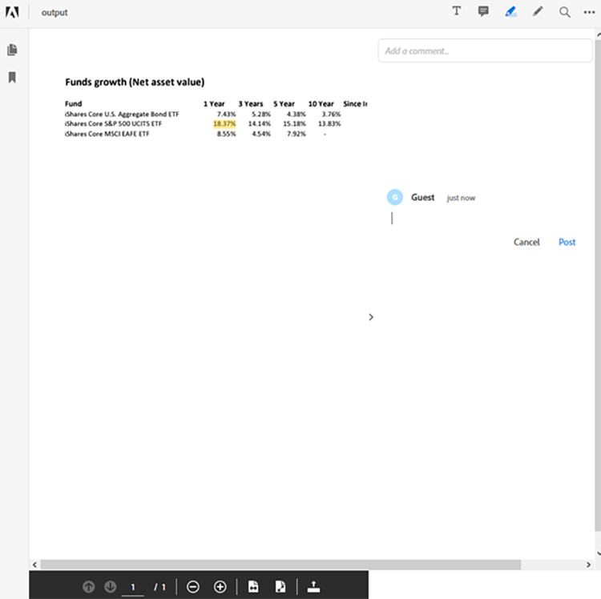

# Gerenciamento de fluxos de trabalho de documentos financeiros em Java


O setor financeiro usa arquivos PDF extensivamente para trocar dados porque ajuda a manter o formato, o design e a estrutura do documento. Esse formato robusto permite que analistas financeiros e consultores ajudem seus clientes a tomar decisões bem informadas.

No entanto, o formato PDF pode ser desafiador para processar e automatizar, especialmente ao combinar várias fontes de dados — um caso de uso comum no setor financeiro. Criar uma solução personalizada para processar documentos de PDF é uma opção, mas não há necessidade de investir muito tempo e dinheiro em software e infraestrutura. O [!DNL Adobe Acrobat Services] fornece todas as ferramentas, serviços e recursos necessários para processar e extrair dados de documentos PDF.

## O que você pode aprender

Neste tutorial prático, saiba como usar APIs do [!DNL Adobe Acrobat Services] para aplicativos do [!DNL Java Spring Boot]. Você cria um aplicativo Model-View-Controller (MVC) que extrai conteúdo de documentos PDF, o converte em outros formatos de dados, como Excel, combina vários PDF e protege os recursos por senha. Este tutorial explica como processar documentos do PDF e mostrá-los em seus sites usando a [API de PDF incorporada](https://developer.adobe.com/document-services/apis/pdf-embed) do Adobe.

## APIs e recursos relevantes

* [API de Serviços PDF](https://opensource.adobe.com/pdftools-sdk-docs/release/latest/index.html)

* [API de inserção de PDF](https://www.adobe.com/devnet-docs/dcsdk_io/viewSDK/index.html)

* [Amostras de projeto](https://github.com/adobe/pdftools-java-sdk-samples)

## Configuração

[!DNL Adobe Acrobat Services] usa um sistema de autenticação para controlar o acesso a recursos. Para acessar os serviços, você deve solicitar uma chave de API do Adobe para sua organização ou aplicativo. Se você tiver uma chave de API, continue para a próxima seção. Para criar uma nova chave de API, visite [Introdução](https://www.adobe.io/apis/documentcloud/dcsdk/gettingstarted.html) no site [!DNL Acrobat Services]. Você pode criar uma chave usando a avaliação gratuita que fornece 1.000 transações de documentos que podem ser usadas por até seis meses.

Para acompanhar este tutorial, você precisa de dois conjuntos de chaves de API:

* Adobe PDF Services — usado para processar o documento do PDF

* API incorporada do Adobe PDF

Depois de criar as credenciais, copie as credenciais da API dos Serviços de PDF e a chave privada para o aplicativo [!DNL Spring Boot] na seção de recursos. Saiba mais sobre as [bibliotecas e dependências Maven e Gradle](https://developer.adobe.com/document-services/docs/overview/pdf-services-api) no site [!DNL Adobe Acrobat Services]. Certifique-se de configurar todos os pacotes e bibliotecas necessários antes de continuar.


Para configurar os serviços de log, visite a [documentação do Adobe](https://developer.adobe.com/document-services/docs/overview/pdf-services-api) e role até a seção Log.

>[!NOTE]
>
> No ambiente de produção, não salve as chaves privadas no controle de versão. Sempre use um cofre secreto ou um serviço de injeção de chave para impedir o uso não autorizado de credenciais.

Agora que o aplicativo [!DNL Spring Boot] está configurado, você pode continuar com o processamento dos PDF e a geração de relatórios para clientes.

## Enviando os dados do relatório

Para usar a API de Serviços do Adobe PDF, primeiro configure um `ExecutionContext` que consuma as credenciais fornecidas. Como você tem as credenciais dentro do aplicativo, é possível lê-las no arquivo e criar o contexto da seguinte maneira:

```
Credentials credentials = Credentials.serviceAccountCredentialsBuilder()
    .fromFile(AUTH_FILE_PATH)
    .build();

ExecutionContext executionContext = ExecutionContext.create(credentials);
```

Em seguida, obtenha o contexto para processar os documentos do PDF. Estas são as ações que você pode executar:

* Converta os documentos do PDF (no Excel, Word ou no tipo de gráficos)

* Crie os documentos PDF (do HTML, Excel, Word e mais)

* Combinar vários documentos PDF

* Protect e desproteja os documentos PDF (você deve ter a senha)

* Otimizar os documentos do PDF para distribuição nas redes

Todas essas amostras estão disponíveis no repositório [GitHub](https://github.com/adobe/pdfservices-java-sdk-samples/tree/master/src/main/java/com/adobe/pdfservices/operation/samples).

Em seguida, em [!DNL Spring Boot], você pode obter um arquivo usando o caminho da Cadeia de Caracteres ou o Fluxo no qual o arquivo está sendo carregado. Todas as operações executadas devem ser inicializadas e um caminho de arquivo de entrada deve ser definido. Neste tutorial, você usa os relatórios de PDF disponíveis publicamente do [Blackrock](https://www.blackrock.com/us/individual/products/investment-funds). Você pode usar qualquer outra fonte, inclusive seus próprios relatórios.

Comece capturando o objeto FileRef do arquivo. Para simplificar, concentre-se nos arquivos por caminho de string. Abaixo, você cria uma operação para converter um arquivo em seu caminho do PDF para o Excel:

```
ExecutionContext executionContext = ExecutionContext.create(credentials);
ExportPDFOperation exportOperation = ExportPDFOperation.createNew(ExportPDFTargetFormat.XLSX);

// Create the input source
FileRef inputPdf = FileRef.createFromLocalFile(INPUT_PDF);
exportOperation.setInput(inputPdf);
```

Após essa etapa, o programa estará pronto para executar a primeira operação no PDF. Em seguida, execute a operação e obtenha o resultado na planilha do Excel:

```
try {
    FileRef output = exportOperation.execute(executionContext);
    output.saveAs(OUTPUT_EXCEL);
} catch (ServiceApiException e) {
    e.printStackTrace();
}
```

Esse cenário lida com apenas um arquivo PDF. Você também pode começar com vários arquivos de PDF e combiná-los em um único arquivo. O uso de vários arquivos é comum no relatório de dados financeiros porque é necessário processar fundos de várias fontes para fornecer um relatório abrangente.

## Gerando o relatório

O [!DNL Adobe Acrobat Services] não oferece suporte ao processamento de documentos do Excel prontos para uso, mas você ainda pode usar bibliotecas e estruturas de comunidade para processar o conteúdo.

Por exemplo, você pode usar o [Apache POI](https://poi.apache.org/) para processar o Excel (ou outros documentos do Microsoft) em seu aplicativo [!DNL Java Spring Boot] ou pode executar outras tarefas manuais ou automatizadas no arquivo do Excel.

Neste exemplo, começando com seus documentos PDF, você extrai o valor de ativo líquido para seus três fundos e os mostra em uma tabela. Você também pode extrair outras informações, como gráficos e tabelas, com base nos seus requisitos e nos dados disponíveis. Você pode até mesmo trazer dados de outras fontes.

Depois que o relatório for gerado, neste exemplo, em formato Excel, você poderá usar as operações dos Serviços do Adobe PDF para converter o relatório de volta em um documento PDF e protegê-lo.

Para converter o relatório do formato do Excel em um documento do PDF, use a seguinte operação:

```
ExecutionContext executionContext = ExecutionContext.create(credentials);
CreatePDFOperation exportOperation = CreatePDFOperation.createNew();

// Create the input source
FileRef inputPdf = FileRef.createFromLocalFile(INPUT_EXCEL);
exportOperation.setInput(inputPdf);

try {
    FileRef output = exportOperation.execute(executionContext);
    output.saveAs(OUTPUT_PDF);
} catch (ServiceApiException e) {
    e.printStackTrace();
}
```

>[!TIP]
>
> Para evitar a necessidade de recriar o objeto toda vez que uma solicitação for recebida, use a injeção de dependência Spring para injetar o objeto `ExecutionContext`.

Esse código gera um documento PDF a partir do relatório no formato do Excel.

Antes de fornecer este PDF aos seus clientes, você pode protegê-lo com uma senha. Crie outra operação que trate dessa proteção para você, ProtectPDFOperation, depois use ProtectPDFOptions para adicionar a senha ao documento.

```
ProtectPDFOptions options = ProtectPDFOptions.passwordProtectOptionsBuilder()
                    .setUserPassword("p@55w0rd")
                    .setEncryptionAlgorithm(EncryptionAlgorithm.AES_256)
                    .build();
ProtectPDFOperation operation = ProtectPDFOperation.createNew(options);
```

Em seguida, especifique a entrada e execute a operação. O arquivo resultante deve ter uma senha para evitar acesso não autorizado.

## Exibição do relatório

Agora que o relatório de PDF foi gerado, você pode exibi-lo no site usando a API incorporada do Adobe PDF. Essa API JavaScript permite que os desenvolvedores da Web carreguem e renderizem os documentos PDF de forma nativa no navegador da Web.

>[!NOTE]
>
> Nesse ponto, você precisa do segundo token de credencial, a ID do cliente.

No aplicativo [!DNL Spring Boot], adicione o seguinte trecho de HTML onde deseja renderizar o relatório de PDF:

```
<div id="pdf-viewer"></div>
<script src="https://documentcloud.adobe.com/view-sdk/main.js"></script>
<script type="text/javascript">
    document.addEventListener("adobe_dc_view_sdk.ready", function()
    {
        var adobeDCView = new AdobeDC.View({ clientId: "<your-client-id-here>", divId: "pdf-viewer" });
        adobeDCView.previewFile(
        {
            content: {
                location: {
                    url: "<your-document.pdf>"
                }
            },
            metaData: {
                fileName: "<document-name.pdf>"
            }
        });
    });
</script>
```

Esse script carrega o documento PDF e permite que os visualizadores anotem e comentem nos documentos. Esta é a visualização desta API incorporada, conforme mostrado no Firefox:



A API de incorporação de PDF fornece todas as ferramentas necessárias para visualizar o PDF, bem como para anotar o relatório.

## Próximas etapas

Este tutorial prático explorou as APIs do [[!DNL Adobe Acrobat Services]](https://developer.adobe.com/document-services/homepage/) e discutiu como usar esses serviços para processar dados de PDF e gerar relatórios para decisões financeiras. Ele demonstrou como você pode integrar as APIs em seus sistemas, usando o [!DNL Java Spring Boot] como uma estrutura de exemplo, para mostrar como é fácil processar documentos PDF rapidamente.

Explore [[!DNL Adobe Acrobat Services]](https://developer.adobe.com/document-services/homepage/) e veja o que os Serviços da Adobe PDF podem fazer por sua empresa. Para saber mais sobre os recursos disponíveis no SDK, consulte o [Repositório GitHub](https://github.com/adobe/pdftools-java-sdk-samples) para obter as amostras e explorar como a [API de Incorporação PDF](https://developer.adobe.com/document-services/apis/pdf-embed) pode ajudá-lo a mostrar rapidamente PDF dentro dos seus aplicativos.

Para combinar e manipular documentos facilmente, criando relatórios de PDF úteis para seus clientes financeiros, comece se cadastrando em sua [conta de desenvolvedor de Adobe](https://developer.adobe.com/document-services/homepage/) gratuita hoje mesmo.
