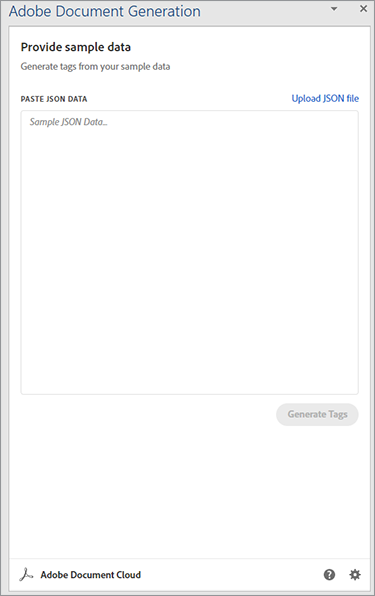
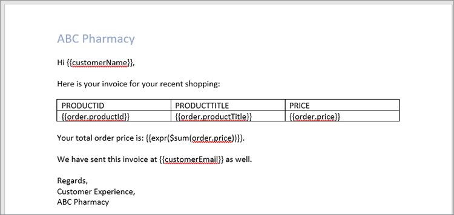

# Manuseando faturas


É ótimo quando os negócios estão crescendo, mas a produtividade é prejudicada quando chega a hora de preparar todas essas faturas. Gerar faturas manualmente é demorado, além de você correr o risco de cometer um erro, potencialmente perder dinheiro ou irritar um cliente com um valor incorreto.

Pense em Danielle, por exemplo, trabalhando no [departamento de contabilidade](https://www.adobe.io/apis/documentcloud/dcsdk/invoices.html) [de uma empresa de fornecimento médico](https://www.adobe.io/apis/documentcloud/dcsdk/invoices.html). É o fim do mês, então ela está extraindo informações de vários sistemas diferentes, verificando a precisão e formatando as faturas. Depois de todo esse trabalho, ela finalmente está pronta para converter os documentos em PDF (para que qualquer pessoa possa visualizá-los sem adquirir um software específico) e enviar a cada cliente sua fatura personalizada.

Mesmo quando o faturamento mensal está completo, Danielle não pode escapar dessas faturas. Alguns clientes têm ciclos de faturamento não mensais, por isso ela está sempre criando uma fatura para alguém. Ocasionalmente, um cliente edita sua fatura e paga indevidamente. Danielle passa tempo resolvendo essa incompatibilidade de faturas. Nesse ritmo, ela precisa contratar um assistente para acompanhar todo o trabalho!

Danielle precisa de uma forma de gerar faturas com rapidez e precisão, em lote no final do mês e ad hoc em outros momentos. De maneira ideal, se ela pudesse proteger essas faturas de edições, não teria que se preocupar em solucionar problemas de valores incompatíveis.

## O que você pode aprender

Neste tutorial prático, saiba como usar a API de geração de documento Adobe para gerar faturas automaticamente, proteger por senha os PDF e enviar uma fatura para cada cliente. Basta um pouco de conhecimento de Node.js, JavaScript, Express.js, HTML e CSS.

O código completo deste projeto é [disponível no GitHub](https://github.com/afzaal-ahmad-zeeshan/adobe-pdf-invoice-generation). Você deve configurar o diretório público com seu modelo e as pastas de dados brutos. Em produção, você deve buscar os dados de uma API externa. Você também pode explorar essa versão arquivada do aplicativo que contém os recursos do modelo.

## APIs e recursos relevantes

* [API de serviços PDF](https://opensource.adobe.com/pdftools-sdk-docs/release/latest/index.html)

* [API de geração de documento Adobe](https://www.adobe.io/apis/documentcloud/dcsdk/doc-generation.html)

* [API do Adobe Sign](https://www.adobe.io/apis/documentcloud/sign.html)

* [Código do projeto](https://github.com/afzaal-ahmad-zeeshan/adobe-pdf-invoice-generation)

## Preparando os dados

Este tutorial não analisa como os dados são importados de seus data warehouses. Seus pedidos de clientes podem estar em um banco de dados, uma API externa ou um software personalizado. A API de geração de documento Adobe espera um documento JSON que contenha os dados de faturamento, como informações de seu gerenciamento de relacionamento com o cliente (CRM) ou plataforma de comércio eletrônico. Este tutorial presume que os dados já estão no formato JSON.

Para simplificar, use a seguinte estrutura JSON para faturamento:

```
{ 
    "customerName": "John Doe", 
    "customerEmail": "john-doe@example.com", 
    "order": [ 
        { 
            "productId": 26, 
            "productTitle": "Bandages", 
            "price": 15.82 
        }, 
        { 
            "productId": 54, 
            "productTitle": "Masks", 
            "price": 25 
        }, 
        { 
            "productId": 76, 
            "productTitle": "Gloves", 
            "price": 7.59 
        } 
    ] 
} 
```

O documento JSON contém os detalhes do cliente, bem como as informações do pedido. Use este documento estruturado para elaborar sua fatura e exibir os elementos no formato PDF.

## Desenvolvendo um modelo de NFF

A API de geração de documento Adobe espera que um modelo baseado no Microsoft Word e um documento JSON criem um documento PDF ou Word dinâmico. Crie um modelo do Microsoft Word para o aplicativo de faturamento e use o [complemento Document Generation Tagger gratuito](https://opensource.adobe.com/pdftools-sdk-docs/docgen/latest/wordaddin.html#add-in-demo) para gerar as tags de modelo. Instale o suplemento e abra a guia no Microsoft Word.



Depois de colar o conteúdo JSON no suplemento, como mostrado acima, clique em Gerar tags. Este plug-in mostra o formato do seu objeto. Seu modelo básico pode usar o nome e o email do cliente, mas não mostra as informações do pedido. As informações da ordem são discutidas posteriormente neste tutorial.


Dentro do documento do Microsoft Word, comece a escrever o modelo de fatura. Deixe o cursor onde você deve inserir dados dinâmicos e selecione a tag na janela do suplemento Adobe. Clique em **Inserir texto** portanto, o complemento Adobe Document Generation Tagger pode gerar e inserir as tags. Para personalização, vamos inserir o nome e o email do cliente.

Agora, passe para os dados que mudam a cada nova fatura. Selecione o **Avançado** do suplemento. Para ver as opções disponíveis para gerar uma tabela dinâmica com base nos produtos solicitados por um cliente, clique em **Tabelas e Listas** .

Selecionar **Ordem** na primeira lista suspensa. Na segunda lista suspensa, selecione as colunas desta tabela. Neste tutorial, selecione todas as três colunas do objeto para renderizar a tabela.


A API de geração de documento também pode executar operações complexas, como agregar elementos dentro de um array. No menu **Avançado** , selecione **Cálculos Numéricos** e no **Agregação** selecione o campo no qual deseja aplicar o cálculo.


Clique no botão **Inserir Cálculo** para inserir essa tag quando necessário no documento. O texto a seguir agora aparece no arquivo do Microsoft Word:



Esta amostra de fatura contém informações do cliente, os produtos pedidos e a quantia total devida.

## Gerando uma NFF usando a API de Geração de Documento do Adobe

Use o kit de desenvolvimento de software (SDK) Node.js dos Serviços do Adobe PDF para combinar os documentos do Microsoft Word e JSON. Crie um aplicativo Node.js para criar a fatura usando a API de geração de documento.

A API de serviços PDF inclui o serviço de geração de documentos, para que você possa usar as mesmas credenciais para ambos. Aproveite uma [avaliação gratuita de seis meses](https://www.adobe.io/apis/documentcloud/dcsdk/pdf-pricing.html)e pague apenas US$ 0,05 por transação de documento.

Aqui está o código para mesclar o PDF:

```
async function compileDocFile(json, inputFile, outputPdf) { 
    try { 
        // configurations 
        const credentials =  adobe.Credentials 
            .serviceAccountCredentialsBuilder() 
            .fromFile("./src/pdftools-api-credentials.json") 
            .build(); 

        // Capture the credential from app and show create the context 
        const executionContext = adobe.ExecutionContext.create(credentials); 
  
        // create the operation 
        const documentMerge = adobe.DocumentMerge, 
            documentMergeOptions = documentMerge.options, 
            options = new documentMergeOptions.DocumentMergeOptions(json, documentMergeOptions.OutputFormat.PDF);

        const operation = documentMerge.Operation.createNew(options); 
  
        // Pass the content as input (stream) 
        const input = adobe.FileRef.createFromLocalFile(inputFile); 
        operation.setInput(input); 
  
        // Async create the PDF 
        let result = await operation.execute(executionContext); 
        await result.saveAsFile(outputPdf); 
    } catch (err) { 
        console.log('Exception encountered while executing operation', err); 
    } 
} 
```

Esse código obtém informações do documento JSON de entrada e do arquivo de modelo de entrada. Em seguida, cria uma operação de mesclagem de documento para combinar os arquivos em um único relatório de PDF. Por fim, ele executa a operação com suas credenciais de API. Se você ainda não os tiver, [criar credenciais](https://opensource.adobe.com/pdftools-sdk-docs/release/latest/index.html#getting-credentials) (A geração de documentos e a API de serviços de PDF usam as mesmas credenciais).

Use esse código dentro do roteador Express para lidar com a solicitação de documento:

```
// Create one report and send it back
try {
    console.log(\`[INFO] generating the report...\`);
    const fileContent = fs.readFileSync(\`./public/documents/raw/\${vendor}\`,
    'utf-8');
    const parsedObject = JSON.parse(fileContent);

    await pdf.compileDocFile(parsedObject,
    \`./public/documents/template/Adobe-Invoice-Sample.docx\`,
    \`./public/documents/processed/output.pdf\`);

    await pdf.applyPassword("p@55w0rd", './public/documents/processed/output.pdf',
    './public/documents/processed/output-secured.pdf');

    console.log(\`[INFO] sending the report...\`);
    res.status(200).render("preview", { page: 'invoice', filename: 'output.pdf' });
} catch(error) {
    console.log(\`[ERROR] \${JSON.stringify(error)}\`);
    res.status(500).render("crash", { error: error });
}
```

Depois que esse código é executado, ele fornece um documento PDF contendo a fatura gerada dinamicamente com base nos dados fornecidos. Com os dados JSON de exemplo (fornecidos acima), a saída desse código é:


Esta fatura inclui os dados dinâmicos do documento JSON.

## Faturas protegidas por senha

Como Danielle, a contadora, está preocupada com a alteração da fatura por parte dos clientes, aplique uma senha para restringir a edição. [API de serviços PDF](https://opensource.adobe.com/pdftools-sdk-docs/release/latest/index.html) pode aplicar automaticamente uma senha a documentos. Aqui, você usa o Adobe PDF Services SDK para proteger os documentos com uma senha. O código é:

```
async function applyPassword(password, inputFile, outputFile) {
    try {
        // Initial setup, create credentials instance.
        const credentials = adobe.Credentials
        .serviceAccountCredentialsBuilder()
        .fromFile("./src/pdftools-api-credentials.json")
        .build();

        // Create an ExecutionContext using credentials
        const executionContext = adobe.ExecutionContext.create(credentials);
        // Create new permissions instance and add the required permissions
        const protectPDF = adobe.ProtectPDF,
        protectPDFOptions = protectPDF.options;
        // Build ProtectPDF options by setting an Owner/Permissions Password, Permissions,
        // Encryption Algorithm (used for encrypting the PDF file) and specifying the type of content to encrypt.
        const options = new protectPDFOptions.PasswordProtectOptions.Builder()
        .setOwnerPassword(password)
        .setEncryptionAlgorithm(protectPDFOptions.EncryptionAlgorithm.AES_256)
        .build();

        // Create a new operation instance.
        const protectPDFOperation = protectPDF.Operation.createNew(options);

        // Set operation input from a source file.
        const input = adobe.FileRef.createFromLocalFile(inputFile);
        protectPDFOperation.setInput(input);

        // Execute the operation and Save the result to the specified location.
        let result = await protectPDFOperation.execute(executionContext);

        result.saveAsFile(outputFile);
    } catch (err) {
        console.log('Exception encountered while executing operation', err);
    }
}
```

Quando você usa esse código, ele protege seu documento com uma senha e faz upload de uma nova fatura para o sistema. Para saber mais sobre como esse código é usado ou para experimentar, consulte o [amostra de código](https://github.com/afzaal-ahmad-zeeshan/adobe-pdf-invoice-generation).

Quando terminar de usar a fatura, convém enviá-la automaticamente por email ao cliente. Existem algumas maneiras de realizar automaticamente enviar e-mail aos seus clientes. A maneira mais rápida é usar uma API de e-mail de terceiros junto com uma biblioteca auxiliar como [sendgrid-nodejs](https://github.com/sendgrid/sendgrid-nodejs). Como alternativa, se você já tiver acesso a um servidor SMTP, poderá usar [nodemailer](https://www.npmjs.com/package/nodemailer) para enviar emails via SMTP.

## Próximas etapas

Neste tutorial prático, você criou um aplicativo simples para ajudar Danielle na contabilidade com [faturamento](https://www.adobe.io/apis/documentcloud/dcsdk/invoices.html). Ao usar a API de serviços de PDF e o SDK de geração de documento, você preencheu um modelo do Microsoft Word com informações de ordem do cliente de um documento JSON, criando uma fatura de PDF. Em seguida, cada documento é protegido por senha usando os serviços de proteção por senha [API de serviços PDF](https://opensource.adobe.com/pdftools-sdk-docs/release/latest/index.html).

Como Danielle pode gerar faturas automaticamente e não precisa se preocupar com clientes que editam suas faturas, ela não precisará contratar um assistente para ajudar com todo o trabalho manual. Ela pode usar seu tempo extra para encontrar economias de custo nos arquivos de contas a pagar.

Agora que você viu como é fácil, pode expandir esse aplicativo simples usando outras ferramentas de Adobe para incorporar faturas em seu site. Por exemplo, para que os clientes possam exibir suas faturas ou saldo a qualquer momento. [API incorporada do Adobe PDF](https://www.adobe.io/apis/documentcloud/dcsdk/pdf-embed.html) é livre para usar. Você pode até mesmo acessar o departamento de vendas ou recursos humanos, ajudando a automatizar os contratos e coletar assinaturas eletrônicas.

Para explorar todas as possibilidades e começar a criar seu próprio aplicativo prático, crie um [[!DNL Adobe Acrobat Services]](https://www.adobe.io/apis/documentcloud/dcsdk/gettingstarted.html) conta para começar hoje. Aproveite uma avaliação gratuita de seis meses depois [pré-pago](https://www.adobe.io/apis/documentcloud/dcsdk/pdf-pricing.html)
a apenas US$ 0,05 por transação de documento, conforme a escala de sua empresa.
