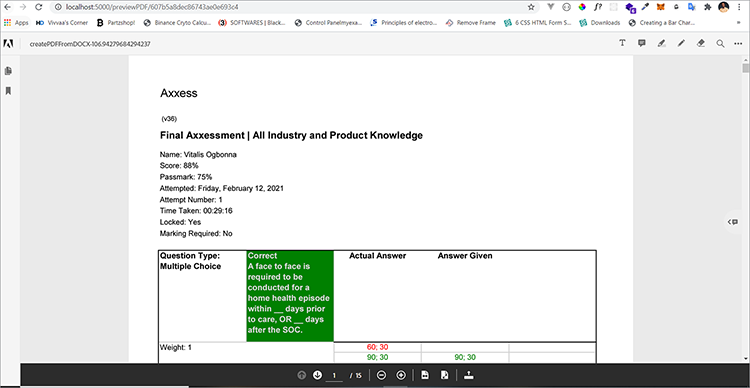

# Gerenciar contratos legais


A digitalização traz desafios. Hoje, a maioria das organizações tem muitos tipos de [contratos legais](https://www.adobe.io/apis/documentcloud/dcsdk/legal-contracts.html) que devem criar, editar, aprovar e ter assinado por diferentes partes. Esses contratos legais geralmente exigem personalização e identidade visual exclusivas. As organizações também podem precisar salvá-los em um formato protegido depois de assinados para mantê-los seguros. Para fazer tudo isso, eles precisam de uma solução robusta de geração e gerenciamento de documentos.

Muitas soluções oferecem alguma geração de documento, mas não podem personalizar entradas de dados e lógica condicional, como cláusulas que se aplicam apenas a cenários específicos. A atualização manual dos modelos legais de uma empresa é desafiadora e sujeita a erros, à medida que esses documentos se tornam mais abrangentes. A necessidade de automatizar esses processos é considerável.

## O que você pode aprender

Neste tutorial prático, explore os recursos das [[!DNL Adobe Acrobat Services] APIs](https://www.adobe.io/apis/documentcloud/dcsdk/doc-generation.html) na geração de campos de entrada personalizados em documentos. Além disso, explore como converter facilmente esses documentos gerados em um formato de documento portátil protegido (PDF) para evitar a manipulação de dados.

Este tutorial envolve um pouco de programação ao explorar a conversão de contratos em PDF. Para acompanhar com eficácia, o [Microsoft Word](https://www.microsoft.com/en-us/download/office.aspx) e o [Node.js](https://nodejs.org/) devem estar instalados no computador. Também é recomendável ter uma compreensão básica de Node.js e [sintaxe ES6](https://www.w3schools.com/js/js_es6.asp).

## APIs e recursos relevantes

* [API de Geração de Documento do Adobe](https://www.adobe.io/apis/documentcloud/dcsdk/doc-generation.html)

* [API de inserção de PDF](https://www.adobe.com/devnet-docs/dcsdk_io/viewSDK/index.html)

* [API DO Adobe Sign](https://www.adobe.io/apis/documentcloud/sign.html)

* [Código do projeto](https://github.com/agavitalis/adobe_legal_contracts.git)

## Criação de um documento modelo

Você pode criar documentos legais usando o aplicativo Microsoft Word ou baixando [modelos de amostra do Word](https://www.adobe.io/apis/documentcloud/dcsdk/doc-generation.html#sample-blade) do Adobe. Adobe Ainda assim, não é fácil personalizar as entradas e assinar digitalmente esses documentos sem usar algumas ferramentas auxiliares, como o [complemento Document Generation Tagger](https://www.adobe.io/apis/documentcloud/dcsdk/docs.html?view=docgen-addin) para Microsoft Word.

O Document Generation Tagger é um complemento do Microsoft Word feito para facilitar a personalização de documentos usando tags. Permite a criação de campos dinâmicos em modelos de documento que são preenchidos dinamicamente usando dados JSON.


Para ilustrar o uso do Document Generation Tagger, instale este suplemento e crie um modelo de dados JSON, que é usado na marcação de um documento legal de contrato simples.

Instale o Document Generation Tagger no Word clicando na guia **Inserir** e, no grupo Suplementos, clique em **Meus Suplementos**. No menu Suplementos do Office, pesquise “Geração de Documento do Adobe“, clique em **Adicionar** e siga o processo. Você pode ver essas etapas na captura de tela acima.

Depois de instalar o complemento Document Generation Tagger para Word, crie um modelo de dados JSON simples para marcar o documento legal.

Para continuar, abra qualquer editor de sua escolha, crie um arquivo chamado Agreement.json e cole o trecho de código abaixo no arquivo JSON criado.

```
{
"Agreement": {
"Date": "1/24/2021",
"Prime Contractor Name": "Ogbonna Vitalis Corp",
"Prime State": "Lagos",
"Address": "Maryland Ave, Lagos State, Ng",
"Sub Contractor Name": "Vivvaa Soln",
"Sub Contractor State": "California",
"Sub Contractor Address": "Molusi Avenue, Dallas Texas, CA",
"Agreement Date": "1/24/2021",
"Length": 5
}
}
```

Depois de salvar este documento JSON, importe-o para o complemento Document Generation Tagger. Importe o documento clicando em **Geração de documento** no grupo Adobe no lado superior direito da tela do Word, conforme mostrado na captura de tela abaixo.


Isso exibe um vídeo para guiá-lo. Você pode assistir ou ir direto para o campo de marcação clicando em **Começar**. Depois de clicar em **Começar**, um formulário de carregamento é exibido. Clique em **Carregar arquivo JSON** e selecione o arquivo JSON que você acabou de criar. Quando a importação estiver concluída, clique em **Gerar Marca** para gerar as marcas.

Depois de importar e gerar marcas de formatação, você pode adicioná-las ao seu documento. Para adicioná-las, coloque o cursor no ponto exato em que deseja que a tag apareça. Em seguida, selecione uma marca da API de Geração de Documento e clique em **Inserir Texto**. A captura de tela abaixo descreve esse procedimento.


Além das tags básicas criadas com o modelo de dados JSON importado, você também pode usar recursos avançados para mais opções como imagens, lógica condicional, cálculos, elementos repetidos e frases condicionais. Você pode acessar esses recursos clicando em **Avançado** no painel Marcador de Geração de Documento. Você pode ver isso na captura de tela abaixo.


Esses recursos avançados não são diferentes das tags básicas. Para incluir a lógica condicional, selecione a parte do documento a ser preenchida. Em seguida, configure a regra que determina a inserção da tag.

Para ilustrar ainda mais, digamos que no contrato haja uma seção que você deseja incluir, apenas condicionalmente. No campo Selecionar tipo de conteúdo, selecione Seção **.** No campo Selecionar registros, escolha a opção que determina se a seção condicional será mostrada. Selecione o operador condicional desejado e defina o valor que está testando no campo Valor. Em seguida, clique em **Inserir Condição.** A captura de tela abaixo ilustra esse processo.


Para cálculos, selecione Aritmética ou Agregação e, em seguida, inclua o primeiro registro, o operador e o segundo registro relevantes a serem usados com base nas tags de modelo disponíveis. Em seguida, clique em **Inserir Cálculo**.

Além disso, os contratos legais muitas vezes exigem assinaturas das partes envolvidas. Você pode inserir uma assinatura eletrônica usando as tags de texto do Adobe Sign localizadas logo abaixo da seção “Cálculos numéricos”. Para incluir a assinatura eletrônica, você deve especificar o número de destinatários, selecionar **Signatário** e o tipo de campo nas listas suspensas. Uma vez concluído, clique em **Inserir Marca de Texto do Adobe Sign** para finalizar o processo.

Para garantir a integridade dos dados, salve os documentos legais em um formato protegido. Com [!DNL Acrobat Services] APIs, você pode transformar rapidamente documentos em formato PDF. Você pode criar um aplicativo simples express Node.js, integrar a API de geração de documento a ele e usar esse aplicativo simples para converter o documento marcado do formato Word para o formato PDF.

## Configuração do projeto

Primeiro, configure a estrutura de pastas para o aplicativo Node.js. Neste exemplo, chame este aplicativo simples de AdobeLegalContractAPI. Você pode recuperar o código-fonte [aqui](https://github.com/agavitalis/adobe_legal_contracts.git).

### Estrutura de diretórios

Crie uma pasta chamada AdobeLegalContractAPI e abra-a em um editor de sua escolha. Crie um aplicativo Node.js básico com o comando ```npm init``` usando a estrutura de pastas abaixo:

```
###Directory Structure
AdobeLegalContractAPI
-----config
----------default.json
-----controllers
----------createPDFController.js
----------previewController.js
-----models
----------document.js
-----routes
----------web.js
-----services
-----------upload.js
-----uploads
-----views
-----index.js
```

Acima há uma estrutura de aplicativo Node.js simples para o seu aplicativo. Agora, continue com a instalação dos pacotes npm necessários.

### Instalação do pacote

Instale os pacotes necessários usando o comando npm install conforme mostrado no trecho de código abaixo:

```
npm install express body-parser morgan multer hbs path config mongoose
```

Depois de instalar os pacotes, certifique-se de que o conteúdo do arquivo package.json seja como o trecho de código abaixo:

```
###package.json
{
"name": "adobelegalcontractapi",
"version": "1.0.0",
"description": "",
"main": "index.js",
"directories": {
"test": "test"
},
"dependencies": {
"body-parser": "^1.19.0",
"config": "^3.3.6",
"express": "^4.17.1",
"hbs": "^4.1.1",
"mongoose": "^5.12.1",
"morgan": "^1.10.0",
"multer": "^1.4.2",
"path": "^0.12.7"
},
"devDependencies": {},
"scripts": {
"start": "node index.js"
},
"repository": {
"type": "git",
"url": "https://github.com/agavitalis/adobe_legal_contracts.git"
},
"author": "Ogbonna Vitalis",
"license": "ISC",
"bugs": {
"url": "https://github.com/agavitalis/adobe_legal_contracts/issues"
},
"homepage": "https://github.com/agavitalis/adobe_legal_contracts#readme"
}
```

Nesses snippets de código, você instalou as dependências do aplicativo, incluindo o mecanismo de modelo Handlebars para a exibição.

O foco principal deste tutorial é o uso de [[!DNL Acrobat Services] APIs](https://www.adobe.io/apis/documentcloud/dcsdk/) para converter documentos em PDF. Portanto, não há um processo passo a passo de como construir esse aplicativo Node.js. No entanto, você pode recuperar o código completo do aplicativo Node.js de trabalho em [GitHub](https://github.com/agavitalis/adobe_legal_contracts.git).

## Integrando [!DNL Adobe Acrobat Services] APIs em um aplicativo Node.js

As APIs do [!DNL Adobe Acrobat Services] são serviços confiáveis baseados em nuvem projetados para a manipulação perfeita de documentos. Ele oferece três APIs:

* API de Serviços do Adobe PDF

* API incorporada do Adobe PDF

* API de geração de documento Adobe

Você precisa de credenciais para usar [!DNL Acrobat Services] APIs (diferentes das credenciais de API incorporadas ao PDF). Se você não tiver credenciais válidas, [registre-se](https://www.adobe.com/go/dcsdks_credentials?ref=getStartedWithServicesSDK) e conclua o fluxo de trabalho conforme ilustrado na captura de tela abaixo. Aproveite uma avaliação gratuita de [seis meses e pague conforme usa](https://www.adobe.io/apis/documentcloud/dcsdk/pdf-pricing.html), por apenas US$ 0,05 por transação de documento.


Uma vez que o processo de inscrição é concluído, uma amostra de código é automaticamente baixada para o seu PC para ajudá-lo a começar. Você pode extrair essa amostra de código e acompanhar. Não se esqueça de copiar os arquivos pdftools-api-credentials.json e private.key da amostra de código extraída para o diretório raiz do projeto Node.js. As credenciais são necessárias para que você possa acessar os pontos de extremidade da API [!DNL Acrobat Services]. Você também pode baixar amostras de SDK com suas credenciais personalizadas para não ter que atualizar a chave no código de exemplo.

Agora, instale o Adobe PDF Services Node SDK executando o comando ```npm install \--save @adobe/documentservices-pdftools-node-sdk``` usando o terminal no diretório raiz do aplicativo. Quando instalado com êxito, você pode usar as APIs do [!DNL Acrobat Services] para manipular documentos em seu aplicativo.

## Criação de um documento PDF

As APIs do [!DNL Acrobat Services] oferecem suporte à criação de PDF a partir de documentos do Microsoft Office (Word, Excel e PowerPoint) e outros [formatos de arquivo compatíveis](https://opensource.adobe.com/pdftools-sdk-docs/release/latest/howtos.html#create-a-pdf), como .txt, .rtf, .bmp, .jpeg, gif, .tiff e .png. Você pode facilmente converter contratos legais de qualquer outro formato de arquivo em PDF usando as APIs de serviço do Acrobat.

A API de geração de documento Adobe permite a conversão em um arquivo do Word ou PDF. Por exemplo, é possível usar um modelo do Word para gerar um contrato, incluindo uma redefinição para marcar o texto editado. Em seguida, converta-o em um PDF e use a API de serviços de PDF para proteger o documento com uma senha, enviá-lo para assinatura e muito mais.

Para implementar a criação de documentos PDF a partir dos formatos de arquivo com suporte disponíveis, há um formulário para carregar um documento para transformação usando o [!DNL Acrobat Services].

O formulário de upload criado aparece na captura de tela abaixo e você pode acessar os arquivos HTML e CSS no [GitHub](https://github.com/agavitalis/adobe_legal_contracts.git).


Agora, adicione os seguintes snippets de código ao arquivo controllers /createPDFController.js. Esse código recupera o documento carregado e o transforma em PDF. [!DNL Acrobat Services] salva o arquivo original carregado e o arquivo transformado em diferentes pastas.

```
###controllers/createPDFController.js
const PDFToolsSdk = require('@adobe/documentservices-pdftools-node-sdk');
const Document = require('../models/document');
/*
* GET / route to show the createPDF form.
*/
function createPDF(req, res) {
//catch any response on the url
let response = req.query.response
res.render('index', { response })
}
/*
* POST /createPDF to create a new PDF File.
*/
function createPDFPost(req, res) {
let filePath = req.file.path;
let fileName = req.file.filename;
try {
// Initial setup, create credentials instance.
const credentials = PDFToolsSdk.Credentials
.serviceAccountCredentialsBuilder()
.fromFile("pdftools-api-credentials.json")
.build();
// Create an ExecutionContext using credentials and create a new operation instance.
const executionContext = PDFToolsSdk.ExecutionContext.create(credentials),
createPdfOperation = PDFToolsSdk.CreatePDF.Operation.createNew();
// Set operation input from a source file.
const input = PDFToolsSdk.FileRef.createFromLocalFile(filePath);
createPdfOperation.setInput(input);
// Execute the operation and Save the result to the specified location.
createPdfOperation.execute(executionContext)
.then(async(result) => {
let newFileName = `createPDFFromDOCX-${Math.random() * 171}.pdf`
let newFilePath = require('path').resolve('./') + `\\output\\${newFileName}`
await result.saveAsFile(`views/output/${newFileName}`)
//Creates a new document
let newDocument = new Document({
documentName: newFileName,
url: newFilePath
});
//Save it into the DB.
newDocument.save((err, docs) => {
if (err) {
res.send(err);
}
else {
res.redirect('/?response=PDF Successfully created')
}
});
})
.catch(err => {
if (err instanceof PDFToolsSdk.Error.ServiceApiError
|| err instanceof PDFToolsSdk.Error.ServiceUsageError) {
console.log('Exception encountered while executing operation', err);
} else {
console.log('Exception encountered while executing operation', err);
}
});
} catch (err) {
console.log('Exception encountered while executing operation', err);
}
}
//export all the functions
module.exports = { createPDF, createPDFPost };
```

O trecho de código acima exigia o modelo de documento e o SDK do Nó [!DNL Acrobat Services] instalados anteriormente. Há duas funções:

* createPDF exibe o formulário de upload de documento.

* createPDFPost transforma o documento carregado em um PDF.

As funções salvam os documentos PDF transformados no diretório views/output, onde você pode transferi-los para o seu PC.

Você também pode visualizar o arquivo de PDF transformado usando a API de PDF incorporada gratuita. Usando a API Incorporada de PDF, você pode gerar credenciais de Adobe [aqui](https://www.adobe.com/go/dcsdks_credentials) (diferentes das credenciais de [!DNL Acrobat Services]) e registrar domínios permitidos para acessar a API. Siga o processo e gere credenciais de API de PDF incorporado para o seu aplicativo. Você também pode conferir a demonstração [aqui](https://documentcloud.adobe.com/view-sdk-demo/index.html#/view/FULL_WINDOW/Bodea%20Brochure.pdf), da qual você pode facilmente gerar códigos para começar rapidamente.

De volta ao aplicativo, crie arquivos list.hbs e preview.hbs na pasta de exibição do seu aplicativo e cole o trecho de código abaixo nos arquivos list.hbs e preview.hbs, respectivamente.

```
###views/list.hbs
<!DOCTYPE html>
<html lang="en">
<head>
<title>Adobe Legal Contract</title>
<!-- Meta tags -->
<meta charset="UTF-8">
<meta name="viewport" content="width=device-width,
initial-scale=1.0">
<meta http-equiv="X-UA-Compatible" content="ie=edge">
<!-- //Meta tags -->
<link
href=".min.css" rel="stylesheet" integrity="sha384-eOJMYsd53ii+scO/
bJGFsiCZc+5NDVN2yr8+0RDqr0Ql0h+rP48ckxlpbzKgwra6" crossorigin="anonymous">
<link rel="stylesheet" href="css/style.css" type="text/css"
media="all" /><!-- Style-CSS -->
<link href="css/font-awesome.css" rel="stylesheet" /><!--
font-awesome-icons -->
</head>
<body>
<section>
<div class="form-36-mian section-gap">
<div class="wrapper">
<div class="container">
<div class="row">
{{#each documents}}
<div class="col-md-4 mb-2">
<div class="card" style="width:
18rem;">

<div class="card-body">
<h5
class="card-title">{{documentName}}</h5>
<a
href="/downloadPDF/{{_id}}" class="btn btn-primary"><i class="fa
fa-download" aria-hidden="true"></i> Download</a>
<a
href="/previewPDF/{{_id}}" class="btn btn-info"><i class="fa fa-eye"
aria-hidden="true"></i> Preview</a>
</div>
</div>
</div>
{{/each}}
</div>
</div>
<!-- copyright -->
<div class="copy-right">
<p>(c) 2021 Vitalis</p>
</div>
<!-- //copyright -->
</div>
</div>
</section>
</body>
</html>
###views/preview.hbs
<!DOCTYPE html>
<html lang="en">
<head>
<title>[!DNL Adobe Acrobat Services] PDF Embed API</title>
<meta charset="utf-8" />
<meta http-equiv="X-UA-Compatible" content="IE=edge,chrome=1" />
<meta id="viewport" name="viewport" content="width=device-width,
initial-scale=1" />
</head>
<body style="margin: 0px">
<input type="hidden" id="pdfDocumentName"
value={{document.documentName}} />
<input type="hidden" id="pdfDocumentUrl" value={{document.url}} />
<div id="adobe-dc-view"></div>
<script
src="https://documentcloud.adobe.com/view-sdk/main.js"></script>
<script type="text/javascript">
let pdfDocumentName =
document.getElementById("pdfDocumentName").value;
let pdfDocumentUrl =
document.getElementById("pdfDocumentUrl").value;
document.addEventListener("adobe_dc_view_sdk.ready", function
() {
var adobeDCView = new AdobeDC.View({ clientId:
"XXXXXXXXXXXXXXXX", divId: "adobe-dc-view" });
adobeDCView.previewFile({
content: { location: { url:
`http://localhost:5000/output/${pdfDocumentName}` } },
metaData: { fileName: pdfDocumentName }
}, {});
});
</script>
</body>
</html>
```

Além disso, crie um arquivo controller/previewController.js e cole os snippets de código abaixo nele.

```
const Document = require('../models/document');
/*
* GET /listFiles route to show PDF file lists.
*/
async function listFiles(req, res) {
let documents = await Document.find({});
res.render('lists', { documents })
}
/*
* GET /previewPDF route to show PDF file in AdobeEmbedAPI.
*/
async function previewPDF(req, res) {
//catch any response on the url
let documentId = req.params.documentId
let document = await Document.findOne({_id:documentId});
res.render('preview', { document })
}
/*
* GET /downloadPDF To Download PDF Documents.
*/
async function downloadPDF(req, res) {
let documentId = req.params.documentId
let document = await Document.findOne({_id:documentId});
res.download(document.url);
}
//export all the functions
module.exports = {listFiles, previewPDF, downloadPDF };
```

No arquivo do controlador acima, há três funções: listFiles, previewPDF e downloadPDF. A função listFiles lista todos os arquivos de PDF gerados até o momento usando [!DNL Acrobat Services] APIs. A função previewPDF permite visualizar arquivos de PDF usando a API incorporada do PDF, enquanto a função downloadPDF permite baixar o arquivo de PDF gerado para o seu PC. A captura de tela abaixo mostra uma amostra da visualização do PDF usando a API incorporada PDF.



## Resumo

Neste tutorial prático, você marcou um documento usando o complemento Document Generation Tagger do Microsoft Word. Em seguida, integrou [!DNL Acrobat Services] APIs em um aplicativo Node.js e
converteu um documento marcado em um formato de PDF para download, embora você também pudesse ter criado o contrato legal diretamente para o PDF. Por fim, você usou a API incorporada do Adobe PDF para visualizar o PDF gerado para verificação e assinatura.

O aplicativo concluído facilita muito marcar [modelos de contrato legal](https://www.adobe.io/apis/documentcloud/dcsdk/legal-contracts.html) com campos dinâmicos, convertê-los em PDF, visualizá-los e assiná-los usando [!DNL Acrobat Services] APIs. Em vez de gastar tempo criando um contrato exclusivo, sua equipe pode enviar automaticamente o contrato correto para cada cliente e dedicar mais tempo à expansão dos seus negócios.

As organizações usam [!DNL Adobe Acrobat Services] APIs para sua integridade e facilidade de uso. E o melhor de tudo é que você pode aproveitar uma avaliação gratuita de [seis meses e depois pagar conforme usa](https://www.adobe.io/apis/documentcloud/dcsdk/pdf-pricing.html). Você paga apenas pelo que usa. Além disso, a API de incorporação do PDF é sempre gratuita.

Pronto para aumentar a produtividade aprimorando o fluxo de documentos? [Comece](https://www.adobe.io/apis/documentcloud/dcsdk/gettingstarted.html) hoje.
