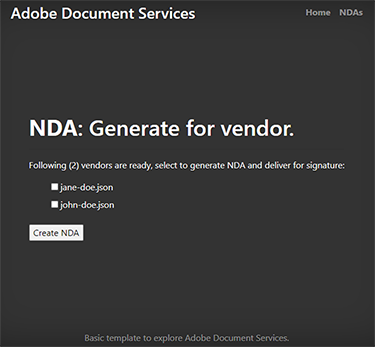

# Criando um NDA


As organizações colaboram com colaboradores externos para desenvolver seus serviços e produtos. Um acordo de confidencialidade (NDA) é uma parte importante dessas colaborações. Vincula todas as partes de divulgar qualquer informação confidencial que possa prejudicar qualquer entidade.

O formato NDA mais amplamente utilizado é um documento PDF. As organizações preparam um contrato de não divulgação e o enviam a todas as partes. Então, uma vez que todos assinaram, eles iniciam o contrato. Em uma equipe de alta velocidade, a criação manual de PDF retarda o progresso.

## O que você pode aprender

Este tutorial prático explica como criar um modelo de não divulgação do Microsoft Word especializado para sua empresa. suplemento Adobe para Microsoft Word, [Adobe Document Generation Tagger](https://opensource.adobe.com/pdftools-sdk-docs/docgen/latest/wordaddin.html#add-in-demo), insere “tags” para inserir os valores dinâmicos. Saiba como passar os dados JSON para o modelo e criar um PDF dinâmico. O PDF resultante pode ser enviado por e-mail ou mostrado aos colaboradores no navegador, dependendo dos requisitos e objetivos da sua empresa. Para acompanhar, basta ter uma pequena experiência com Node.js, JavaScript, Express.js, HTML e CSS.

## APIs e recursos relevantes

Com [!DNL Adobe Acrobat Services], você pode gerar documentos PDF dinamicamente usando dados dinâmicos. [!DNL Acrobat Services] oferece um pacote de ferramentas de PDF, incluindo a API de geração de documento Adobe para automatizar [Criação de NDA](https://www.adobe.io/apis/documentcloud/dcsdk/nda-creation.html).

* [API de geração de documento Adobe](https://www.adobe.io/apis/documentcloud/dcsdk/doc-generation.html)

* [API do Adobe Sign](https://www.adobe.io/apis/documentcloud/sign.html)

* [Adobe Document Generation Tagger](https://opensource.adobe.com/pdftools-sdk-docs/docgen/latest/wordaddin.html#add-in-demo)

* [Código do projeto](https://github.com/afzaal-ahmad-zeeshan/adobe-docugen-sample)

* [[!DNL Acrobat Services] teclas](https://opensource.adobe.com/pdftools-sdk-docs/release/latest/index.html#getcred)

## Criando o modelo JSON

O modelo do Microsoft Word depende do modelo JSON, então você o cria primeiro. Para o tutorial, use uma estrutura JSON básica que contenha detalhes da empresa, como informações de contato.

```
{
"vendor": {
"companyName": "GlobalCorp",
"street": "123 Any Street",
"street2": "",
"city":"Anywhere",
"state":"CA",
"primaryContact": {
"firstName":"John",
"lastName":"Doe",
"email":"john-doe@example.com",
"phone":"123-456-7890"
}
},
"authorizedSigner": {
"firstName": "Sarah",
"lastName": "Rose",
"email": "sarah@example.com",
"phone":"555-555-1234"
}
}
```

Use essa estrutura dentro do Microsoft Word para gerar um modelo. Esses dados podem vir de qualquer fonte de dados, desde que estejam no formato JSON. Para simplificar, você cria vários arquivos dentro do aplicativo Node.js, mas seu caso de uso pode exigir uma conexão de banco de dados para obter informações do fornecedor.

## Criação do modelo do Microsoft Word

Crie o modelo de não divulgação em um documento do Microsoft Word. A API de serviços do Adobe PDF espera que o documento do Microsoft Word contenha tags nas quais o serviço possa injetar valores de documentos JSON. Embora o modelo seja o mesmo para todas as solicitações ao Adobe, os dados dinâmicos no JSON são alterados. Essas etiquetas ajudam a criar documentos PDF para cada fornecedor nesse caso, usando um único modelo do Microsoft Word e acelerando o processo automatizando a geração de documentos NDA.

Você pode instalar o [complemento Document Generation Tagger gratuito](https://opensource.adobe.com/pdftools-sdk-docs/docgen/latest/wordaddin.html#add-in-demo) para o Microsoft Word. Se você faz parte de uma organização, pode solicitar ao administrador do Microsoft Office que instale o suplemento gratuito para todos.

Depois de instalar o suplemento, você pode encontrá-lo na guia Início, na categoria Adobe. Para abrir a guia, selecione **Geração de documento**:


Dentro da guia, você pode fazer upload do documento JSON de amostra. Este documento pode ser uma amostra porque você só pode usá-lo para criar um modelo do Microsoft Word.


Selecionar **Gerar tags** para exibir os itens que você pode usar dentro do modelo. Estas são as propriedades extraídas da estrutura JSON, prontas para uso no modelo:


Esses são os recursos do `authorizedSigner` campo. Outros campos são quebrados e você pode expandir a exibição no Microsoft Word. O suplemento também oferece opções avançadas de dados, como tabelas, listas, valores calculados e muito mais.

## Criar as tags

Se quiser, crie um modelo ou importe um [modelo existente](https://www.adobe.io/apis/documentcloud/dcsdk/doc-generation.html#sample-blade) no Microsoft Word. Depois de configurar o documento, adicione tags a cada campo clicando nos tokens correspondentes no suplemento.

O seguinte modelo em um arquivo do Microsoft Word:


Esse arquivo contém várias tags. Quando você executa o programa, esses campos são preenchidos com as informações do fornecedor.

O Document Generation Tagger se integra à API do Adobe Sign. Devido a essa integração, você pode criar automaticamente tags de texto do Sign para que o documento gerado possa ser enviado ao Adobe Sign para assinatura.

## Gerar o NDA para fornecedores

Dentro do aplicativo de amostra, você preparou pastas para as entradas e saídas. Como mencionado anteriormente, você usa arquivos JSON, de modo que haja dois arquivos para mostrar os fornecedores disponíveis no sistema. Os arquivos são mostrados dentro de um formulário que é impresso no navegador:

```
<h1><b>NDA</b>: Generate for vendor.</h1>
<hr />
<p>Following ({{files.length}}) vendors are ready, select to generate NDA and deliver for signature:</p>
<form method="POST">
<ul>
{{#each files }}
<li><input type="checkbox" name="vendor" value="{{this}}" id="file-{{@index}}" /> <label for="file-{{@index}}">{{this}}</label></li>
{{/each}}
</ul>
<input type="submit" value="Create NDA" />
</form>
```

Esse código gera a seguinte interface de usuário (UI) no navegador:



Quando o administrador seleciona uma pessoa, o aplicativo usa os Serviços da Adobe PDF para gerar o NDA em qualquer lugar.

```
async function compileDocFile(json, inputFile, outputPdf) {
try {
// configurations
const credentials = adobe.Credentials
.serviceAccountCredentialsBuilder()
.fromFile("./src/pdftools-api-credentials.json")
.build();
// Capture the credential from app and show create the context
const executionContext = adobe.ExecutionContext.create(credentials);
// create the operation
const documentMerge = adobe.DocumentMerge,
documentMergeOptions = documentMerge.options,
options = new documentMergeOptions.DocumentMergeOptions(json, documentMergeOptions.OutputFormat.PDF);
const operation = documentMerge.Operation.createNew(options);
// Pass the content as input (stream)
const input = adobe.FileRef.createFromLocalFile(inputFile);
operation.setInput(input);
// Async create the PDF
let result = await operation.execute(executionContext);
await result.saveAsFile(outputPdf);
} catch (err) {
console.log('Exception encountered while executing operation', err);
}
}
```

Use esse código dentro do roteador Express:

```
// Create one report and send it back
try {
console.log(`[INFO] generating the report...`);
const fileContent = fs.readFileSync(`./public/documents/raw/${vendor}`, 'utf-8');
const parsedObject = JSON.parse(fileContent);
await pdf.compileDocFile(parsedObject, `./public/documents/template/Adobe-NDA-Sample.docx`, `./public/documents/processed/output.pdf`);
console.log(`[INFO] sending the report...`);
res.status(200).render("preview", { page: 'nda', filename: 'output.pdf' });
} catch(error) {
console.log(`[ERROR] ${JSON.stringify(error)}`);
res.status(500).render("crash", { error: error });
}
```

Você pode visualizar [o código de exemplo completo](https://github.com/afzaal-ahmad-zeeshan/adobe-docugen-sample) no GitHub.

Esse código usa um documento JSON e o modelo do Microsoft Word na chamada da API para o [!DNL Adobe Acrobat Services] SDK. Na resposta, você recebe a saída e a salva no sistema de arquivos do aplicativo. Você pode encaminhar o documento gerado para seus clientes por email ou mostrar uma visualização dentro do navegador usando o [API incorporada do Adobe PDF](https://www.adobe.io/apis/documentcloud/dcsdk/pdf-embed.html).

Esta chamada cria o seguinte documento de não divulgação:


[!DNL Adobe Acrobat Services] As APIs inserem conteúdo para criar um documento PDF. Sem essas ferramentas, talvez seja necessário gravar o código para processar documentos do Office e trabalhar com formatos de arquivo PDF raw. Com a ajuda dos Serviços da Adobe PDF, você pode executar todas essas etapas com uma única chamada de API.

Agora use [API do Adobe Sign](https://www.adobe.io/apis/documentcloud/sign.html) solicitar assinaturas nos NDAs e entregar o documento final assinado a todas as partes. A Adobe Sign notifica você [usar um Webhook](https://www.adobe.io/apis/documentcloud/sign/docs.html#!adobedocs/adobe-sign/master/webhooks.md). Ao ouvir este webhook, você pode obter o status do NDA.

Para obter uma explicação mais detalhada sobre o processo do Adobe Sign, [consulte a documentação](https://www.adobe.io/apis/documentcloud/sign/docs.html) ou leia esta postagem de blog detalhada.

## Próximas etapas

Neste tutorial prático, o Adobe Document Generation Tagger foi usado para gerar dinamicamente documentos PDF usando modelos do Microsoft Word e arquivos de dados JSON. O suplemento ajudou a [criar NDAs automaticamente](https://www.adobe.io/apis/documentcloud/dcsdk/nda-creation.html) personalizado para cada parte e colete assinaturas usando a API do Sign.

Você pode usar essas técnicas para criar dinamicamente seus próprios NDAs ou outros documentos, liberando o tempo da sua equipe para se concentrar no trabalho produtivo. Explorar [[!DNL Adobe Acrobat Services]](https://www.adobe.io/apis/documentcloud/dcsdk/pdf-tools.html) encontrar APIs e SDKs para seu idioma e tempo de execução de sua escolha para que você possa adicionar funções de PDF diretamente aos seus aplicativos para criar rapidamente documentos PDF. [Começar agora](https://www.adobe.io/apis/documentcloud/dcsdk/gettingstarted.html) com uma avaliação gratuita de seis meses,
[pré-pago](https://www.adobe.io/apis/documentcloud/dcsdk/pdf-pricing.html) por apenas US$ 0,05 por transação de documento.
