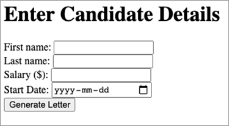
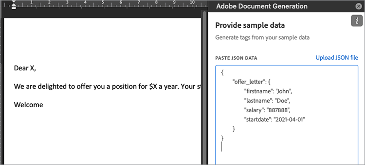

# Gerenciar cartas de oferta de funcionário


As cartas de oferta de funcionário são uma das primeiras experiências que os funcionários têm com sua organização. Como resultado, você quer ter certeza de que suas letras de oferta são de marca, mas não quer ter que criar sempre uma letra no seu processador de texto do zero. [!DNL Adobe Acrobat Services] As APIs oferecem uma maneira rápida, fácil e eficaz de lidar com partes importantes de [geração e entrega de cartas de oferta para novos funcionários](https://www.adobe.io/apis/documentcloud/dcsdk/employee-offer-letters.html).

## O que você pode aprender

Este tutorial prático aborda a configuração de um projeto do Node Express que exibe um formulário web para um usuário preencher com detalhes do funcionário. Esses detalhes usam [!DNL Acrobat Services] na web para gerar uma carta de oferta como um PDF que pode ser entregue a um cliente para sua assinatura usando a API do Adobe Sign.

## APIs e recursos relevantes

* [API de serviços PDF](https://opensource.adobe.com/pdftools-sdk-docs/release/latest/index.html)

* [API de geração de documento Adobe](https://www.adobe.io/apis/documentcloud/dcsdk/doc-generation.html)

* [API do Adobe Sign](https://www.adobe.io/apis/documentcloud/sign.html)

* [Complemento do Word para Marcador de Geração de Documento](https://www.adobe.io/apis/documentcloud/dcsdk/docs.html?view=docgen-addin)

* [Amostra de projeto](https://www.adobe.io/apis/documentcloud/dcsdk/employee-offer-letters.html)

## Introdução

[Node.js](https://nodejs.org/) é a plataforma de programação. Ele vem com um enorme conjunto de bibliotecas, como o servidor Web Express. [Baixar Node.js](https://nodejs.org/en/download/) e siga as etapas para instalar este excelente ambiente de desenvolvimento de código aberto.

Para usar a API de geração de documento Adobe no Node.js, acesse o [API de geração de documento](https://www.adobe.io/apis/documentcloud/dcsdk/doc-generation.html) site para acessar sua conta ou cadastrar-se em uma nova. Sua conta é [grátis por seis meses e depois pague conforme usa](https://www.adobe.io/apis/documentcloud/dcsdk/pdf-pricing.html) por apenas US$ 0,05 por transação de documento, para que você possa experimentar sem riscos e pagar apenas à medida que a sua empresa crescer.

Após fazer logon no [Console do Adobe Developer](https://console.adobe.io/), clique em **[!UICONTROL Criar novo projeto]**. O projeto é chamado “Projeto 1” por padrão. Clique no botão **[!UICONTROL Editar projeto]** e altere o nome para “Offer Letter Generator”. No centro da tela, há um **[!UICONTROL Comece A Usar Seu Novo Projeto]** seção. Para habilitar a segurança em seu projeto, execute as seguintes etapas:

Clique em **Adicionar API**. Você verá várias APIs para escolher. No menu **[!UICONTROL Filtrar por produto]** , selecione **[!UICONTROL Document Cloud]** e clique em **[!UICONTROL Próxima]**.

Agora, gere credenciais para acessar a API. As credenciais estão no formato de um token da Web JSON ([JWT](https://jwt.io/)): um padrão aberto para comunicação segura. Se você estiver familiarizado com o JWT e já tiver gerado as chaves, faça upload da sua chave pública aqui. Como alternativa, continue selecionando **Opção 1** para que o Adobe gere as chaves para você.


Clique no botão **[!UICONTROL Gerar par de chaves]** botão. Você obtém um arquivo config.zip para download. Descompacte o arquivo. Contém dois arquivos: certificate_pub.crt e private.key. Certifique-se de que o último seja mantido seguro, pois contém suas credenciais privadas e pode ser usado para gerar documentos falsos se estiver fora de seu controle.

Clique em **[!UICONTROL Próximo]**. Não, habilita o acesso à API de geração de PDF. Na guia **[!UICONTROL Selecionar perfis de produto]** , verifique **[!UICONTROL Desenvolvedor de serviços PDF corporativos]** e clique no botão **[!UICONTROL Salvar API configurada]** botão. Agora você pode começar a usar a API.

## Configurando o projeto

Configure um projeto de Nó para executar o código. Este exemplo usa [Código do Visual Studio](https://code.visualstudio.com/) (Código VS) como o editor. Crie uma pasta chamada “letter-generator” e abra-a no código VS. Na guia **[!UICONTROL Arquivo]** , selecione **[!UICONTROL Terminal]** \> **[!UICONTROL Novo Terminal]** para abrir um shell nesta pasta. Verifique se o Node está instalado e se está no caminho digitando o seguinte:

```
node -v
```

Você deve ver a versão do Node que instalou.

Agora que o ambiente de desenvolvimento está instalado, você pode criar o projeto.

Primeiro, inicialize o projeto usando o Gerenciador de pacotes de nós (npm). Digite o seguinte:

```
npm init
```

São feitas algumas perguntas sobre seu projeto de Nó. Você pode ignorar a maioria dessas perguntas, mas certifique-se de que o nome do projeto seja “gerador de letras” e o ponto de entrada seja **index.js**. Selecionar **Sim** para concluir a inicialização do projeto.

Agora você tem um arquivo package.json. O Node usa este arquivo para organizar seu projeto. Antes de criar index.js, você deve adicionar bibliotecas Adobe com o seguinte comando:

```
npm install --save @adobe/documentservices-pdftools-node-sdk
```

Deve haver uma nova pasta chamada node_modules adicionada ao projeto. Essa pasta é onde todas as bibliotecas (chamadas dependências no nó) são baixadas. O arquivo package.json também é atualizado com uma referência aos Serviços da Adobe PDF.

Agora você deseja instalar o Express como sua estrutura de Web leve. Insira o seguinte comando:

```
npm install express –save
```

Como antes, a seção dependências de package.json é atualizada de acordo.

## Criação de um modelo de carta de oferta

Agora, na raiz do projeto, crie um arquivo chamado “app.js”. Vamos colocar o seguinte código inicial nele:

```
const express = require('express');
const bodyParser = require('body-parser');
const PDFToolsSdk = require('@adobe/documentservices-pdftools-node-sdk')
const path = require('path');
const app = express();
const port = 8000;
app.use(bodyParser.urlencoded({ extended: true }));
app.get('/', (req, res) => {
res.sendFile(path.join(__dirname + '/index.html'));
});
app.post('/', (req, res) => {
console.log('Got body:', req.body);
res.sendStatus(200);
});
app.listen(port, () => {
console.log(`Candidate offer letter app listening on port ${port}!`)
});
```

Observe que get route retorna um **index.html** arquivo. Vamos criar um arquivo HTML com esse nome e o seguinte formato simples. Você pode adicionar estilos CSS e outros elementos de design posteriormente como achar melhor. Este formulário toma os detalhes básicos do candidato para gerar uma carta de boas-vindas:

```
<!DOCTYPE html>
<html lang="en">
<head>
<meta charset="UTF-8">
<meta http-equiv="X-UA-Compatible" content="IE=edge">
<meta name="viewport" content="width=device-width, initial-scale=1.0">
<title>Offer Letter Generator</title>
</head>
<body>
<h1>Enter Candidate Details</h1>
<form action="" method="post">
<div>
<label for="firstname">First name: </label>
<input type="text" name="firstname" id="firstname" required>
</div>
<div>
<label for="lastname">Last name: </label>
<input type="text" name="lastname" id="lastname" required>
</div>
<div>
<label for="salary">Salary ($): </label>
<input type="number" name="salary" id="salary" required>
</div>
<div>
<label for="startdate">Start Date: </label>
<input type="date" name="startdate" id="startdate" required>
</div>
<div>
<input type="submit" value="Generate Letter">
</div>
</form>
</body>
</html>
```

Execute o servidor Web com o seguinte comando:

```
node app.js
```

Você deverá ver a mensagem “Candidate offer letter app listening on port 8000”. Se você abrir o navegador para <http://localhost:8000/>, o formulário deve ter a seguinte aparência:



Observe que o formulário é publicado nele mesmo. Se você preencher os dados e clicar em **Gerar Carta,** você deverá ver as seguintes informações no console:

```
Got body: { firstname: 'John',
lastname: 'Doe',
salary: '887888',
startdate: '2021-04-01' }
```

Substitua o registro deste console por uma chamada de serviço da Web para [!DNL Acrobat Services]. Primeiro, você deve criar um modelo das informações baseado em JSON. O formato deste modelo é semelhante ao seguinte:

```
{
    "offer_letter": {
    "firstname": "John",
    "lastname": "Doe",
    "salary": "887888",
    "startdate": "2021-04-01"
    }
}
```

Você pode tornar este modelo mais elaborado se desejar, mas para este tutorial, continue com este exemplo simples. Não há validação neste formulário porque ele está fora do escopo deste artigo. Para converter o corpo do formulário para o modelo de dados descrito acima, altere o método do manipulador app.post para ter o seguinte código:

```
app.post('/', (req, res) => {
const docModel = {'offer_letter': req.body};
generateLetter(docModel);
res.sendStatus(200);
});
```

A primeira linha coloca os dados JSON no formato desejado. Agora você passa esses dados para uma função generateLetter. Pare seu servidor e cole o seguinte código no final de app.js. Esse código pega um documento do Word como um modelo e preenche os espaços reservados com informações de um documento JSON.

```
// Letter generation function
function generateLetter(jsonDataForMerge) {
try {
// Initial setup, create credentials instance.
const credentials = PDFToolsSdk.Credentials
.serviceAccountCredentialsBuilder()
.fromFile("pdftools-api-credentials.json")
.build();
// Create an ExecutionContext using credentials
const executionContext = PDFToolsSdk.ExecutionContext.create(credentials);
// Create a new DocumentMerge options instance
const documentMerge = PDFToolsSdk.DocumentMerge,
documentMergeOptions = documentMerge.options,
options = new documentMergeOptions.DocumentMergeOptions(jsonDataForMerge,
documentMergeOptions.OutputFormat.PDF);
// Create a new operation instance using the options instance
const documentMergeOperation = documentMerge.Operation.createNew(options)
// Set operation input document template from a source file.
const input = PDFToolsSdk.FileRef.createFromLocalFile(
'resources/OfferLetter-Template.docx');
documentMergeOperation.setInput(input);
// Execute the operation and Save the result to the specified location.
documentMergeOperation.execute(executionContext)
.then(result => result.saveAsFile('output/OfferLetter.pdf'))
.catch(err => {
if(err instanceof PDFToolsSdk.Error.ServiceApiError
|| err instanceof PDFToolsSdk.Error.ServiceUsageError) {
console.log(
'Exception encountered while executing operation', err);
} else {
console.log(
'Exception encountered while executing operation', err);
}
});
} catch (err) {
console.log('Exception encountered while executing operation', err);
}
}
```

Há muito código para desempacotar lá. Vamos pegar a parte principal primeiro: o `documentMergeOperation`. Esta seção é onde você obtém seus dados JSON e os mescla com um modelo de Documento do Word. Você pode usar o comando [exemplo no site do Adobe](https://www.adobe.io/apis/documentcloud/dcsdk/doc-generation.html#sample-blade) como referência, mas vamos dar um exemplo simples. Abra o Word e crie um novo documento em branco. Você pode personalizá-lo o quanto quiser, mas pelo menos tem algo como:

Prezado X,

Temos o prazer de oferecer-lhe uma posição para $X por ano. Sua data de início será X.

Bem-vindo

Salve o documento como “OfferLetter-Template.docx” em uma pasta chamada “resources” na raiz do projeto. Observe os três X no documento. Esses Xs são espaços reservados temporários para suas informações JSON. Embora você possa usar uma sintaxe especial para substituir esses espaços reservados, o Adobe fornece um complemento do Word que simplifica essa tarefa. Para instalar o suplemento, vá para o Adobe [Complemento do Word para Marcador de Geração de Documento](https://www.adobe.io/apis/documentcloud/dcsdk/docs.html?view=docgen-addin) local.

No Modelo OfferLetter, clique no novo **Geração de documento** botão. Um painel lateral é aberto. Clique em **Começar**. Você recebe uma área de texto para colar nos dados JSON de amostra. Copie o snippet “offer-data” do JSON de cima para a área de texto. Ele deve ter a seguinte aparência:



Clique no botão **Gerar tags** botão. Você obtém um menu suspenso de tags para inserir nos pontos apropriados do documento. Realce o primeiro X no documento e selecione **[!UICONTROL firstname]**. Clique em **[!UICONTROL Inserir texto]** e “Dear X,” é alterado para “Dear ```{{`offer_letter`.firstname}}```,”. Essa tag é o formato correto para `documentMergeOperation`. Vá em frente e adicione as três tags restantes no Xs apropriado. Não se esqueça de salvar OfferLetter-template.docx. Ele deve ficar assim:

Prezado ```{{`offer_letter`.firstname}} {{`offer_letter`.lastname}}```,

Temos o prazer de oferecer-lhe uma posição para $ ```{{`offer_letter`.salary}}``` um ano. Sua data de início será ```{{`offer_letter`.startdate}}```.

Bem-vindo

Agora o modelo do Word tem uma marcação que corresponde ao formato JSON. Por exemplo, ```{{`offer_letter`.`firstname`}}``` no início do documento do Word é substituído pelo valor na seção “nome” dos dados JSON.

Voltar para a sua `generateLetter` função. Para proteger sua chamada REST, crie um novo arquivo intitulado pdftools-api-credentials.json na raiz do projeto. Cole os seguintes dados JSON e ajuste-os com detalhes da seção Conta de serviço (JWT) de sua [Developer Console](https://console.adobe.io/).

```
{
"client_credentials": {
"client_id": "<YOUR_CLIENT_ID>",
"client_secret": "<YOUR_CLIENT_SECRET>"
},
"service_account_credentials": {
"organization_id": "<YOUR_ORGANIZATION_ID>",
"account_id": "<YOUR_TECHNICAL_ACCOUNT_ID>",
"private_key_file": "<PRIVATE_KEY_FILE_PATH>"
}
}
```

* A ID do cliente, o segredo do cliente e a ID da organização podem ser copiados diretamente do **[!UICONTROL Detalhes da credencial]** do console.

* A ID da conta é o **ID da conta técnica**.

* Copie o arquivo private.key gerado anteriormente para o projeto e insira seu nome na seção private_key_file do arquivo pdftools-api-credentials.json. Se desejar, você pode colocar um caminho para o arquivo de chave privada aqui. Lembre-se de mantê-lo seguro, pois ele pode ser mal usado quando estiver fora de seu controle.

Para gerar um PDF com os dados JSON preenchidos, volte para o **[!UICONTROL Inserir Detalhes do Candidato]** formulário da Web e publique alguns dados. Demora um pouco, pois o documento precisa ser baixado do Adobe, mas você deve ter um arquivo intitulado OfferLetter.pdf em uma nova pasta intitulada output.

## Próximas etapas

É isso! Isso é só o começo. Se você estudar a seção Avançado da guia Geração de documento do Suplemento do Word, notará que nem todos os marcadores de espaço reservado são dos dados JSON associados. Você também pode adicionar tags de assinatura. Essas tags permitem que você pegue o documento resultante e faça upload dele para [Adobe Sign](https://acrobat.adobe.com/ca/en/sign.html) para entrega e assinatura do novo funcionário. Leia Introdução à API do Adobe Sign para saber como fazer isso. Esse processo é semelhante porque você está usando chamadas REST protegidas com um token JWT.

O exemplo de documento único fornecido acima pode ser usado como base para um aplicativo quando uma organização deve [aumentar contratação sazonal](https://www.adobe.io/apis/documentcloud/dcsdk/employee-offer-letters.html) de funcionários em vários locais. Como demonstrado, o fluxo principal é a obtenção de dados dos candidatos através de uma inscrição on-line. Os dados são usados para preencher os campos de uma carta de oferta e enviá-la para assinatura eletrônica.

[!DNL Adobe Acrobat Services] é gratuito para uso por seis meses, depois [pré-pago](https://www.adobe.io/apis/documentcloud/dcsdk/pdf-pricing.html) por apenas US$ 0,05 por transação de documento, para que você possa experimentar e dimensionar o fluxo de trabalho de carta de oferta à medida que a sua empresa cresce. Para [começar](https://www.adobe.io/apis/documentcloud/dcsdk/gettingstarted.html)
criando seus próprios modelos, [inscreva sua conta de desenvolvedor](https://www.adobe.io/).
