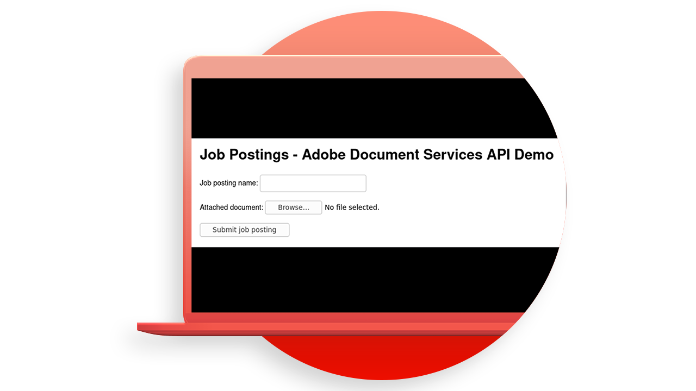

# [!DNL Adobe Acrobat Services] Casos de uso de API

## O que o [!DNL Adobe Acrobat Services] As APIs servem para mim?

Saiba como o [!DNL Adobe Acrobat Services] As APIs podem mudar seus negócios com esses casos de uso prático.

### [!DNL Acrobat Services] APIs

<table style="table-layout:fixed">
<tr>
  <td>
    
    

    <a href="automatelegalworkflows.md"><strong>Automatizar fluxos de trabalho legais</strong></a>
    

    <em>Saiba como automatizar fluxos de trabalho legais com conteúdo condicional</em>
     
  </td>
  <td>
      
      

      <a href="employeeonboarding.md"><strong>Modernização da integração do funcionário</strong></a>
      

      <em>Saiba como modernizar a integração de funcionários</em>
       
  </td>
  <td>
      
      

      <a href="acceleratesales.md"><strong>Acelere seu processo de vendas</strong></a>
      

      <em>Saiba como acelerar as vendas integrando experiências de documento</em>
       
    </td>
    <td>
      
      

      <a href="sales.md"><strong>Gerenciamento de propostas de vendas e contratos</strong></a>
      

      <em>Saiba como criar um fluxo de trabalho eficiente para automatizar e simplificar propostas de vendas</em>
       
    </td>
</tr>
<tr>
  <td>
    
    

    <a href="nda.md"><strong>Criando um NDA</strong></a>
    

    <em>Saiba como criar um PDF NDA dinâmico para colaboração</em>
     
  </td>
  <td>
    
    

    <a href="legal.md"><strong>Gerenciar contratos legais</strong></a>
    

    <em>Saiba como gerar e proteger documentos legais automaticamente com a entrada de dados personalizados</em>
     
  </td>
  <td>
    
    

    <a href="offer.md"><strong>Gerenciar cartas de oferta de funcionário</strong></a>
    

    <em>Saiba como gerar uma carta de oferta que pode ser entregue a um novo funcionário para assinatura</em>
     
  </td>
  <td>
    
    

    <a href="searching.md"><strong>Pesquisa e indexação</strong></a>
    

    <em>Saiba como criar arquivos de PDF pesquisáveis a partir de documentos digitalizados</em>
     
  </td>
</tr>
<tr>
  <td>
    
    

    <a href="reviews.md"><strong>Revisões e aprovações</strong></a>
    

    <em>Saiba como criar um fluxo de trabalho de revisão e aprovação de documentos para colaboração entre equipes</em>
     
  </td>
  <td>
    
    

    <a href="reportcreation.md"><strong>Criação e edição de relatórios</strong></a>
    

    <em>Saiba como gerar relatórios de PDF em seu site para os clientes</em>
     
  </td>
  <td>
    
    

    <a href="jobposting.md"><strong>Lançamento de trabalho</strong></a>
    

    <em>Saiba como desenvolver uma experiência na Web tranquila e consistente para candidatos a emprego e empregadores</em>
     
  </td>
  <td>
    
    

    <a href="educationcollab.md"><strong>Colaboração entre aluno e professor</strong></a>
    

    <em>Saiba como criar uma plataforma de aprendizado online que permite que professores e estudantes compartilhem recursos facilmente no PDF</em>
     
  </td>
</tr>
<tr>
  <td>
    
    

    <a href="AgreementWorkflowsNodejs.md"><strong>Fluxos de trabalho do contrato no Node.js</strong></a>
    

    <em>[!DNL Adobe Acrobat Services] As APIs incorporam facilmente recursos de PDF em seus aplicativos da Web</em>
     
  </td>
  <td>
    
    

    <a href="HRAgreementWorkflowsJava.md"><strong>Fluxos de trabalho de documentos de RH em Java</strong></a>
    

    <em>[!DNL Adobe Acrobat Services] As APIs incorporam facilmente recursos de PDF em seus aplicativos web de RH</em>
     
  </td>
  <td>
    
    

    <a href="FinanceWorkflowsJava.md"><strong>Gerenciamento de fluxos de trabalho de documentos financeiros em Java</strong></a>
    

    <em>[!DNL Adobe Acrobat Services] fornece todas as ferramentas, serviços e recursos necessários para processar e extrair dados de documentos financeiros do PDF</em>
     
  </td>
  <td>
    
    

     
  </td>
</tr>
</table>

### APIs de geração de documento

<table style="table-layout:fixed">
<tr>
  <td>
    
    

    <a href="invoices.md"><strong>Manuseando faturas</strong></a>
    

    <em>Saiba como gerar, proteger com senha e entregar faturas de clientes automaticamente</em>
     
  </td>
  <td>
    
    

     
  </td>
  <td>
    
    

     
  </td>
  <td>
    
    

     
  </td>
</tr>
</table>

### PDF Embed API

<table style="table-layout:fixed">
<tr>
   <td>
    
    

    <a href="ddppdfembedapi.md"><strong>Publicação de documentos digitais</strong></a>
    

    <em>Saiba como exibir documentos PDF incorporados em páginas da Web usando a API incorporada do Adobe PDF</em>
     
  </td>
  <td>
    
    

     
  </td>
  <td>
    
    

     
  </td>
  <td>
    
    

     
  </td>
</tr>
</table>