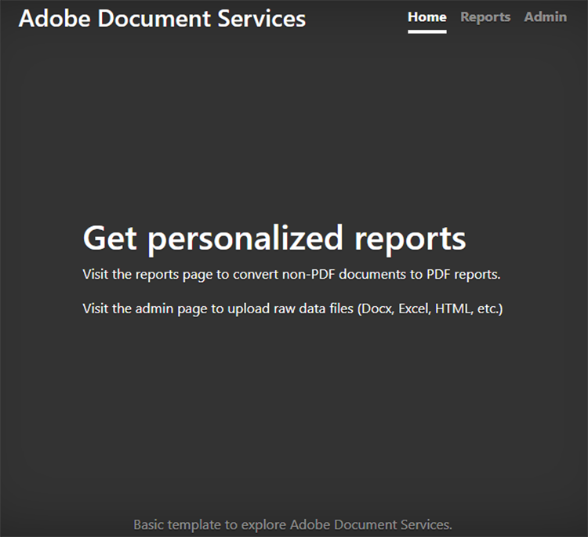

# Criação e edição de relatórios


Os setores financeiro, educacional, de marketing e outros usam PDF para compartilhar dados com seus clientes e partes interessadas. Os PDF facilitam o compartilhamento de documentos sofisticados, com tabelas, gráficos e conteúdo interativo, em um formato que todos podem visualizar. [!DNL Adobe Acrobat Services] As APIs ajudam essas empresas a gerar relatórios de PDF compartilháveis do Microsoft Word, Microsoft Excel, gráficos e outros formatos de documentos diversos.

Diga você [executar uma empresa de rastreamento de redes sociais](https://www.adobe.io/apis/documentcloud/dcsdk/on-demand-report-creation.html). Seus clientes fazem logon em uma parte do seu site protegida por senha para exibir a análise da campanha. Muitas vezes, eles querem compartilhar essas estatísticas com seus executivos, acionistas, doadores ou outros interessados. Documentos PDF para download são uma ótima maneira de seus clientes compartilharem números, gráficos e muito mais.

Ao incorporar [API de serviços PDF](https://www.adobe.io/apis/documentcloud/dcsdk/pdf-tools.html) em seu site, você pode gerar relatórios PDF em qualquer lugar para cada cliente. Você pode criar PDF e combiná-los em um relatório prático para seus clientes baixarem e enviarem aos colaboradores.

## O que você pode aprender

Neste tutorial prático, aprenda a usar o PDF Services SDK em um ambiente Node.js e Express.js (com apenas alguns JavaScript, HTML e CSS) para adicionar rápida e facilmente a funcionalidade orientada a PDF a um site existente. Este site tem uma página onde os administradores carregam relatórios, uma área onde os clientes visualizam uma lista de relatórios disponíveis e selecionam documentos para converter em PDF, e pontos finais úteis para baixar PDF gerados pelo sistema.

## APIs e recursos relevantes

* [API de serviços PDF](https://opensource.adobe.com/pdftools-sdk-docs/release/latest/index.html)

* [API de incorporação do PDF](https://www.adobe.com/devnet-docs/dcsdk_io/viewSDK/index.html)

## Painel de relatórios do Campaign para clientes

>[!NOTE]
>
>Este tutorial não aborda as práticas recomendadas do Node.js ou como proteger suas aplicações Web. Algumas áreas do site estão expostas para uso público e a nomeação de documentos pode não ser de produção fácil. Para discutir a melhor abordagem possível para projetar um sistema como este, consulte seus arquitetos e engenheiros.

Aqui, você tem um aplicativo da Web básico do Express.js que tem uma área de relatórios do cliente e uma seção do administrador. Este aplicativo pode apresentar relatórios para campanhas em redes sociais. Por exemplo, ele pode demonstrar o número de vezes que um anúncio é clicado.



Você pode baixar este projeto do [Repositório GitHub](https://github.com/afzaal-ahmad-zeeshan/express-adobe-pdf-tools).

Agora, vamos explorar como publicar os relatórios.

## Carregando relatórios

Para manter a simplicidade, use apenas o upload e o processamento baseados no sistema de arquivos aqui. No Express.js, você pode usar o módulo fs para listar todos os arquivos disponíveis em um diretório.

Na mesma página, permita que o administrador carregue arquivos de relatório no servidor para que os clientes vejam. Esses arquivos podem estar em vários formatos diferentes, como Microsoft Word, Microsoft Excel, HTML e [outros formatos de dados]https://opensource.adobe.com/pdftools-sdk-docs/release/latest/howtos.html#create-a-pdf) incluindo arquivos de gráficos. A página do administrador é semelhante a esta:


>[!NOTE]
>
>Proteja seus URLs por senha ou use o pacote do passport do npm para proteger seu aplicativo por trás da camada de autenticação e autorização.

Quando o administrador seleciona e faz upload de um arquivo, ele é movido para um repositório público, onde outras pessoas podem acessá-lo. Use o mesmo repositório para publicar documentos na página do administrador e listar os relatórios de marketing disponíveis para os clientes. Este código é:

```
router.get('/', (req, res) => {
try {
let files = fs.readdirSync('./public/documents/raw') // read the files
res.status(200).render("reports", { page: 'reports', files: files });
} catch (error) {
res.status(500).render("crash", { error: error });
}
});
```

Esse código lista todos os arquivos e renderiza uma visualização da lista de arquivos.

## Seleção de relatórios

No lado do usuário, você tem um formulário para os clientes selecionarem os documentos que desejam incluir no relatório da campanha nas redes sociais. Para simplificar, na página de exemplo, mostre apenas o nome do documento e uma caixa de seleção para selecionar o documento. Os clientes podem selecionar um único relatório ou vários relatórios para combinar em um único documento do PDF.

Para uma interface de usuário mais avançada, você também pode mostrar uma visualização do relatório aqui.


## Gerando um relatório PDF

Use o PDF Services SDK para criar os relatórios de PDF a partir das entradas de dados. Os dados (conforme mostrado nas capturas de tela acima) podem vir de vários formatos de dados, como Microsoft Word, Microsoft Excel, HTML, gráficos e muito mais. Comece instalando o pacote npm para o PDF Services SDK.

```
$ npm install --save @adobe/documentservices-pdftools-node-sdk
```

Antes de iniciar, você deve ter credenciais de API, [isento de Adobe](https://opensource.adobe.com/pdftools-sdk-docs/release/latest/index.html#getcred). Use seu [!DNL Acrobat Services] conta [gratuito por seis meses e depois pague conforme precisar](https://www.adobe.io/apis/documentcloud/dcsdk/pdf-pricing.html) por apenas \$0,05 por transação de documento.

Baixe o arquivo compactado e extraia o arquivo JSON para obter as credenciais e a chave privada. No projeto de amostra, coloque o arquivo no diretório src.


Agora que as credenciais estão configuradas, você pode escrever a tarefa de conversão de PDF. Para esta demonstração, você tem duas operações que devem ser executadas no aplicativo:

* Converter documentos raw em arquivos PDF

* Combine vários arquivos PDF em um único relatório

O procedimento geral é semelhante para executar qualquer operação. A única diferença é o serviço que você usa. No código a seguir, você converte o documento raw em um arquivo PDF:

```
async function createPdf(rawFile, outputPdf) {
try {
// configurations
const credentials = adobe.Credentials
.serviceAccountCredentialsBuilder()
.fromFile("./src/pdftools-api-credentials.json")
.build();
// Capture the credential from app and show create the context
const executionContext = adobe.ExecutionContext.create(credentials),
operation = adobe.CreatePDF.Operation.createNew();
// Pass the content as input (stream)
const input = adobe.FileRef.createFromLocalFile(rawFile);
operation.setInput(input);
// Async create the PDF
let result = await operation.execute(executionContext);
await result.saveAsFile(outputPdf);
} catch (err) {
console.log('Exception encountered while executing operation', err);
}
}
```

No código acima, você lê as credenciais e cria o contexto de execução. O SDK de Serviços PDF requer o contexto de execução para autenticar suas solicitações.

Em seguida, execute a operação Criar PDF que converte os documentos raw no formato PDF. Finalmente, você usa o `outputPdf` para copiar o relatório PDF. No exemplo de código, você encontra esse código no arquivo src/helpers/pdf.js. Posteriormente neste tutorial, você importa o módulo PDF e chama esse método.

Como demonstrado na seção anterior, seus clientes podem acessar a seguinte página para selecionar os relatórios que desejam converter em PDF:


Quando um cliente seleciona um ou mais desses relatórios, você cria o arquivo PDF.

Primeiro, vamos ver um único arquivo PDF em ação. Quando o usuário seleciona um único relatório, você só precisa convertê-lo em PDF e fornecer o link de download.

```
try {
console.log(`[INFO] generating the report...`);
await pdf.createPdf(`./public/documents/raw/${reports}`, `./public/documents/processed/output.pdf`);
console.log(`[INFO] sending the report...`);
res.status(200).render("download", { page: 'reports', filename: 'output.pdf' });
} catch(error) {
console.log(`[ERROR] ${JSON.stringify(error)}`);
res.status(500).render("crash", { error: error });
}
```

Esse código cria um relatório e compartilha o URL de download com o cliente. Aqui está a página da Web de saída:


E aqui está o PDF de saída:


Os clientes podem selecionar vários arquivos para gerar um relatório combinado. Quando o cliente seleciona mais de um documento, você executa duas operações: o primeiro cria uma PDF parcial para cada documento e o segundo combina-os em um único relatório PDF.

```
async function combinePdf(pdfs, outputPdf) {
try {
// configurations
const credentials = adobe.Credentials
.serviceAccountCredentialsBuilder()
.fromFile("./src/pdftools-api-credentials.json")
.build();
// Capture the credential from app and show create the context
const executionContext = adobe.ExecutionContext.create(credentials),
operation = adobe.CombineFiles.Operation.createNew();
// Pass the PDF content as input (stream)
for (let pdf of pdfs) {
const source = adobe.FileRef.createFromLocalFile(pdf);
operation.addInput(source);
}
// Async create the PDF
let result = await operation.execute(executionContext);
await result.saveAsFile(outputPdf);
} catch (err) {
console.log('Exception encountered while executing operation', err);
}
}
```

Esse método está disponível no arquivo src/helpers/pdf.js e exposto como parte da exportação do módulo.

```
try {
console.log(`[INFO] creating a batch report...`);
// Create a batch report and send it back
let partials = [];
for (let index in reports) {
const name = `partial-${index}-${reports[index]}`;
await pdf.createPdf(`./public/documents/raw/${reports[index]}`, `./public/documents/processed/${name}`);
partials.push(`./public/documents/processed/${name.replace('docx', 'pdf').replace('xlsx', 'pdf')}`);
}
await pdf.combinePdf(partials, `./public/documents/processed/output.pdf`);
console.log(`[INFO] sending the combined report...`);
res.status(200).render("download", { page: 'reports', filename: 'output.pdf' });
} catch(error) {
console.log(`[ERROR] ${JSON.stringify(error)}`);
res.status(500).render("crash", { error: error });
}
```

Esse código gera um relatório compilado para vários documentos de entrada. A única função adicionada é a `combinePdf` método que usa uma lista de nomes de caminho de arquivo PDF e retorna um único PDF de saída.

Agora, seus clientes do painel de redes sociais podem selecionar relatórios relevantes de suas contas e baixá-los como uma PDF útil. Esse painel permite mostrar ao gerenciamento e a outras partes interessadas o sucesso de suas campanhas com dados, tabelas e gráficos em um formato universalmente fácil de abrir.

## Próximas etapas

Este tutorial prático mostra como usar a API de serviços do PDF para ajudar os clientes a baixar relatórios relevantes como PDF fáceis de compartilhar. Você criou um aplicativo Node.js para mostrar o poder da API de serviços PDF para serviços de relatório e leitura de PDF. O aplicativo demonstrou como seus clientes podem baixar um único documento de relatório ou combinar e mesclar vários documentos em um único relatório PDF.

Esse aplicativo habilitado para Adobe ajuda o [clientes do painel de redes sociais](https://www.adobe.io/apis/documentcloud/dcsdk/on-demand-report-creation.html) receba e compartilhe os relatórios necessários, sem se preocupar se todos os destinatários têm o Microsoft Office ou outro software instalado em seu dispositivo. Você pode usar as mesmas técnicas no seu próprio aplicativo para ajudar os usuários a exibir, combinar e baixar documentos. Ou consulte várias outras APIs para adicionar e monitorar assinaturas e muito mais. Adobe

Para começar, reivindique seu [[!DNL Adobe Acrobat Services]](https://www.adobe.io/apis/documentcloud/dcsdk/gettingstarted.html) e crie experiências de relatórios envolventes para seus funcionários e clientes. Aproveite sua conta gratuitamente por seis meses e [pay-as-you-go](https://www.adobe.io/apis/documentcloud/dcsdk/pdf-pricing.html) à medida que seus esforços de marketing aumentam, apenas \$0,05 por transação de documento.
