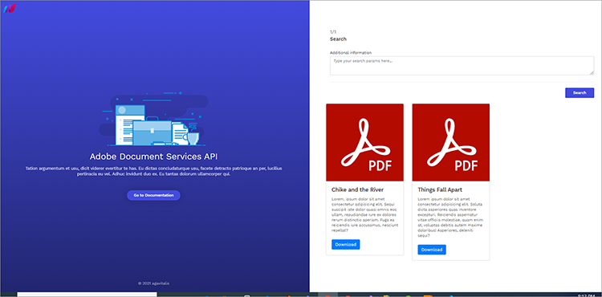

# Pesquisa e indexação


As organizações geralmente precisam digitalizar seus documentos impressos e arquivos digitalizados. Considere isso [cenário](https://docs.google.com/document/d/11jZdVQAw-3fyE3Y-sIqFFTlZ4m02LsCC/edit). Um escritório de advocacia tem milhares de contratos jurídicos digitalizados para criar arquivos digitais. Querem determinar se algum desses contratos jurídicos tem uma cláusula ou um complemento específico que devem rever. A precisão é necessária para fins de conformidade. A solução é fazer um inventário dos documentos digitais, tornar o texto pesquisável e criar um índice para encontrar essas informações.

O desafio de criar arquivos digitais para recuperar informações para edição ou operações downstream é um pesadelo para a maioria das organizações.

## O que você pode aprender

Este tutorial prático explora como [!DNL Adobe Acrobat Services] Os recursos das APIs podem ser usados com facilidade para arquivar e digitalizar documentos. Você explora esses recursos criando um aplicativo Express NodeJS e, em seguida, integrando [!DNL Acrobat Services] APIs para arquivamento, digitalização e transformação de documentos.

Para acompanhar, você precisa [Node.js](https://nodejs.org/) instalado e uma compreensão básica do Node.js e [Sintaxe ES6](https://www.w3schools.com/js/js_es6.asp).

## APIs e recursos relevantes

* [API de serviços PDF](https://opensource.adobe.com/pdftools-sdk-docs/release/latest/index.html)

* [Código do projeto](https://github.com/agavitalis/AdobeDocumentServicesAPIs.git)

## Configuração do projeto

Primeiro, configure a estrutura de pastas do aplicativo. Você pode recuperar o código-fonte [aqui](https://github.com/agavitalis/AdobeDocumentAPI.git).

## Estrutura do diretório

Crie uma pasta chamada AdobeDocumentServicesAPIs e abra-a em um editor de sua escolha. Crie um aplicativo NodeJS básico com o `npm init` usando esta estrutura de pastas:

```
AdobeDocumentServicesAPIs
config
default.json
controllers
createPDFController.js
makeOCRController.js
searchController.js
models
document.js
output
.gitkeep
routes
web.js
services
upload.js
views
index.hbs
ocr.hbs
search.hbs
index.js
```

Você está usando MongoDB como um banco de dados para este aplicativo. Portanto, para configurar, coloque suas configurações padrão de banco de dados na pasta config/, colando o trecho de código abaixo no arquivo default.json desta pasta e, em seguida, adicione o URL do seu banco de dados.

```
### config/default.json and config/dev.json
{ "DBHost": "YOUR_DB_URI" }
```

## Instalação do pacote

Agora, instale alguns pacotes usando o comando npm install, conforme mostrado no trecho de código abaixo:

```
{
    "name": "adobedocumentservicesapis",
    "version": "1.0.0",
    "description": "",
    "main": "index.js",
    "directories": {
    "test": "test"
    },
    "dependencies": {
    "body-parser": "^1.19.0",
    "config": "^3.3.6",
    "express": "^4.17.1",
    "hbs": "^4.1.1",
    "mongoose": "^5.12.1",
    "morgan": "^1.10.0",
    "multer": "^1.4.2",
    "path": "^0.12.7"
    },
    "devDependencies": {},
    "scripts": {
    "start": "set NODE_ENV=dev && node index.js"
    },
    "repository": {
    "type": "git",
    "url": "git+https://github.com/agavitalis/AdobeDocumentServicesAPIs.git"
    },
    "author": "Ogbonna Vitalis",
    "license": "ISC",
    "bugs": {
    "url": "https://github.com/agavitalis/AdobeDocumentServicesAPIs/issues"
    },
    "homepage": "https://github.com/agavitalis/AdobeDocumentServicesAPIs#readme"
}
```

```
###bash
npm install express mongoose config body-parser morgan multer hbs path pdf-parse
Ensure that the content of your package.json file is similar to this code snippet:
###package.json
{
```

Esses snippets de código instalam as dependências do aplicativo, incluindo o mecanismo de modelagem Handlebars para a exibição. Na tag scripts, você configura os parâmetros de tempo de execução do aplicativo.

## Integração [!DNL Acrobat Services] APIs

[!DNL Acrobat Services] O inclui três APIs:

* API de serviços da Adobe PDF

* API incorporada do Adobe PDF

* API de geração de documento Adobe

Essas APIs automatizam a geração, a manipulação e a transformação de conteúdo PDF por meio de um conjunto de serviços da Web baseados em nuvem.

Para obter as credenciais necessárias [registrar](https://www.adobe.com/go/dcsdks_credentials?ref=getStartedWithServicesSDK) e conclua o fluxo de trabalho. A API de incorporação do PDF é gratuita para uso. A API de serviços do PDF e a API de geração de documentos são gratuitas por seis meses. Quando a versão de avaliação terminar, você poderá [pay-as-you-go](https://www.adobe.io/apis/documentcloud/dcsdk/pdf-pricing.html) por apenas US$ 0,05 por transação de documento. Você paga apenas à medida que sua empresa cresce e processa mais contratos.


Após concluir a inscrição, um exemplo de código será baixado no computador e conterá as credenciais de API. Extraia este exemplo de código e coloque os arquivos private.key e pdftools-api-credentials.json no diretório raiz do seu aplicativo.

Agora, instalar [PDF Services Node.js SDK](https://www.npmjs.com/package/@adobe/documentservices-pdftools-node-sdk) executando o ` npm install --save @adobe/documentservices-pdftools-node-sdk ` usando o terminal no diretório raiz do aplicativo.

## Criando um PDF

[!DNL Acrobat Services] suporta a criação de PDF a partir de documentos do Microsoft Office (Word, Excel e PowerPoint) e outros [formatos de arquivo suportados](https://opensource.adobe.com/pdftools-sdk-docs/release/latest/howtos.html#create-a-pdf) como .txt, .rtf, .bmp, .jpg, .gif, .tiff e .png.

Para criar documentos PDF a partir dos formatos de arquivo suportados, use este formulário para fazer upload dos documentos. Você pode acessar os arquivos HTML e CSS do formulário em [GitHub](https://github.com/agavitalis/AdobeDocumentServicesAPIs.git).


Agora, adicione os seguintes snippets de código ao arquivo controllers/createPDFController.js . Esse código recupera o documento e o transforma em um PDF.

Os arquivos originais e o arquivo transformado são salvos em uma pasta dentro do aplicativo.

```
const PDFToolsSdk = require('@adobe/documentservices-pdftools-node-sdk');
/*
* GET / route to show the createPDF form.
*/
function createPDF(req, res) {
//catch any response on the url
let response = req.query.response
res.render('index', { response })
}
/*
* POST /createPDF to create a new PDF File.
*/
function createPDFPost(req, res) {
let filePath = req.file.path;
let fileName = req.file.filename;
try {
// Initial setup, create credentials instance.
const credentials = PDFToolsSdk.Credentials
.serviceAccountCredentialsBuilder()
.fromFile("pdftools-api-credentials.json")
.build();
// Create an ExecutionContext using credentials and create a new operation
instance.
const executionContext = PDFToolsSdk.ExecutionContext.create(credentials),
createPdfOperation = PDFToolsSdk.CreatePDF.Operation.createNew();
// Set operation input from a source file.
const input = PDFToolsSdk.FileRef.createFromLocalFile(filePath);
createPdfOperation.setInput(input);
// Execute the operation and Save the result to the specified location.
createPdfOperation.execute(executionContext)
.then((result) => {
result.saveAsFile('output/createPDFFromDOCX.pdf')
//download the file
res.redirect('/?response=PDF Successfully created')
})
.catch(err => {
if (err instanceof PDFToolsSdk.Error.ServiceApiError
|| err instanceof PDFToolsSdk.Error.ServiceUsageError) {
console.log('Exception encountered while executing operation',
err);
} else {
console.log('Exception encountered while executing operation',
err);
}
});
} catch (err) {
console.log('Exception encountered while executing operation', err);
}
}
//export all the functions
module.exports = { createPDF, createPDFPost };
```

Este trecho de código requer [PDF Services Node.js SDK](https://www.npmjs.com/package/@adobe/documentservices-pdftools-node-sdk). Use as funções:

* createPDF, que exibe o formulário de upload de documento

* createPDFPost, que transforma o documento carregado em um PDF

Os documentos PDF transformados são salvos no diretório de saída, enquanto o arquivo original é salvo no diretório de uploads.

## Uso do reconhecimento de texto

O reconhecimento óptico de caracteres (OCR) converte imagens e documentos digitalizados em arquivos pesquisáveis. É possível converter [!DNL Acrobat Services] APIs, imagens e documentos digitalizados em PDF pesquisáveis. Após executar uma operação de OCR, o arquivo torna-se editável e pesquisável. Você pode armazenar o conteúdo do arquivo em um armazenamento de dados para indexação e outros usos.

Lembre-se de que pesquisar e indexar documentos digitalizados é essencial para muitas organizações onde o gerenciamento de arquivos e o processamento de informações são essenciais. O recurso de OCR elimina esses desafios.

Para implementar esse recurso, você deve criar um formulário de upload semelhante ao acima. Desta vez, você restringe o formulário a arquivos PDF, pois pode usar o recurso OCR somente em documentos PDF.

Aqui está o formulário de upload para este exemplo:


Agora, para manipular o PDF carregado e executar algumas operações de OCR, adicione o snippet de código abaixo ao arquivo controllers/makeOCRController.js. Esse código implementa o processo de OCR em um arquivo carregado e salva o arquivo no sistema de arquivos do aplicativo.

```
const fs = require('fs')
const pdf = require('pdf-parse');
const mongoose = require('mongoose');
const Document = require('../models/document');
const PDFToolsSdk = require('@adobe/documentservices-pdftools-node-sdk');
/*
* GET /makeOCR route to show the makeOCR form.
*/
function makeOCR(req, res) {
//catch any response on the url
let response = req.query.response
res.render('ocr', { response })
}
/*
* POST /makeOCRPost to create a new PDF File.
*/
function makeOCRPost(req, res) {
let filePath = req.file.path;
let fileName = req.file.filename;
try {
// Initial setup, create credentials instance.
const credentials = PDFToolsSdk.Credentials
.serviceAccountCredentialsBuilder()
.fromFile("pdftools-api-credentials.json")
.build();
// Create an ExecutionContext using credentials and create a new operation
instance.
const executionContext = PDFToolsSdk.ExecutionContext.create(credentials),
ocrOperation = PDFToolsSdk.OCR.Operation.createNew();
// Set operation input from a source file.
const input = PDFToolsSdk.FileRef.createFromLocalFile(filePath);
ocrOperation.setInput(input);
// Execute the operation and Save the result to the specified location.
ocrOperation.execute(executionContext)
.then(async (result) => {
let newFileName = `createPDFFromDOCX-${Math.random() * 171}.pdf`;
await result.saveAsFile(`output/${newFileName}`);
let documentContent = fs.readFileSync(
require("path").resolve("./") + `\\output\\${newFileName}`
);
pdf(documentContent)
.then(function (data) {
//Creates a new document
var newDocument = new Document({
documentName: fileName,
documentDescription: description,
documentContent: data.text,
url: require("path").resolve("./") + `\\output\\${newFileName}`
});
//Save it into the DB.
newDocument.save((err, docs) => {
if (err) {
res.send(err);
} else {
//If no errors, send it back to the client
res.redirect(
"/makeOCR?response=OCR Operation Successfully performed on
the PDF File"
);
}
});
})
.catch(function (error) {
// handle exceptions
console.log(error);
});
})
.catch(err => {
if (err instanceof PDFToolsSdk.Error.ServiceApiError
|| err instanceof PDFToolsSdk.Error.ServiceUsageError) {
console.log('Exception encountered while executing operation',
err);
} else {
console.log('Exception encountered while executing operation',
err);
}
});
} catch (err) {
console.log('Exception encountered while executing operation', err);
}
}
//export all the functions
module.exports = { makeOCR, makeOCRPost };
```

Você precisa do [!DNL Acrobat Services] SDK de nó e os módulos mongoose, pdf-parse e fs e o esquema de modelo de documento. Estes módulos são necessários para salvar o conteúdo do arquivo transformado em um banco de dados MongoDB.

Agora crie duas funções: makeOCR para exibir o formulário carregado e makeOCRPost para processar o documento carregado. Salve o formulário original em um banco de dados e salve o formulário transformado na pasta de saída do aplicativo.

As credenciais fornecidas pelo Adobe do arquivo pdftools-api-credentials.json são carregadas em cada caso antes de transformar o arquivo.

>[!NOTE]
>
>O recurso OCR é compatível apenas com documentos PDF.

Além disso, adicione o snippet de código abaixo ao arquivo Modes/Document.js do seu aplicativo.

No trecho de código, defina um modelo mongoso e descreva as propriedades do documento a serem salvas no banco de dados. Além disso, indexe o campo documentContent para tornar a pesquisa de textos fácil e eficiente.

```
const mongoose = require("mongoose");
const Schema = mongoose.Schema;
//Document schema definition
var DocumentSchema = new Schema(
{
documentName: { type: String, required: false },
documentDescription: { type: String, required: false },
documentContent: { type: String, required: false },
url: { type: String, required: false },
status: {
type: String,
enum : ["active","inactive"],
default: "active"
}
},
{ timestamps: true }
);
//for text search
DocumentSchema.index({
documentContent: "text",
});
//Exports the DocumentSchema for use elsewhere.
module.exports = mongoose.model("document", DocumentSchema);
```

## Pesquisa de textos

Agora você implementa um recurso de pesquisa simples para permitir que os usuários realizem algumas pesquisas de texto simples. Você também adiciona a funcionalidade de download para ativar o download de arquivos PDF.

Essa funcionalidade requer um formulário e cartões simples para exibir o resultado da pesquisa. Você pode encontrar os designs do formulário e dos cartões na [GitHub](https://github.com/agavitalis/AdobeDocumentServicesAPIs.git).

A captura de tela abaixo ilustra o recurso de pesquisa e os resultados da pesquisa. Você pode baixar qualquer um dos resultados da pesquisa.



Para implementar a função de pesquisa, crie um arquivo searchController.js dentro da pasta controller do seu aplicativo e cole o trecho de código abaixo:

```
const fs = require('fs')
const mongoose = require('mongoose');
const Document = require('../models/document');
/*
* GET / route to show the search form.
*/
function search(req, res) {
//catch any response on the url
let response = req.query.response
res.render('search', { response })
}
/*
* POST /searchPost to search the contents of your saved file.
*/
function searchPost(req, res) {
let searchString = req.body.searchString;
Document.aggregate([
{ $match: { $text: { $search: searchString } } },
{ $sort: { score: { $meta: "textScore" } } },
])
.then(function (documents) {
res.render('search', { documents })
})
.catch(function (error) {
let response = error
res.render('search', { response })
});
}
//export all the functions
module.exports = { search, searchPost, downloadPDF };
```

Agora implemente um recurso de download para permitir o download dos documentos retornados da pesquisa de um usuário.

## Baixando documentos

Implementar um recurso de download é semelhante ao que você já fez. Adicione o seguinte snippet de código após a função searchPost no arquivo controllers/earchController.js:

```
/*
* POST /downloadPDF To Download PDF Documents.
*/
async function downloadPDF(req, res) {
console.log("here")
let documentId = req.params.documentId
let document = await Document.findOne({_id:documentId});
res.download(download.link);
}
```

## Próximas etapas

Neste tutorial prático, você integrou [!DNL Acrobat Services] APIs em um aplicativo Node.js e também usou a API para implementar uma transformação de documento que converte arquivos em PDF. Você adicionou um recurso de OCR que torna as imagens e os arquivos digitalizados pesquisáveis. Em seguida, você salvou os arquivos em uma pasta para que eles possam ser baixados.

Em seguida, você adicionou um recurso de pesquisa para pesquisar os documentos convertidos em texto por OCR. Finalmente, você implementou uma função de download para permitir o download fácil desses arquivos. Seu aplicativo completo facilita muito para uma empresa jurídica localizar e processar textos específicos.

Uso [!DNL Acrobat Services] para transformação de documentos é altamente recomendado devido à sua robustez e facilidade de uso em comparação com outros serviços. Você pode criar rapidamente uma conta para começar a aproveitar os recursos do [!DNL Acrobat Services] APIs para transformação e gerenciamento de documentos.

Agora que você tem um forte entendimento de como usar [!DNL Acrobat Services] APIs, você pode aprimorar suas habilidades com a prática. Você pode clonar o repositório usado neste tutorial e experimentar algumas das habilidades que acabou de aprender. Melhor ainda, você pode tentar reconstruir esse aplicativo enquanto explora as possibilidades ilimitadas de [!DNL Acrobat Services] APIs.

Pronto para ativar o compartilhamento e a revisão de documentos em seu próprio aplicativo? Inscreva-se para sua [[!DNL Adobe Acrobat Services]](https://www.adobe.io/apis/documentcloud/dcsdk/gettingstarted.html)
conta de desenvolvedor. Aproveite uma teste grátis de seis meses e [pay-as-you-go](https://www.adobe.io/apis/documentcloud/dcsdk/pdf-pricing.html) por apenas \$0,05 por transação de documento, à medida que sua empresa cresce.
